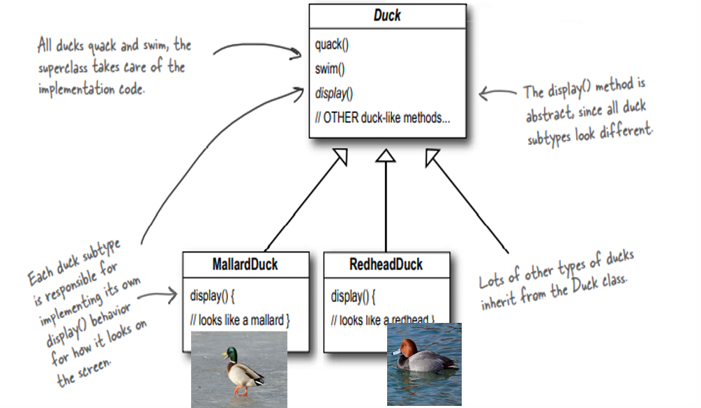
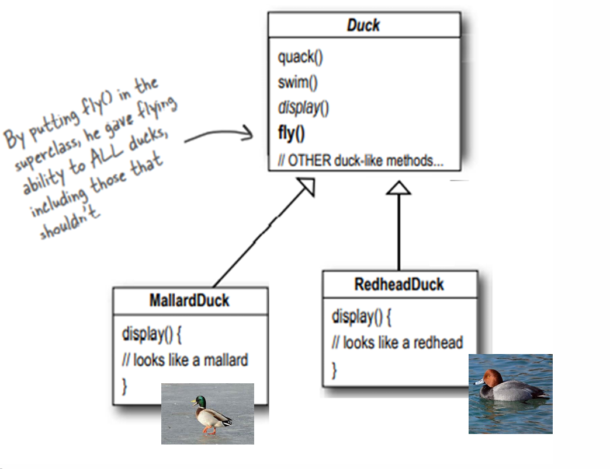
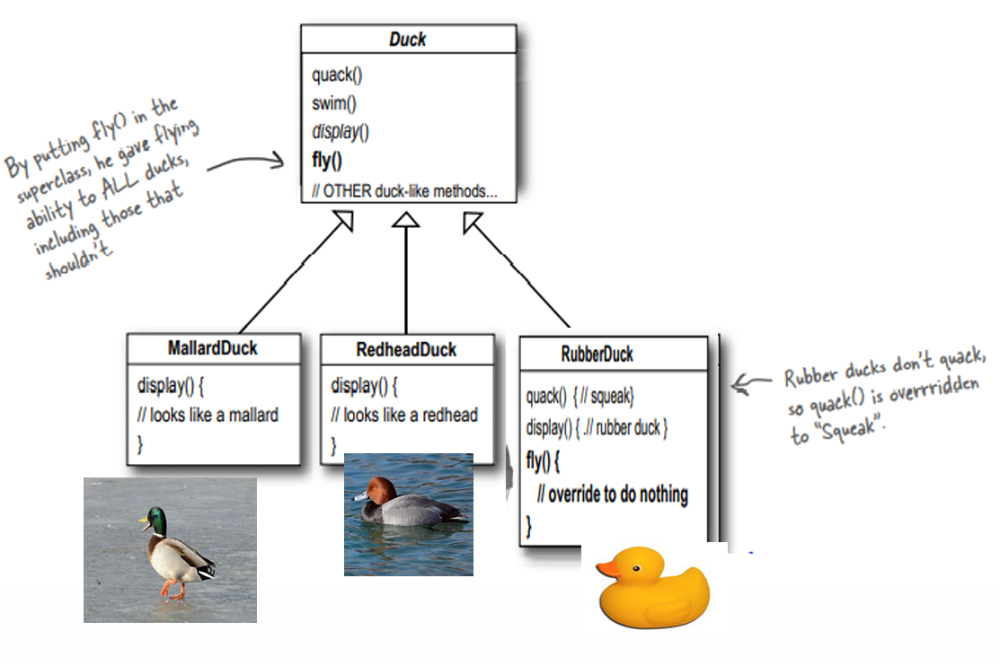
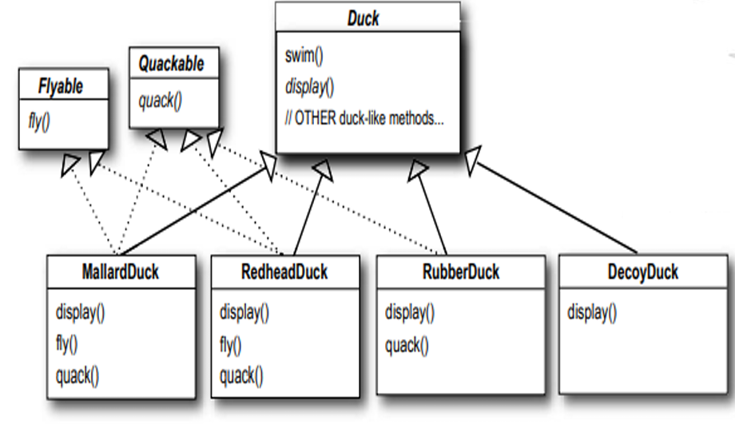
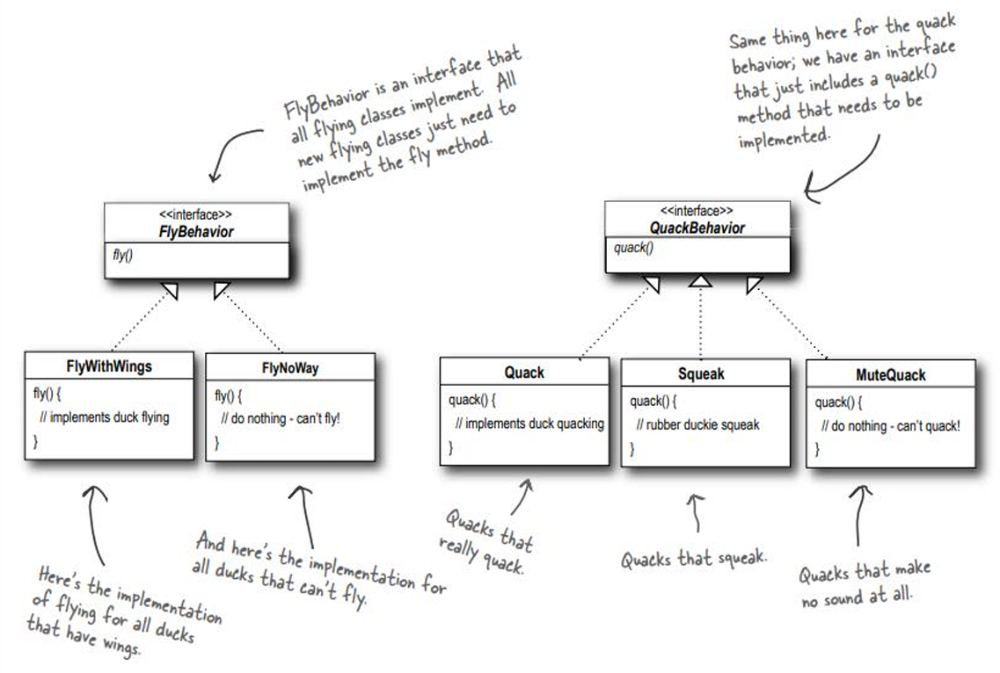
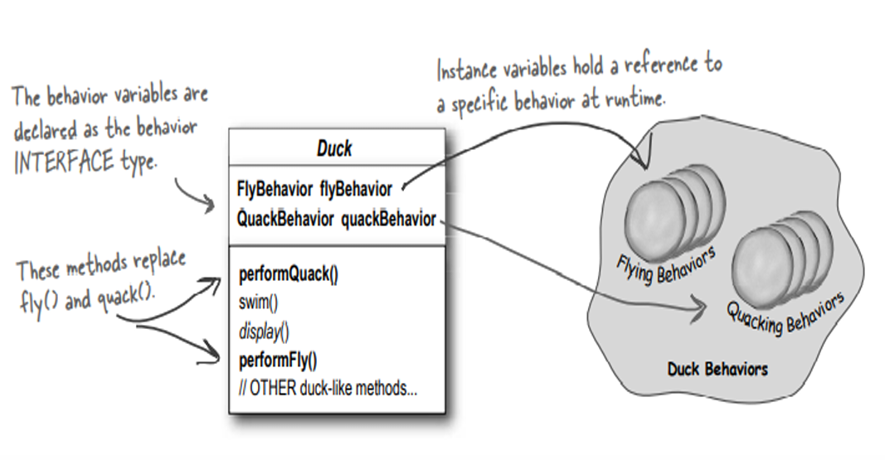
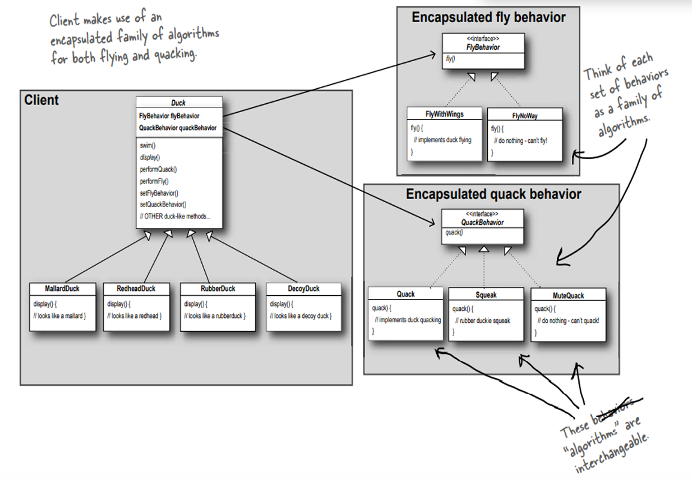

## Strategy Pattern

- **Intent**: Define a family of algorithms, encapsulate each one, and make them interchangeable at runtime without changing the client.
- **Why**: Avoid giant `if/else` blocks and subclass explosions when behavior must vary dynamically (e.g., ducks that fly differently, multiple encryption schemes).  
  *Slides reference*: See the lecture handout for the classic duck example and the encryption table of AES / RSA / ECC options.

---

## Table of Contents

- [When to Use](#when-to-use)
- [Structure (Roles)](#structure-roles)
- [How to Recognize Strategy Pattern in UML Diagrams](#how-to-recognize-strategy-pattern-in-uml-diagrams)
- [Pattern Structure – Diagram Walkthrough](#duck-example--diagram-walkthrough)
- [Examples in this folder](#examples-in-this-folder)
- [Benefits & Trade-offs](#benefits-trade-offs)
- [Related Patterns](#related-patterns)
- [Common Use Cases](#common-use-cases)
- [Implementation Notes](#implementation-notes)
- [Exam Focus: Strategy Pattern](#exam-focus-strategy-pattern)

---

## When to Use
- You have several interchangeable algorithms (sorting, compression, encryption, pricing rules).
- Behavior must switch at runtime based on context or configuration.
- You want to follow the Open/Closed Principle: add new behaviors without touching existing client code.
- You want to unit test behaviors in isolation.

---

## Structure (roles)
- `Strategy`: interface describing the algorithm (`fly()`, `quack()`, `encrypt()`).
- `ConcreteStrategy`: individual implementations (e.g., `FlyWithWings`, `FlyNoWay`, `AesEncryption`).
- `Context`: holds a `Strategy` reference and delegates to it; can swap strategies on the fly (`Duck`, `SecureMessenger`).
- `Client`: configures which strategy to use.
Key idea: **composition over inheritance**. The context *has a* strategy instead of hard-coding behavior.

---

## How to Recognize Strategy Pattern in UML Diagrams

When analyzing a UML diagram to identify the Strategy pattern, look for these key visual indicators:

### 1. **Interface/Abstract Class with Multiple Implementations**
- Look for a **Strategy interface** (or abstract class) with **multiple concrete implementations**
- The interface should define a method signature (e.g., `execute()`, `algorithm()`, `perform()`)
- Multiple classes should implement this interface (typically 2-4+ implementations)
- **Visual**: One interface/abstract class with multiple arrows pointing to it (implementation relationships)

### 2. **Context Class with Composition Relationship**
- Look for a **Context class** that has a **composition/association** relationship with the Strategy interface
- The Context should have a field/reference to the Strategy (shown as an arrow with a diamond or arrow)
- The Context should NOT inherit from Strategy (no inheritance arrow)
- **Visual**: Context class connected to Strategy interface with a "has-a" relationship (arrow or diamond)

### 3. **Delegation Pattern**
- The Context class should have methods that **delegate** to the Strategy
- Context methods call methods on the Strategy object
- **Visual**: Context methods show calls to Strategy methods (may be shown as dependency arrows or method calls)

### 4. **Key UML Elements to Look For**

**Class Diagram Elements:**
```
┌─────────────────┐
│   <<interface>> │
│    Strategy     │
├─────────────────┤
│ + execute()     │
└────────┬────────┘
         │ implements
         │
    ┌────┴────┬──────────┬──────────┐
    │         │          │          │
┌───▼───┐ ┌──▼───┐  ┌───▼───┐  ┌───▼───┐
│Concrete│ │Concrete│ │Concrete│ │Concrete│
│Strategy│ │Strategy│ │Strategy│ │Strategy│
│   A    │ │   B    │ │   C    │ │   D    │
└────────┘ └────────┘ └────────┘ └────────┘
         ▲
         │ uses (composition)
         │
┌────────┴────────┐
│    Context      │
├─────────────────┤
│ - strategy      │
│ + setStrategy() │
│ + doSomething() │
└─────────────────┘
```

**Key Indicators:**
- ✅ **Strategy interface** with multiple concrete implementations
- ✅ **Context class** with a field/reference to Strategy (composition)
- ✅ **No inheritance** between Context and Strategy
- ✅ **Multiple algorithms** represented as separate classes
- ✅ **Delegation** from Context to Strategy

### 5. **What to Look For in Exam Diagrams**

**Pattern Recognition Checklist:**
- [ ] Is there an interface/abstract class defining an algorithm?
- [ ] Are there multiple classes implementing this interface?
- [ ] Is there a Context class that uses (has-a) the Strategy interface?
- [ ] Does the Context delegate to the Strategy (not inherit)?
- [ ] Can strategies be swapped/interchanged?
- [ ] Are the strategies independent algorithms?

**Common Names in Diagrams:**
- Strategy interface: `Strategy`, `Algorithm`, `Behavior`, `Policy`
- Concrete strategies: Often named after the algorithm (e.g., `QuickSort`, `MergeSort`, `AES`, `RSA`)
- Context: Usually the main class that uses strategies (e.g., `Sorter`, `Encryptor`, `Calculator`)

### 6. **Distinguishing from Similar Patterns**

**Strategy vs State:**
- **Strategy**: Multiple independent algorithms, client chooses which to use
- **State**: States transition to each other, behavior changes based on current state
- **Visual difference**: State diagrams show transitions between states; Strategy shows multiple parallel implementations

**Strategy vs Template Method:**
- **Strategy**: Uses composition (has-a), multiple implementations
- **Template Method**: Uses inheritance (is-a), one abstract class with template method
- **Visual difference**: Strategy has composition arrow; Template Method has inheritance arrow

**Strategy vs Decorator:**
- **Strategy**: Replaces behavior, one strategy at a time
- **Decorator**: Adds behavior, multiple decorators can wrap
- **Visual difference**: Strategy shows one-to-one relationship; Decorator shows chain/wrapper pattern

### 7. **Example: Recognizing from a Diagram**

If you see a diagram like this:
```
PaymentStrategy (interface)
    ↑ implements
    ├── CreditCardPayment
    ├── PayPalPayment
    └── BankTransferPayment

ShoppingCart (Context)
    - paymentStrategy: PaymentStrategy
    + setPaymentStrategy()
    + checkout()
```

**This is Strategy Pattern because:**
- ✅ `PaymentStrategy` is an interface with multiple implementations
- ✅ `ShoppingCart` has a composition relationship with `PaymentStrategy`
- ✅ `ShoppingCart` can swap payment strategies
- ✅ Each payment method is an independent algorithm

---

## Duck Example – Diagram Walkthrough <a id="duck-example--diagram-walkthrough"></a>

### 1. Basic inheritance – `Duck` + concrete ducks (`diagram1.png`)


- **Idea**: All ducks `quack()` and `swim()`, so `Duck` implements these once and every subtype (e.g., `MallardDuck`, `RedheadDuck`) inherits that implementation.
- **`display()`** is **abstract** in `Duck` because each subtype looks different and must implement its own display behavior.
- Many other duck types can inherit from `Duck` and provide their own `display()`.

### 2. The problem – adding `fly()` to `Duck`


- When we add `fly()` to the `Duck` superclass, **all** ducks can now fly by inheritance.
- This is wrong for ducks like rubber or wooden decoys that **should not fly**, but still get `fly()` for free.

### 3. Patching with overrides – Rubber & Decoy ducks


- We try to fix the problem by adding `RubberDuck` and `DecoyDuck` subclasses that override behavior:
  - `RubberDuck.quack()` is overridden to **squeak** instead of a real quack.
  - Both `RubberDuck.fly()` and `DecoyDuck.fly()` are overridden to **do nothing**.
  - `DecoyDuck.quack()` is also overridden to **do nothing**.
- This works for a while, but every new non‑flying / non‑quacking duck forces more overrides and duplicated “do nothing” code.

### 4. Splitting responsibilities – `Flyable` and `Quackable`


- To avoid forcing all ducks to inherit `fly()` and `quack()`, we **extract interfaces**:
  - `Flyable` with `fly()`.
  - `Quackable` with `quack()`.
- Only ducks that actually fly implement `Flyable`; only ducks that actually quack implement `Quackable`.
- This reduces wrong behavior, but still couples each duck directly to a single hard‑coded implementation of `fly()` / `quack()`.

### 5. Encapsulating behaviors – `FlyBehavior` and `QuackBehavior`


- We move from “can fly” / “can quack” markers to full **behavior interfaces**:
  - `FlyBehavior` with implementations: `FlyWithWings`, `FlyNoWay`, etc.
  - `QuackBehavior` with implementations: `Quack`, `Squeak`, `MuteQuack`.
- Each behavior class encapsulates one algorithm:
  - `FlyWithWings.fly()` implements real flying.
  - `FlyNoWay.fly()` does nothing (for ducks that cannot fly).
  - `Quack.quack()` prints a real quack, `Squeak.quack()` squeaks, `MuteQuack.quack()` is silent.

### 6. Final `Duck` design – has‑a behavior


- The `Duck` class no longer hard‑codes `fly()` / `quack()` implementation; instead it **contains** strategy objects:
  - Fields: `FlyBehavior flyBehavior`, `QuackBehavior quackBehavior`.
  - Methods: `performFly()` delegates to `flyBehavior.fly()` and `performQuack()` delegates to `quackBehavior.quack()`.
- `display()` remains abstract so each concrete duck can define how it looks.
- Concrete ducks (Mallard, Redhead, Rubber, Decoy) are configured by **choosing which behavior objects** they use.

### 7. Full system – client + encapsulated behaviors


- On the right side, we have **families of algorithms** (encapsulated fly and quack behaviors) that are interchangeable.
- On the left, client code uses the **`Duck` abstraction**:
  - Each `Duck` subtype holds references to a `FlyBehavior` and a `QuackBehavior`.
  - Client calls `performFly()` / `performQuack()` on ducks without knowing which concrete behavior is used.
- This is the Strategy pattern: the client works with a `Duck`, and the **behavior objects** supply the pluggable algorithms.

---

## Examples in this folder
- `StrategyDuckDemo.java`: Classic duck simulator where flying/quacking behaviors are pluggable and changeable at runtime.
- `StrategyEncryptionDemo.java`: Secure messenger that can switch between AES, RSA, and ECC strategies based on the required security level.

Compile & run from this directory:
```bash
javac StrategyDuckDemo.java StrategyEncryptionDemo.java
java StrategyDuckDemo
java StrategyEncryptionDemo
```

---

## Example 1 – Duck behaviors (runtime swapping)
- Strategies: `FlyBehavior` (`FlyWithWings`, `FlyNoWay`, `RocketFly`) and `QuackBehavior` (`Quack`, `Squeak`, `MuteQuack`).
- Context: `Duck` with `performFly()` / `performQuack()` delegating to current strategies.
- Benefit: Add a new fly or quack behavior without changing `Duck` subclasses; swap behaviors on the fly for a single duck instance.

---

## Example 2 – Pluggable encryption
- Strategies: `AesEncryption`, `RsaEncryption`, `EccEncryption`.
- Context: `SecureMessenger` encrypts outgoing messages using the injected strategy; caller can swap strategy per message or per session.
- Benefit: Different security levels without changing messenger code; adding a new algorithm means adding one class.

---

## Benefits & Trade-offs <a id="benefits-trade-offs"></a>
- ✅ Add/replace algorithms independently of the context.
- ✅ Test each strategy separately; reduce branching in the context.
- ✅ Swap behavior at runtime.
- ⚠️ Slightly more objects; ensure sensible defaults to avoid `null` strategies.

---

## Related Patterns
- **State**: similar structure, but strategies represent independent algorithms; state typically models lifecycle stages with transitions.
- **Decorator**: adds responsibilities by wrapping; Strategy swaps core behavior.
- **Factory**: often used to choose which strategy to instantiate.

---

## Exam Focus: Strategy Pattern

### Key Concepts for Exams

**Core Idea**: Define a family of algorithms, encapsulate each one, and make them interchangeable at runtime.

**Key Characteristics**:
- **Composition over inheritance**: Context has-a strategy (not is-a)
- **Runtime behavior switching**: Can change strategy at runtime
- **Open/Closed Principle**: Add new strategies without modifying context
- **Encapsulation**: Each algorithm is in its own class

**Pattern Roles**:
1. **Strategy Interface**: Defines the algorithm interface
2. **Concrete Strategies**: Implementations of the algorithm
3. **Context**: Uses a strategy reference and delegates to it
4. **Client**: Selects and uses strategies

**📋 UML Diagram Recognition**: See [How to Recognize Strategy Pattern in UML Diagrams](#how-to-recognize-strategy-pattern-in-uml-diagrams) section above for detailed guidance on identifying Strategy pattern from UML diagrams.

### Common Exam Scenarios

1. **Payment Methods**: Different payment strategies (Credit Card, PayPal, Bank Transfer)
2. **Sorting Algorithms**: Different sorting strategies (QuickSort, MergeSort, BubbleSort)
3. **Compression**: Different compression strategies (ZIP, RAR, GZIP)
4. **Encryption**: Different encryption strategies (AES, RSA, ECC)
5. **Discount Calculations**: Different discount strategies (Percentage, Fixed, Seasonal)
6. **Validation Rules**: Different validation strategies (Email, Phone, Credit Card)
7. **Transportation**: Different travel strategies (Car, Bus, Train, Plane)

### Strategy vs State Pattern

| Aspect | Strategy | State |
|--------|----------|-------|
| **Purpose** | Encapsulate interchangeable algorithms | Encapsulate state-specific behavior |
| **Focus** | Algorithm selection | State transitions |
| **Behavior** | Independent algorithms | Behavior changes with state |
| **Switching** | Client chooses strategy | State changes automatically |
| **Example** | Sorting algorithms | Vending machine states (Idle, HasMoney, Dispensing) |

**Key Difference**: Strategy = "which algorithm to use", State = "what state am I in"

### Strategy vs Decorator Pattern

| Aspect | Strategy | Decorator |
|--------|----------|-----------|
| **Purpose** | Swap algorithms | Add responsibilities |
| **Focus** | Core behavior | Additional features |
| **Composition** | One strategy at a time | Multiple decorators |
| **Behavior** | Replaces behavior | Wraps behavior |
| **Example** | Encryption algorithms | Coffee with milk, sugar, whipped cream |

**Key Difference**: Strategy = "which algorithm", Decorator = "what features to add"

### Strategy vs Template Method Pattern

| Aspect | Strategy | Template Method |
|--------|----------|-----------------|
| **Purpose** | Swap entire algorithm | Define algorithm skeleton |
| **Focus** | Algorithm selection | Algorithm structure |
| **Inheritance** | Uses composition | Uses inheritance |
| **Flexibility** | Runtime selection | Compile-time structure |
| **Example** | Different sorting algorithms | Algorithm with steps (prepare, execute, cleanup) |

**Key Difference**: Strategy = "which algorithm", Template Method = "how to structure algorithm"

### Exam Keywords

- "Different algorithms" → Strategy
- "Interchangeable behaviors" → Strategy
- "Runtime behavior switching" → Strategy
- "Encapsulate algorithms" → Strategy
- "Composition over inheritance" → Strategy
- "Open/Closed Principle" → Strategy
- "Family of algorithms" → Strategy

### Common Exam Questions

**Q: When would you use Strategy pattern?**
- When you have multiple algorithms for the same task
- When you want to switch algorithms at runtime
- When you want to avoid if/else chains
- When algorithms should be independent and testable

**Q: How does Strategy pattern differ from State pattern?**
- Strategy: Client chooses which algorithm to use
- State: Object's behavior changes based on its internal state
- Strategy: Algorithms are independent
- State: States have transitions between them

**Q: What is the main advantage of Strategy pattern?**
- Allows runtime selection of algorithms
- Follows Open/Closed Principle
- Reduces conditional logic
- Makes algorithms testable in isolation

### Quick Reference

**Pattern Type**: Behavioral

**Intent**: Define a family of algorithms, encapsulate each one, and make them interchangeable.

**Structure**:
- Strategy Interface
- Concrete Strategies (multiple implementations)
- Context (has-a strategy)
- Client (selects strategy)

**When to Use**:
- Multiple algorithms for same task
- Need to switch algorithms at runtime
- Want to avoid if/else chains
- Algorithms should be independent

**When NOT to Use**:
- Only one algorithm
- Algorithms are not interchangeable
- Simple conditional logic is sufficient
- Performance is critical (slight overhead)

### Exam Practice Scenarios

**Scenario 1**: You're building a shopping cart that needs to calculate discounts. Different discount types (percentage, fixed amount, buy-one-get-one) should be interchangeable.

**Answer**: Strategy Pattern - Each discount type is a strategy (PercentageDiscount, FixedDiscount, BOGODiscount), and ShoppingCart uses the selected strategy.

**Scenario 2**: A game character can use different weapons (sword, bow, magic wand). The character should be able to switch weapons at runtime.

**Answer**: Strategy Pattern - Each weapon type is a strategy (SwordStrategy, BowStrategy, MagicStrategy), and Character uses the selected weapon strategy.

**Scenario 3**: A data processing system needs to support different file formats (CSV, JSON, XML). The system should be able to process any format without modifying the core code.

**Answer**: Strategy Pattern - Each format is a strategy (CSVStrategy, JSONStrategy, XMLStrategy), and DataProcessor uses the selected strategy.

### Common Mistakes in Exams

1. **Confusing Strategy with State**: Strategy is about algorithm selection, State is about state transitions
2. **Confusing Strategy with Decorator**: Strategy replaces behavior, Decorator adds behavior
3. **Using inheritance instead of composition**: Strategy uses composition (has-a), not inheritance (is-a)
4. **Not allowing runtime switching**: Strategy should allow changing strategies at runtime

### Implementation Checklist

- [ ] Strategy interface defined
- [ ] Multiple concrete strategies implemented
- [ ] Context has-a strategy reference
- [ ] Context delegates to strategy
- [ ] Strategy can be changed at runtime
- [ ] Client selects appropriate strategy
