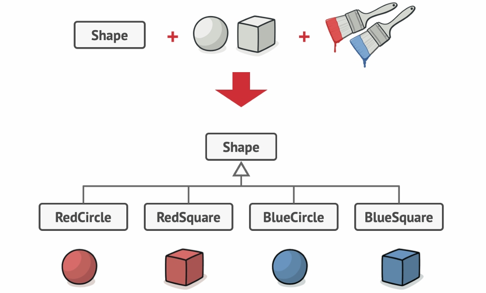
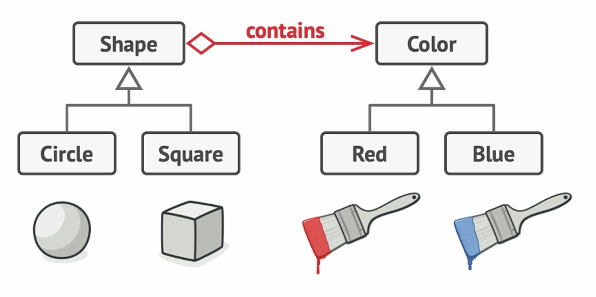

## Bridge Pattern

- **Intent**: Decouple an abstraction from its implementation so that the two can vary independently.
- **When to use**: When you have two dimensions that may change independently (e.g., shapes vs drawing APIs, GUI vs OS APIs, transport vs engine types) and you want to avoid a class explosion from combining every variant.

---

## Pattern Structure

The following diagrams illustrate the Bridge pattern structure and how it helps avoid class explosion.

### Diagram 1 – Naive Inheritance: One Class per Combination



This diagram shows that if we have a `Shape` with two concrete shapes (`Circle`, `Square`) and two colors (`Red`, `Blue`), a naive design might create four separate subclasses:

- `RedCircle`, `RedSquare`, `BlueCircle`, `BlueSquare`

Every time you add a new shape or a new color, you need to add more combined subclasses, causing a **class explosion**.

### Diagram 2 – Separating Shape and Color Hierarchies (Bridge Idea)



This diagram shows the proper Bridge-style solution:

- One hierarchy for **Shape** (`Circle`, `Square`).
- One separate hierarchy for **Color** (`Red`, `Blue`).
- `Shape` **contains** a reference to `Color`.

Now you can mix any shape with any color at runtime by composition, instead of creating separate subclasses for each combination.

### Diagram 3 – Generic Bridge UML Structure


This UML diagram shows the classic Bridge structure:

**Diagram Components:**

1. **`Abstraction`** (Interface / Abstract Class)
   - Defines the high-level interface for clients.
   - Holds a reference to an `Implementor`.
   - Delegates work to the `Implementor` to perform low-level operations.

2. **Refined Abstractions** (Concrete Abstractions)
   - Concrete classes that extend `Abstraction`.
   - May add extra operations or refine existing ones.
   - Still delegate implementation details to the `Implementor`.

3. **`Implementor`** (Interface / Abstract Class)
   - Defines the low-level operations that concrete implementors must provide.
   - Typically more primitive operations that the `Abstraction` composes to provide higher-level behavior.

4. **Concrete Implementors**
   - Concrete classes that implement the `Implementor` interface.
   - Provide platform- / technology-specific behavior.
   - Example: `WindowsAPI`, `LinuxAPI`, `GasEngine`, `ElectricEngine`.

5. **Client**
   - Works with the `Abstraction` interface only.
   - Is not coupled to any specific `Implementor` or concrete implementation classes.

**Key Relationships:**

- `Abstraction` **has-a** reference to `Implementor` (composition).
- Refined abstractions **inherit from** `Abstraction` (generalization).
- Concrete implementors **implement** `Implementor` (realization).
- Client **depends on** `Abstraction`, not on the concrete implementors.

**Pattern Flow:**

1. Client creates a refined abstraction and supplies a concrete implementor.
2. Abstraction stores the implementor in a field.
3. When the client calls a method on the abstraction, the abstraction delegates part (or all) of the work to the implementor.
4. Abstraction and implementor can evolve independently (new abstractions or new implementors) without changing each other.

---

## Bridge Pattern – Transport / Engine Example

In this example, the `Transport` hierarchy is the **Abstraction**, and the `Engine` hierarchy is the **Implementor**.

The Transport class has two subtypes: `Car` and `Plane`.  
Each `Transport` object has the flexibility to use either a **gas** or an **electric** engine.

Instead of creating multiple subclasses like:

- `GasCar`, `ElectricCar`
- `GasPlane`, `ElectricPlane`

we separate the two dimensions:

- **Abstraction hierarchy**: `Transport` → `Car`, `Plane`
- **Implementor hierarchy**: `Engine` → `GasEngine`, `ElectricEngine`

This structure is illustrated in the following diagram for our example:


**Diagram Components:**

1. **`Engine` Interface** (Implementor)
   - Methods:
     - `+start(): void`
     - `+move(): void`

2. **`GasEngine` Class** (Concrete Implementor)
   - Implements `Engine`.
   - `start()` prints `"Gas engine started"`.
   - `move()` prints `"Gas engine spinning"` (or similar).

3. **`ElectricEngine` Class** (Concrete Implementor)
   - Implements `Engine`.
   - `start()` prints `"Electric engine started"`.
   - `move()` prints `"Electric engine spinning"`.

4. **`Transport` Abstract Class** (Abstraction)
   - Attribute: `protected Engine engine;`
   - Constructor takes an `Engine` and stores it.
   - May have common operations (e.g., `startTransport()` that delegates to `engine.start()`).
   - Declares abstract method(s) such as `drive()`.

5. **`Car` Class** (Refined Abstraction)
   - Extends `Transport`.
   - Implements `drive()` by delegating to `engine.move()` and then printing `"Car is being driven."`.

6. **`Plane` Class** (Refined Abstraction)
   - Extends `Transport`.
   - Implements `drive()` by delegating to `engine.move()` and then printing `"Plane is flying."`.

7. **`BridgeTransportDemo` Class** (Client)
   - Creates various combinations:
     - `new Car(new GasEngine())`
     - `new Car(new ElectricEngine())`
     - `new Plane(new GasEngine())`
     - `new Plane(new ElectricEngine())`
   - Calls `drive()` on each instance to demonstrate how abstraction and implementation vary independently.

**Benefits in this Example:**

- Adding a new `Transport` type (e.g., `Boat`) does **not** require changes to engine classes.
- Adding a new `Engine` type (e.g., `HybridEngine`) does **not** require changes to transport classes.
- Combinations are created at runtime by composing transports with engines.

---

## Why Use the Bridge Pattern?

### The Problem: Class Explosion and Tight Coupling

Without Bridge, you might be tempted to mix both dimensions (transport type and engine type) into one inheritance hierarchy:

```java
// Problem: mixing type of transport and engine in one hierarchy
abstract class Transport {
    abstract void drive();
}

class GasCar extends Transport {
    void drive() { System.out.println("Driving gas car"); }
}

class ElectricCar extends Transport {
    void drive() { System.out.println("Driving electric car"); }
}

class GasPlane extends Transport {
    void drive() { System.out.println("Flying gas plane"); }
}

class ElectricPlane extends Transport {
    void drive() { System.out.println("Flying electric plane"); }
}
```

**Problems:**

- ❌ **Class explosion**: For `m` transports and `n` engines, you may need up to `m × n` classes.
- ❌ **Tight coupling**: Transport and engine variations are mixed in the same classes.
- ❌ **Low flexibility**: Adding a new engine type requires adding a new subclass for each transport.
- ❌ **Violation of Single Responsibility**: Each class deals with both transport behavior and engine behavior.

### The Solution: Bridge Pattern

The Bridge pattern solves these problems by:

- ✅ **Separating concerns**: Abstraction (Transport) and implementation (Engine) are separate hierarchies.
- ✅ **Independent evolution**: You can add new transports or engines without changing existing classes.
- ✅ **Runtime flexibility**: You can combine any transport with any engine at runtime.
- ✅ **Loose coupling**: Client depends on `Transport` and `Engine` interfaces, not on concrete combinations.

---

## With Bridge Pattern – Conceptual Example

```java
// Implementor
interface Device {
    void enable();
    void disable();
    void setVolume(int percent);
}

// Concrete Implementors
class TV implements Device {
    public void enable() { System.out.println("TV on"); }
    public void disable() { System.out.println("TV off"); }
    public void setVolume(int percent) {
        System.out.println("TV volume set to " + percent + "%");
    }
}

class Radio implements Device {
    public void enable() { System.out.println("Radio on"); }
    public void disable() { System.out.println("Radio off"); }
    public void setVolume(int percent) {
        System.out.println("Radio volume set to " + percent + "%");
    }
}

// Abstraction
abstract class Remote {
    protected Device device;

    protected Remote(Device device) {
        this.device = device;
    }

    public void togglePower() {
        device.enable();
    }

    public abstract void volumeUp();
}

// Refined Abstraction
class BasicRemote extends Remote {
    public BasicRemote(Device device) {
        super(device);
    }

    public void volumeUp() {
        device.setVolume(50);
    }
}

class AdvancedRemote extends Remote {
    public AdvancedRemote(Device device) {
        super(device);
    }

    public void volumeUp() {
        device.setVolume(100);
    }
}

// Usage
class Demo {
    public static void main(String[] args) {
        Device tv = new TV();
        Remote basicRemote = new BasicRemote(tv);
        basicRemote.togglePower();
        basicRemote.volumeUp();

        Device radio = new Radio();
        Remote advancedRemote = new AdvancedRemote(radio);
        advancedRemote.togglePower();
        advancedRemote.volumeUp();
    }
}
```

**Key Points:**

- `Remote` is the abstraction; `Device` is the implementor.
- `BasicRemote` and `AdvancedRemote` are refined abstractions.
- `TV` and `Radio` are concrete implementors.
- New remotes and new devices can be added independently.

---

## Without Bridge Pattern

```java
// Problem: Remote is tightly coupled to TV
class TVRemote {
    public void togglePower() {
        System.out.println("TV on");
    }

    public void volumeUp() {
        System.out.println("TV volume up");
    }
}

// Another remote for Radio (duplicated logic)
class RadioRemote {
    public void togglePower() {
        System.out.println("Radio on");
    }

    public void volumeUp() {
        System.out.println("Radio volume up");
    }
}
```

**Problems:**

- ❌ Code duplication across `TVRemote` and `RadioRemote`.
- ❌ Hard to add new devices (need new remotes).
- ❌ Hard to add new remote types (need versions for each device).

---

## Pros

- ✅ **Loose coupling** between abstraction and implementation.
- ✅ **Independent extensibility**: you can add new abstractions and new implementors separately.
- ✅ **Avoids class explosion** when you have multiple dimensions of variation.
- ✅ **Improved testability**: you can test abstractions with mock implementors.
- ✅ **Better separation of concerns**.

---

## Cons

- ❌ **More classes** and indirection compared to a naive design.
- ❌ **Higher initial complexity** – structure may be overkill for simple cases.
- ❌ **Requires design effort** to identify abstraction vs implementation axes.

---

## Compare with Other Patterns

- **vs Adapter**: Adapter changes an existing interface to another; Bridge separates abstraction from implementation from the start.
- **vs Decorator**: Decorator adds responsibilities to objects; Bridge separates two dimensions (e.g., type and platform).
- **vs Facade**: Facade provides a simplified interface to a subsystem; Bridge splits abstraction and implementation hierarchies.
- **vs Strategy**: Strategy focuses on swapping algorithms; Bridge focuses on separating abstraction and implementation classes.

---

## File Examples

- **`BridgeTransportDemo.java`**: Transport/Engine example demonstrating independent variation of transports and engines.
- **`BridgeGuiApiDemo.java`**: GUI vs OS API example showing abstraction delegating to platform-specific implementors.


