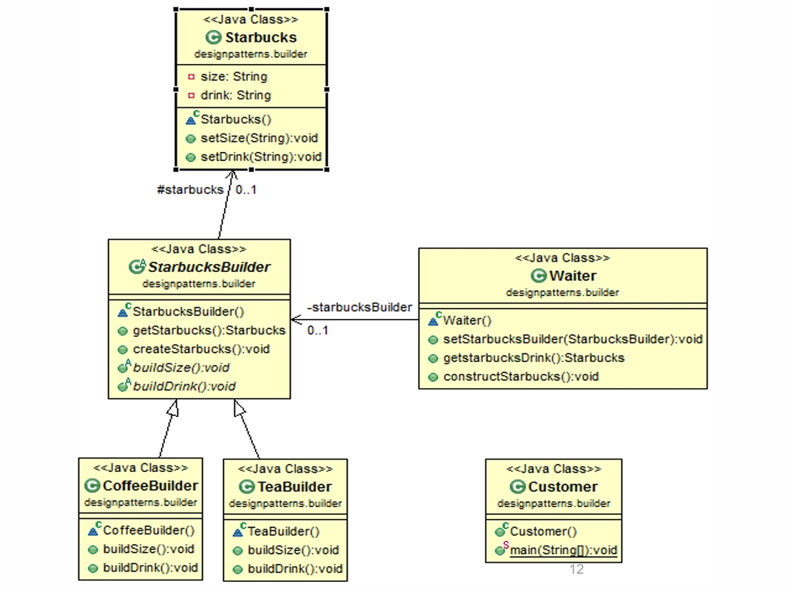
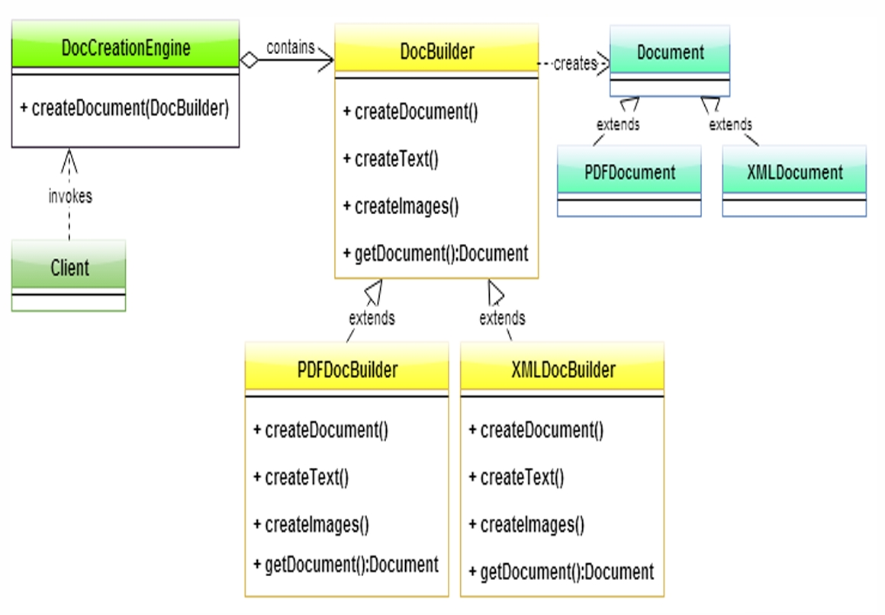

## Builder Pattern

- **Intent**: Separate construction of a complex object from its representation, allowing the same construction process to create different representations.
- **When to use**: When you have many optional parameters, need readable and safe object construction, or want immutable products with flexible construction.

---

## Pattern Structure

The following diagrams illustrate the Builder pattern structure, showing two different implementations: a Director-based builder for drinks and a Director-based builder for documents.

### Diagram 1: Director-Based Builder (Starbucks Example)



**Diagram Components:**

1. **`Starbucks` Class** (Product)
   - The product being constructed
   - Attributes:
     - `size: String` (private) - Size of the drink
     - `drink: String` (private) - Type of drink
   - Methods:
     - `Starbucks()` - Constructor
     - `setSize(String): void` - Sets the size
     - `setDrink(String): void` - Sets the drink type

2. **`StarbucksBuilder` Class** (Abstract Builder)
   - Abstract builder interface defining the construction steps
   - Holds a reference to the `Starbucks` product (association: `#starbucks`, multiplicity: `0..1`)
   - Methods:
     - `StarbucksBuilder()` - Constructor
     - `getStarbucks(): Starbucks` - Retrieves the built product
     - `createStarbucks(): void` - Initializes a new `Starbucks` object
     - `buildSize(): void` - Abstract method for building the size component
     - `buildDrink(): void` - Abstract method for building the drink component

3. **`CoffeeBuilder` Class** (Concrete Builder)
   - Concrete implementation of `StarbucksBuilder` for coffee drinks
   - Implements `buildSize()` and `buildDrink()` methods
   - Provides specific implementation for constructing coffee drinks

4. **`TeaBuilder` Class** (Concrete Builder)
   - Concrete implementation of `StarbucksBuilder` for tea drinks
   - Implements `buildSize()` and `buildDrink()` methods
   - Provides specific implementation for constructing tea drinks

5. **`Waiter` Class** (Director)
   - Orchestrates the building process
   - Holds a reference to `StarbucksBuilder` (association: `-starbucksBuilder`, multiplicity: `0..1`)
   - Methods:
     - `Waiter()` - Constructor
     - `setStarbucksBuilder(StarbucksBuilder): void` - Sets the concrete builder to use
     - `getstarbucksDrink(): Starbucks` - Gets the final built drink
     - `constructStarbucks(): void` - Directs the builder to construct the `Starbucks` object by calling `buildSize()` and `buildDrink()`

6. **`Customer` Class** (Client)
   - The client that initiates the building process
   - Method: `main(String[]): void` - Entry point for the application

**Key Relationships:**
- `CoffeeBuilder` and `TeaBuilder` **inherit** from `StarbucksBuilder` (generalization)
- `StarbucksBuilder` **has** a `Starbucks` product (association, multiplicity: `0..1`)
- `Waiter` **has** a `StarbucksBuilder` (association, multiplicity: `0..1`)
- `Customer` **uses** `Waiter` to construct drinks

**Pattern Flow:**
1. Client (`Customer`) creates a `Waiter` (Director)
2. Client sets a concrete builder (`CoffeeBuilder` or `TeaBuilder`) on the `Waiter`
3. Client calls `constructStarbucks()` on the `Waiter`
4. `Waiter` directs the builder to call `createStarbucks()`, `buildSize()`, and `buildDrink()`
5. Client retrieves the final `Starbucks` product via `getstarbucksDrink()`

### Diagram 2: Director-Based Builder (Document Example)



**Diagram Components:**

1. **`Document` Class** (Product)
   - Abstract product interface/class
   - Represents the document being constructed
   - Serves as the base for `PDFDocument` and `XMLDocument`

2. **`PDFDocument` Class** (Concrete Product)
   - Concrete product representing a PDF document
   - Extends `Document`

3. **`XMLDocument` Class** (Concrete Product)
   - Concrete product representing an XML document
   - Extends `Document`

4. **`DocBuilder` Class** (Abstract Builder)
   - Abstract builder interface defining document construction steps
   - Methods:
     - `createDocument(): void` - Initializes the document product
     - `createText(): void` - Adds text parts to the document
     - `createImages(): void` - Adds image parts to the document
     - `getDocument(): Document` - Returns the constructed `Document` object
   - Has a dependency relationship to `Document` (creates)

5. **`PDFDocBuilder` Class** (Concrete Builder)
   - Concrete implementation of `DocBuilder` for PDF documents
   - Implements `createDocument()`, `createText()`, `createImages()`, and `getDocument()`
   - Creates `PDFDocument` instances

6. **`XMLDocBuilder` Class** (Concrete Builder)
   - Concrete implementation of `DocBuilder` for XML documents
   - Implements `createDocument()`, `createText()`, `createImages()`, and `getDocument()`
   - Creates `XMLDocument` instances

7. **`DocCreationEngine` Class** (Director)
   - Orchestrates the document building process
   - Method: `createDocument(DocBuilder)` - Takes a `DocBuilder` and directs it to construct a document
   - Has a composition relationship with `DocBuilder` (contains)

8. **`Client` Class** (Client)
   - The client that initiates the document creation process
   - Invokes the `DocCreationEngine` to create documents

**Key Relationships:**
- `PDFDocBuilder` and `XMLDocBuilder` **extend** `DocBuilder` (inheritance)
- `PDFDocument` and `XMLDocument` **extend** `Document` (inheritance)
- `DocBuilder` **creates** `Document` (dependency)
- `DocCreationEngine` **contains** `DocBuilder` (composition)
- `Client` **invokes** `DocCreationEngine` (dependency)

**Pattern Flow:**
1. Client creates a `DocCreationEngine` (Director)
2. Client creates a concrete builder (`PDFDocBuilder` or `XMLDocBuilder`)
3. Client calls `createDocument(builder)` on the `DocCreationEngine`
4. `DocCreationEngine` directs the builder to call `createDocument()`, `createText()`, and `createImages()`
5. Client retrieves the final `Document` product via `getDocument()`

**Builder Pattern Roles:**
- **Director**: `Waiter` (Diagram 1) or `DocCreationEngine` (Diagram 2) - Orchestrates the building process
- **Abstract Builder**: `StarbucksBuilder` (Diagram 1) or `DocBuilder` (Diagram 2) - Defines construction steps
- **Concrete Builders**: `CoffeeBuilder`, `TeaBuilder` (Diagram 1) or `PDFDocBuilder`, `XMLDocBuilder` (Diagram 2) - Implement construction steps
- **Product**: `Starbucks` (Diagram 1) or `Document` (Diagram 2) - The object being constructed
- **Concrete Products**: `PDFDocument`, `XMLDocument` (Diagram 2) - Specific product types

Both diagrams demonstrate how the Builder pattern separates the construction of a complex object from its representation, allowing the same construction process to create different representations through different concrete builders.

---

## Why Use the Builder Pattern?

### The Problem: Multiple Constructors (Telescoping Constructor Anti-Pattern)

When a class has many optional parameters, you might create multiple constructors to handle different combinations:

```java
// Problem: Telescoping Constructors
class CarTelescoping {
    private final String engine;
    private final int wheels;
    private final String color;
    private final boolean sunroof;
    private final boolean gps;

    // Constructor with 2 params
    public CarTelescoping(String engine, int wheels) {
        this(engine, wheels, "white", false, false);
    }

    // Constructor with 3 params
    public CarTelescoping(String engine, int wheels, String color) {
        this(engine, wheels, color, false, false);
    }

    // Constructor with 4 params
    public CarTelescoping(String engine, int wheels, String color, boolean sunroof) {
        this(engine, wheels, color, sunroof, false);
    }

    // Constructor with 5 params
    public CarTelescoping(String engine, int wheels, String color, boolean sunroof, boolean gps) {
        this.engine = engine;
        this.wheels = wheels;
        this.color = color;
        this.sunroof = sunroof;
        this.gps = gps;
    }
}
```

**Problems with this approach:**
- ❌ **Hard to read**: `new CarTelescoping("V8", 4, "black", true, true)` - what do these parameters mean?
- ❌ **Error-prone**: Easy to mix up parameter order (is `true` for sunroof or GPS?)
- ❌ **Not scalable**: Adding new optional parameters requires creating more constructors
- ❌ **Maintenance nightmare**: Changes to one constructor require updating all others
- ❌ **No validation**: Can't validate combinations of parameters before construction

### The Solution: Builder Pattern

The Builder pattern solves these problems by:
- ✅ **Readable**: Method names make parameters clear
- ✅ **Flexible**: Set only the parameters you need
- ✅ **Safe**: Can validate parameters in `build()` method
- ✅ **Immutable**: Can create immutable objects
- ✅ **Scalable**: Easy to add new optional parameters

---

## With Builder Pattern

### Fluent Builder Example

```java
// Product class
class Car {
    private final String engine;
    private final int wheels;
    private final String color;
    private final boolean sunroof;
    private final boolean gps;

    private Car(Builder b) {
        this.engine = b.engine;
        this.wheels = b.wheels;
        this.color = b.color;
        this.sunroof = b.sunroof;
        this.gps = b.gps;
    }

    // Inner static Builder class
    public static class Builder {
        // Required parameters
        private final String engine;
        private final int wheels;
        
        // Optional parameters with defaults
        private String color = "white";
        private boolean sunroof = false;
        private boolean gps = false;

        public Builder(String engine, int wheels) {
            this.engine = engine;
            this.wheels = wheels;
        }

        public Builder color(String c) {
            this.color = c;
            return this;  // Fluent interface
        }

        public Builder sunroof(boolean s) {
            this.sunroof = s;
            return this;
        }

        public Builder gps(boolean g) {
            this.gps = g;
            return this;
        }

        public Car build() {
            // Can add validation here
            return new Car(this);
        }
    }
}

// Usage
Car basic = new Car.Builder("V6", 4).build();
Car luxury = new Car.Builder("V8", 4)
    .color("black")
    .sunroof(true)
    .gps(true)
    .build();
```

**Benefits:**
- ✅ Clear parameter names: `.color("black")` is self-documenting
- ✅ Flexible: Can set any combination of optional parameters
- ✅ Readable: Fluent interface reads like natural language
- ✅ Safe: Can validate in `build()` method
- ✅ Immutable: Final fields ensure immutability

---

## Without Builder Pattern

### Telescoping Constructors

```java
class CarTelescoping {
    private final String engine;
    private final int wheels;
    private final String color;
    private final boolean sunroof;
    private final boolean gps;

    // Multiple constructors for different parameter combinations
    public CarTelescoping(String engine, int wheels) {
        this(engine, wheels, "white", false, false);
    }

    public CarTelescoping(String engine, int wheels, String color) {
        this(engine, wheels, color, false, false);
    }

    public CarTelescoping(String engine, int wheels, String color, boolean sunroof) {
        this(engine, wheels, color, sunroof, false);
    }

    public CarTelescoping(String engine, int wheels, String color, boolean sunroof, boolean gps) {
        this.engine = engine;
        this.wheels = wheels;
        this.color = color;
        this.sunroof = sunroof;
        this.gps = gps;
    }
}

// Usage - Hard to read and error-prone
CarTelescoping c1 = new CarTelescoping("V6", 4);
CarTelescoping c2 = new CarTelescoping("V8", 4, "black", true, true);
// What do these boolean values mean? Which is sunroof? Which is GPS?
```

**Problems:**
- ❌ Unclear: `new CarTelescoping("V8", 4, "black", true, true)` - what do the booleans mean?
- ❌ Error-prone: Easy to mix up parameter order
- ❌ Inflexible: Must provide parameters in order, can't skip optional ones
- ❌ Maintenance: Adding new parameters requires creating more constructors

### JavaBeans Pattern (Alternative Without Builder)

```java
class CarJavaBeans {
    private String engine;
    private int wheels;
    private String color = "white";
    private boolean sunroof = false;
    private boolean gps = false;

    // Default constructor
    public CarJavaBeans() {}

    // Setters
    public void setEngine(String engine) { this.engine = engine; }
    public void setWheels(int wheels) { this.wheels = wheels; }
    public void setColor(String color) { this.color = color; }
    public void setSunroof(boolean sunroof) { this.sunroof = sunroof; }
    public void setGps(boolean gps) { this.gps = gps; }
}

// Usage - Not thread-safe, not immutable
CarJavaBeans car = new CarJavaBeans();
car.setEngine("V8");
car.setWheels(4);
car.setColor("black");
car.setSunroof(true);
car.setGps(true);
// Object can be modified after construction - not immutable!
```

**Problems:**
- ❌ Not immutable: Object can be changed after construction
- ❌ Not thread-safe: Multiple setters can be called concurrently
- ❌ Verbose: Requires many lines to construct an object
- ❌ No validation: Can't ensure object is in valid state during construction

---

## Comparison: Builder vs Alternatives

| Aspect | Telescoping Constructors | JavaBeans Pattern | Builder Pattern |
|--------|-------------------------|-------------------|----------------|
| **Readability** | ❌ Poor (unclear parameters) | ⚠️ Medium (verbose) | ✅ Excellent (self-documenting) |
| **Immutability** | ✅ Yes (final fields) | ❌ No (mutable) | ✅ Yes (final fields) |
| **Thread Safety** | ✅ Yes | ❌ No | ✅ Yes |
| **Flexibility** | ❌ Limited (fixed order) | ✅ High | ✅ High |
| **Validation** | ❌ No | ❌ No | ✅ Yes (in build()) |
| **Scalability** | ❌ Poor (many constructors) | ✅ Good | ✅ Excellent |
| **Code Lines** | ⚠️ Medium | ❌ Many | ✅ Few (fluent) |

---

## Pros

- ✅ **Readable**: Method names make parameters self-documenting
- ✅ **Safe**: Can validate parameters in `build()` method
- ✅ **Immutable**: Can create immutable products with final fields
- ✅ **Flexible**: Set only the optional parameters you need
- ✅ **Easy defaults**: Optional parameters can have default values
- ✅ **Scalable**: Easy to add new optional parameters without breaking existing code
- ✅ **Thread-safe**: Immutable objects are inherently thread-safe

---

## Cons

- ❌ **Extra types**: Requires creating a Builder class
- ❌ **Overkill for simple objects**: Not needed for classes with few parameters
- ❌ **Slightly more verbose**: More code than simple constructors for simple cases
- ❌ **Performance**: Slight overhead from builder object creation (usually negligible)

---

## Variants

### 1. Fluent Builder (Inner Static Class)
- Most common variant
- Builder is an inner static class of the product
- Fluent interface (method chaining)
- Example: `FluentBuilderDemo.java`

### 2. Director-based Builder (Classic)
- Uses a Director class to control construction steps
- Abstract builder with concrete implementations
- Useful for fixed assembly sequences
- Example: `DirectorBuilderDemo.java`

---

## When to Use Builder Pattern

### ✅ Use Builder When:
- Class has **many optional parameters** (4+ parameters)
- You need **readable object construction**
- You want **immutable objects**
- You need **parameter validation**
- You want **flexible construction** (set only what you need)

### ❌ Don't Use Builder When:
- Class has **few parameters** (1-3 parameters)
- All parameters are **required**
- Construction is **simple and straightforward**
- Performance is **critical** (though overhead is usually negligible)

---

## Compare with Other Patterns

- **vs Abstract Factory**: Abstract Factory creates families of related objects; Builder assembles one complex object step-by-step.
- **vs Factory Method**: Factory Method creates one product type; Builder constructs one complex object with many optional parts.
- **vs Facade**: Facade simplifies a subsystem interface; Builder hides complex construction steps.
- **vs Prototype**: Prototype copies an existing configured instance; Builder constructs a new instance from scratch.

---

## File Examples

- **`FluentBuilderDemo.java`**: Fluent builder with method chaining (Car example)
- **`DirectorBuilderDemo.java`**: Director-based builder with abstract builder (Palestine drinks example)
- **`DocumentBuilderDemo.java`**: Director-based builder for PDF and XML documents (Document creation example)
- **`TelescopingConstructorDemo.java`**: Contrast example showing problems without Builder
