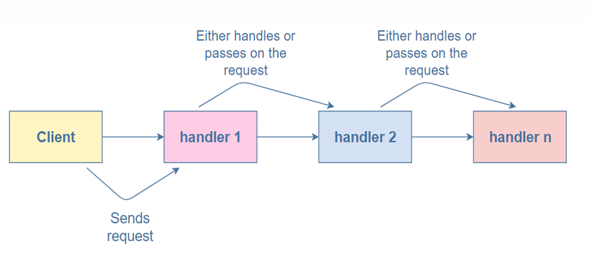
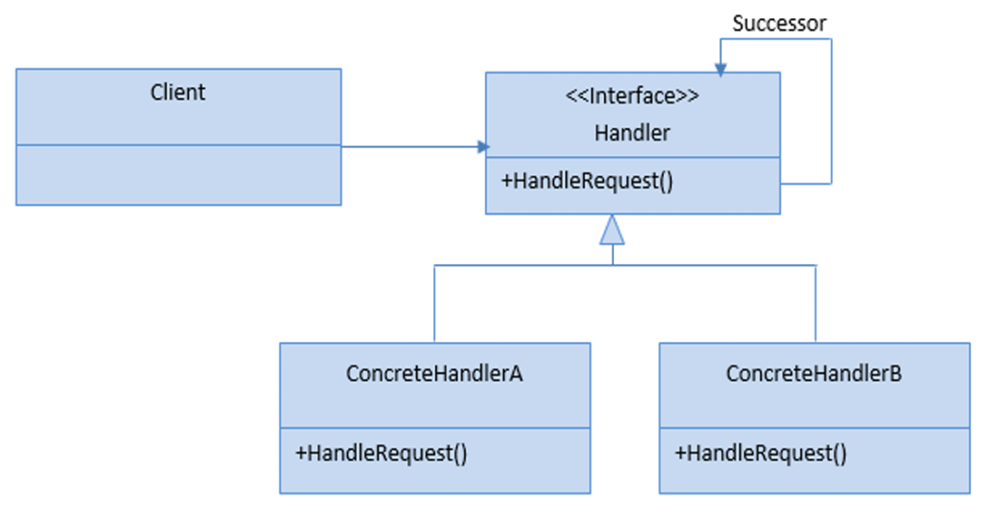
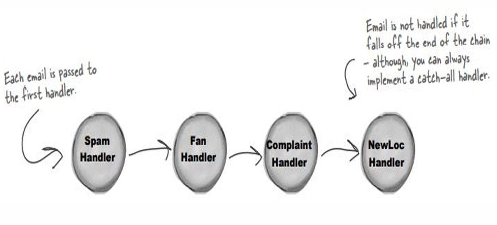
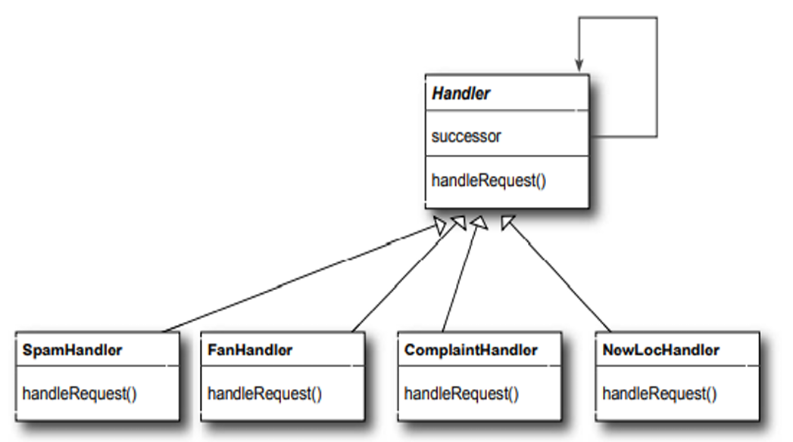

## Chain of Responsibility Pattern

- **Intent**: Pass a request along a chain of handlers. Each handler decides whether to process the request or pass it to the next handler in the chain.
- **Why**: Decouples the sender of a request from its receivers, allowing multiple objects to handle the request without the sender knowing which object will handle it.

---

## When to Use

- Multiple objects can handle a request, and the handler isn't known a priori.
- You want to issue a request to one of several objects without specifying the receiver explicitly.
- The set of handlers that can handle a request should be specified dynamically.
- You want to avoid coupling the sender to specific receivers.

---

## Structure (Roles)

- **`Handler`**: Defines an interface for handling requests and optionally implements the successor link.
- **`ConcreteHandler`**: Handles requests it's responsible for; can access its successor; forwards requests it can't handle.
- **`Client`**: Initiates the request to a `ConcreteHandler` object in the chain.

**Key idea**: Each handler has a reference to the next handler (successor). If a handler can't process the request, it passes it to the successor.

---

## Pattern Structure – Diagram Walkthrough

### 1. Basic flow – Client sends request through chain (`diagram1.png`)


- **Client** sends a request to the first handler in the chain.
- Each handler either **handles the request** or **passes it on** to the next handler.
- The request flows: Client → Handler 1 → Handler 2 → ... → Handler N.

### 2. UML structure – Handler interface with concrete handlers (`diagram2.png`)


- **`Handler`** interface defines `handleRequest()` method and a `successor` reference (self-referential association).
- **`ConcreteHandlerA`** and **`ConcreteHandlerB`** implement the `Handler` interface.
- Each concrete handler can forward requests to its successor if it cannot handle them.

### 3. Email handling example – Sequential processing (`diagram 3.png`)


- **Email processing chain**: Spam Handler → Fan Handler → Complaint Handler → NewLoc Handler.
- Each email is passed to the first handler and propagates through the chain until handled.
- If an email falls off the end of the chain, it's not handled (unless a catch-all handler is implemented).

### 4. Email handlers UML – Concrete implementations (`diagram4.png`)


- **`Handler`** abstract class with `handleRequest()` method and `successor` field.
- **Concrete handlers**: `SpamHandler`, `FanHandler`, `ComplaintHandler`, `NewLocHandler`.
- Each concrete handler implements `handleRequest()` to check if it can process the email type.

---

## Examples in this folder

- `ChainOfResponsibilityEmailDemo.java`: Email processing system where emails flow through Spam → Fan → Complaint → NewLoc handlers.
- `ChainOfResponsibilityApprovalDemo.java`: Purchase approval system where requests flow through approvers based on amount (TeamLead → Manager → Director → VP).

Compile & run from this directory:
```bash
javac ChainOfResponsibilityEmailDemo.java ChainOfResponsibilityApprovalDemo.java
java ChainOfResponsibilityEmailDemo
java ChainOfResponsibilityApprovalDemo
```

---

## Example 1 – Email handling system

**Request**: `Email` object with type (SPAM, FAN, COMPLAINT, NEW_LOC).

**Chain**: `SpamHandler` → `FanHandler` → `ComplaintHandler` → `NewLocHandler` → `CatchAllHandler`.

**How it works**:
- Each handler checks if the email type matches its responsibility.
- If yes, it processes the email and stops the chain.
- If no, it forwards to the next handler.
- If no handler processes it, the catch-all handler handles it.

**Benefits**:
- Add new email types by adding new handlers without modifying existing code.
- Change handler order by reordering the chain setup.
- Remove handlers by simply not including them in the chain.

---

## Example 2 – Purchase approval chain

**Request**: `PurchaseRequest` with amount, item, and requester.

**Chain**: `TeamLead` ($1,000 limit) → `Manager` ($5,000) → `Director` ($20,000) → `VP` ($100,000).

**How it works**:
- Each approver checks if the request amount is within their approval limit.
- If yes, they approve it and stop the chain.
- If no, they forward to the next approver with a higher limit.
- If no approver can handle it, the request is rejected.

**Benefits**:
- Automatic routing: requests automatically find the right approver.
- Easy to add new approval levels or change limits.
- Each approver only knows about the next approver (loose coupling).

---

## Benefits & Trade-offs

### Benefits

- ✅ **Decouples sender and receivers**: Client doesn't need to know which handler will process the request.
- ✅ **Simplifies object structure**: Each handler only knows about the next handler, not the entire chain.
- ✅ **Dynamic chain modification**: Add, remove, or reorder handlers at runtime.
- ✅ **Single Responsibility**: Each handler has one specific responsibility.
- ✅ **Open/Closed Principle**: Add new handlers without modifying existing code.

### Trade-offs

- ⚠️ **No guarantee of handling**: Request might not be handled if it falls off the end (unless catch-all handler exists).
- ⚠️ **Performance**: Request may pass through multiple handlers before being processed.
- ⚠️ **Debugging**: Can be harder to trace which handler processed a request in a long chain.

---

## Related Patterns

- **Command**: Chain of Responsibility can use Command pattern to represent requests as objects.
- **Composite**: Chain of Responsibility is often used with Composite, where a parent component can act as successor.
- **Decorator**: Decorator and Chain of Responsibility both rely on recursive composition, but Decorator adds responsibilities while Chain of Responsibility passes requests along.
- **Strategy**: Strategy chooses an algorithm at runtime; Chain of Responsibility finds which handler can process a request.

---

## Common Use Cases

1. **Event handling**: GUI events passed through widget hierarchy.
2. **Middleware**: HTTP request/response pipeline (authentication → logging → routing).
3. **Exception handling**: Exception propagation through catch blocks.
4. **Logging**: Different log levels handled by different handlers.
5. **Validation**: Input validation through multiple validators.
6. **Approval workflows**: Multi-level approval systems.

---

## Implementation Notes

### Setting up the chain

```java
Handler handler1 = new ConcreteHandler1();
Handler handler2 = new ConcreteHandler2();
Handler handler3 = new ConcreteHandler3();

// Build the chain
handler1.setSuccessor(handler2);
handler2.setSuccessor(handler3);

// Client sends request to first handler
handler1.handleRequest(request);
```

### Handler implementation pattern

```java
public void handleRequest(Request request) {
    if (canHandle(request)) {
        // Process the request
        process(request);
    } else if (successor != null) {
        // Forward to next handler
        successor.handleRequest(request);
    } else {
        // End of chain - handle or reject
        handleUnhandled(request);
    }
}
```

### Optional: Catch-all handler

Always end the chain with a catch-all handler to ensure every request is handled:

```java
Handler catchAll = new CatchAllHandler();
// ... set up chain ...
lastHandler.setSuccessor(catchAll);
```

---

**Further reading**: See the demos for complete working examples:
- [ChainOfResponsibilityEmailDemo.java](ChainOfResponsibilityEmailDemo.java)
- [ChainOfResponsibilityApprovalDemo.java](ChainOfResponsibilityApprovalDemo.java)

