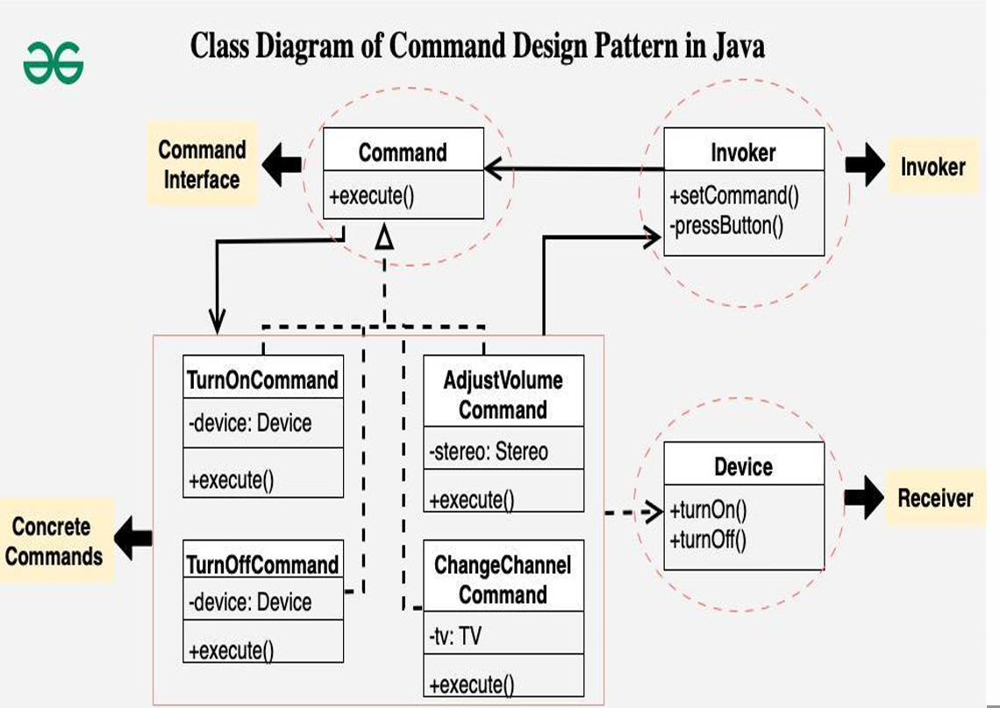
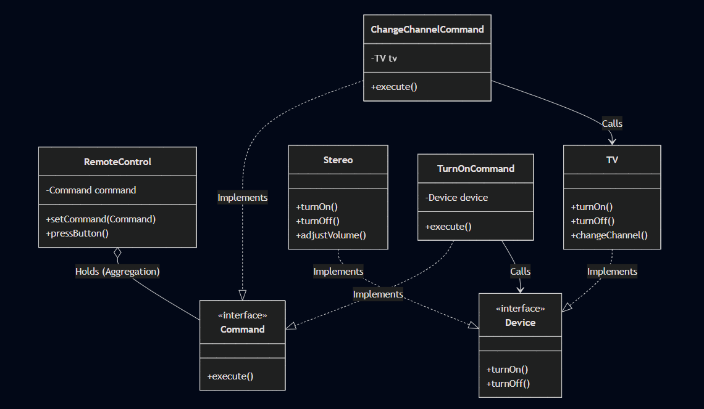

## Command Pattern

- **Intent**: Encapsulate a request under an object as a command and pass it to invoker object. Invoker object looks for the appropriate object which can handle this command and pass the command to the corresponding object and that object executes the command.
- **Also Known As**: Action or Transaction
- **When to use**: When you need to parameterize objects with operations, queue operations, log requests, or support undo/redo functionality.

---

## Pattern Structure

The following diagrams illustrate the Command pattern structure:

### Diagram 1: General Command Pattern Structure



This diagram shows the general structure of the Command pattern with multiple concrete commands and receivers.

### Diagram 2: Command Pattern Implementation



This diagram illustrates the Command pattern structure as implemented in `CommandPatternDemo.java`, showing the specific classes and relationships used in the example.

**Diagram Components:**

1. **`Command` Interface** (`<<Interface>>`)
   - Defines the contract for all command objects
   - Method: `+execute(): void` - Executes the command
   - Serves as the base interface that all concrete commands implement

2. **`RemoteControl` Class** (Invoker)
   - Holds a reference to a `Command` object
   - Attributes:
     - `-command: Command` (private) - The command currently set in the remote
   - Methods:
     - `+setCommand(Command): void` - Sets the command to be executed
     - `+pressButton(): void` - Triggers the command execution
   - Responsible for invoking the command without knowing the concrete command or receiver

3. **Concrete Commands** (Implement `Command` interface):
   - **`TurnOnCommand`**: Encapsulates turning a device on
     - Attribute: `-device: Device` (private) - Reference to the receiver
     - Method: `+execute(): void` - Calls `device.turnOn()`
   - **`ChangeChannelCommand`**: Encapsulates changing TV channel
     - Attribute: `-tv: TV` (private) - Reference to the TV receiver
     - Method: `+execute(): void` - Calls `tv.changeChannel()`

4. **`Device` Interface** (`<<Interface>>`) (Receiver)
   - Defines the common interface for all devices that can receive commands
   - Methods:
     - `+turnOn(): void` - Turns the device on
     - `+turnOff(): void` - Turns the device off
   - Represents the object that performs the actual work

5. **Concrete Receivers**:
   - **`TV` Class**: Implements `Device` interface
     - Methods: `+turnOn(): void`, `+turnOff(): void`, `+changeChannel(): void`
   - **`Stereo` Class**: Implements `Device` interface
     - Methods: `+turnOn(): void`, `+turnOff(): void`, `+adjustVolume(): void`

**Key Relationships:**
- `RemoteControl` **holds** a reference to `Command` (aggregation - white diamond)
- All concrete commands **implement** `Command` interface (realization - dashed line with triangle)
- `TV` and `Stereo` **implement** `Device` interface (realization - dashed line with triangle)
- `TurnOnCommand` **calls** `Device` interface (dependency - solid line with arrow)
- `ChangeChannelCommand` **calls** `TV` class (dependency - solid line with arrow)

**Pattern Flow:**
1. Client creates a concrete command (e.g., `TurnOnCommand`) with a receiver (e.g., `TV` or `Stereo`)
2. Client sets the command in the `RemoteControl` using `setCommand()`
3. Client triggers execution by calling `pressButton()` on `RemoteControl`
4. `RemoteControl` calls `execute()` on the command
5. Command calls the appropriate method on the receiver (e.g., `device.turnOn()` or `tv.changeChannel()`)

This structure decouples the object that invokes the operation (`RemoteControl`) from the object that performs it (`TV`, `Stereo`), allowing for flexible command queuing, logging, and undo/redo functionality.

---

## Command Pattern Example

### Scenario: Smart Home Remote Control System

Imagine you are tasked with designing a remote control system for various electronic devices in a smart home. The devices include a TV, a stereo, and potentially other appliances. The goal is to create a flexible remote control that can handle different types of commands for each device, such as turning devices on/off, adjusting settings, or changing channels.

**Requirements:**
- Remote control should work with any device
- Commands should be reusable and configurable
- Support for different command types (on/off, adjust volume, change channel)
- Easy to add new devices and commands

---

## Implementation

### Command Interface

```java
// Command interface
public interface Command {
    void execute();
}
```

### Concrete Commands

```java
// Concrete command for turning a device on
public class TurnOnCommand implements Command {
    private Device device;
    
    public TurnOnCommand(Device device) {
        this.device = device;
    }
    
    @Override
    public void execute() {
        device.turnOn();
    }
}

// Concrete command for turning a device off
public class TurnOffCommand implements Command {
    private Device device;
    
    public TurnOffCommand(Device device) {
        this.device = device;
    }
    
    @Override
    public void execute() {
        device.turnOff();
    }
}

// Concrete command for changing the channel of a TV
public class ChangeChannelCommand implements Command {
    private TV tv;
    
    public ChangeChannelCommand(TV tv) {
        this.tv = tv;
    }
    
    @Override
    public void execute() {
        tv.changeChannel();
    }
}

// Concrete command for adjusting volume of a stereo
public class AdjustVolumeCommand implements Command {
    private Stereo stereo;
    
    public AdjustVolumeCommand(Stereo stereo) {
        this.stereo = stereo;
    }
    
    @Override
    public void execute() {
        stereo.adjustVolume();
    }
}
```

### Receiver Interface and Classes

```java
// Receiver interface
public interface Device {
    void turnOn();
    void turnOff();
}

// Concrete receiver for a TV
public class TV implements Device {
    @Override
    public void turnOn() {
        System.out.println("TV is now on");
    }
    
    @Override
    public void turnOff() {
        System.out.println("TV is now off");
    }
    
    public void changeChannel() {
        System.out.println("Channel changed");
    }
}

// Concrete receiver for a stereo
public class Stereo implements Device {
    @Override
    public void turnOn() {
        System.out.println("Stereo is now on");
    }
    
    @Override
    public void turnOff() {
        System.out.println("Stereo is now off");
    }
    
    public void adjustVolume() {
        System.out.println("Volume adjusted");
    }
}
```

### Invoker Class

```java
// Invoker class
public class RemoteControl {
    private Command command;
    
    public void setCommand(Command command) {
        this.command = command;
    }
    
    public void pressButton() {
        if (command != null) {
            command.execute();
        }
    }
}
```

### Client Usage

```java
// Client code
public class CommandPatternDemo {
    public static void main(String[] args) {
        // Create receivers
        TV tv = new TV();
        Stereo stereo = new Stereo();
        
        // Create commands
        Command turnOnTV = new TurnOnCommand(tv);
        Command turnOffTV = new TurnOffCommand(tv);
        Command changeChannel = new ChangeChannelCommand(tv);
        Command adjustVolume = new AdjustVolumeCommand(stereo);
        
        // Create invoker
        RemoteControl remote = new RemoteControl();
        
        // Set and execute commands
        remote.setCommand(turnOnTV);
        remote.pressButton();  // Output: TV is now on
        
        remote.setCommand(changeChannel);
        remote.pressButton();  // Output: Channel changed
        
        remote.setCommand(adjustVolume);
        remote.pressButton();  // Output: Volume adjusted
        
        remote.setCommand(turnOffTV);
        remote.pressButton();  // Output: TV is now off
    }
}
```

---

## Why Use the Command Pattern?

### The Problem: Tight Coupling

Without the Command pattern, the invoker (remote control) would be tightly coupled to specific receivers (devices):

```java
// Problem: Tight coupling
class RemoteControl {
    private TV tv;
    private Stereo stereo;
    
    void pressTVButton() {
        tv.turnOn();  // Directly calls TV method
    }
    
    void pressStereoButton() {
        stereo.turnOn();  // Directly calls Stereo method
    }
}
```

**Problems:**
- ❌ **Tight coupling**: Remote control knows about all devices
- ❌ **Hard to extend**: Adding new devices requires modifying remote control
- ❌ **No flexibility**: Can't queue, log, or undo commands
- ❌ **Violates Open/Closed**: Must modify remote control for new commands

### The Solution: Command Pattern

The Command pattern solves these problems by:
- ✅ **Decoupling**: Invoker doesn't know about receivers
- ✅ **Flexibility**: Commands can be queued, logged, or undone
- ✅ **Extensibility**: Easy to add new commands without modifying invoker
- ✅ **Reusability**: Commands can be reused and combined

---

## Pattern Participants

1. **Command** (Interface)
   - Declares an interface for executing an operation
   - Example: `Command` interface with `execute()` method

2. **ConcreteCommand** (Classes)
   - Implements the `Command` interface
   - Binds a receiver to an action
   - Example: `TurnOnCommand`, `TurnOffCommand`, `ChangeChannelCommand`

3. **Invoker** (Class)
   - Asks the command to carry out the request
   - Doesn't know about concrete commands or receivers
   - Example: `RemoteControl` class

4. **Receiver** (Classes)
   - Knows how to perform the operations associated with carrying out a request
   - Example: `TV`, `Stereo` classes

5. **Client** (Class)
   - Creates a `ConcreteCommand` object and sets its receiver
   - Example: `CommandPatternDemo` class

---

## Pros

- ✅ **Decoupling**: Separates object that invokes operation from object that performs it
- ✅ **Flexibility**: Commands can be queued, logged, or scheduled
- ✅ **Undo/Redo**: Easy to implement undo functionality by storing command history
- ✅ **Macro Commands**: Can combine multiple commands into one
- ✅ **Extensibility**: Easy to add new commands without modifying existing code
- ✅ **Open/Closed Principle**: Open for extension (new commands), closed for modification

---

## Cons

- ❌ **Increased complexity**: More classes and indirection
- ❌ **Memory overhead**: Each command is an object (can be significant for many commands)
- ⚠️ **Overkill for simple operations**: May be unnecessary for simple method calls

---

## When to Use Command Pattern

### ✅ Use Command Pattern When:
- You need to **parameterize objects** with operations
- You need to **queue operations**, schedule them, or execute them remotely
- You need to **support undo/redo** functionality
- You need to **log operations** for auditing or debugging
- You need to **support macro commands** (combining multiple commands)
- You need to **decouple invoker from receiver**

### ❌ Don't Use Command Pattern When:
- **Simple operations**: Direct method calls are sufficient
- **Performance critical**: Object creation overhead is too high
- **No need for flexibility**: Operations are fixed and don't need queuing/undo

---

## Advanced Features

### Undo/Redo Support

```java
public interface Command {
    void execute();
    void undo();  // Add undo support
}

public class TurnOnCommand implements Command {
    private Device device;
    
    public TurnOnCommand(Device device) {
        this.device = device;
    }
    
    @Override
    public void execute() {
        device.turnOn();
    }
    
    @Override
    public void undo() {
        device.turnOff();
    }
}
```

### Macro Commands (Composite Commands)

```java
public class MacroCommand implements Command {
    private List<Command> commands;
    
    public MacroCommand(List<Command> commands) {
        this.commands = commands;
    }
    
    @Override
    public void execute() {
        for (Command command : commands) {
            command.execute();
        }
    }
}

// Usage: Combine multiple commands
List<Command> partyMode = Arrays.asList(
    new TurnOnCommand(tv),
    new TurnOnCommand(stereo),
    new AdjustVolumeCommand(stereo)
);
Command macro = new MacroCommand(partyMode);
remote.setCommand(macro);
remote.pressButton();  // Executes all commands
```

### Command Queue

```java
public class CommandQueue {
    private Queue<Command> queue = new LinkedList<>();
    
    public void addCommand(Command command) {
        queue.offer(command);
    }
    
    public void processCommands() {
        while (!queue.isEmpty()) {
            Command command = queue.poll();
            command.execute();
        }
    }
}
```

---

## Real-World Examples

### GUI Applications
- **Menu items**: Each menu item is a command that executes when clicked
- **Button actions**: Buttons execute commands when pressed
- **Keyboard shortcuts**: Key combinations trigger commands

### Transaction Systems
- **Database transactions**: Each transaction is a command that can be committed or rolled back
- **Payment processing**: Payment operations are commands that can be logged and reversed

### Remote Control Systems
- **Home automation**: Smart home devices controlled via commands
- **Robotics**: Robot actions are commands that can be queued and executed

---

## Compare with Other Patterns

- **vs Strategy**: Strategy encapsulates algorithms; Command encapsulates requests/operations
- **vs Memento**: Memento stores state for undo; Command stores operations for undo
- **vs Chain of Responsibility**: Chain passes requests along a chain; Command encapsulates requests
- **vs Observer**: Observer notifies multiple observers; Command encapsulates a single operation

---

## Best Practices

1. **Keep commands simple**: Each command should do one thing
2. **Use interfaces**: Define command interface clearly
3. **Support undo**: Add `undo()` method if undo functionality is needed
4. **Document receivers**: Clearly document which receivers each command works with
5. **Consider performance**: Be aware of object creation overhead for many commands

---

## Notes

- ⚠️ **Command objects are first-class objects**: They can be stored, passed, and manipulated
- ⚠️ **Commands can be parameterized**: Commands can take parameters in constructor
- ⚠️ **Commands can be combined**: Use composite pattern for macro commands
- ⚠️ **Consider memory**: Each command is an object; use object pooling if needed for many commands

