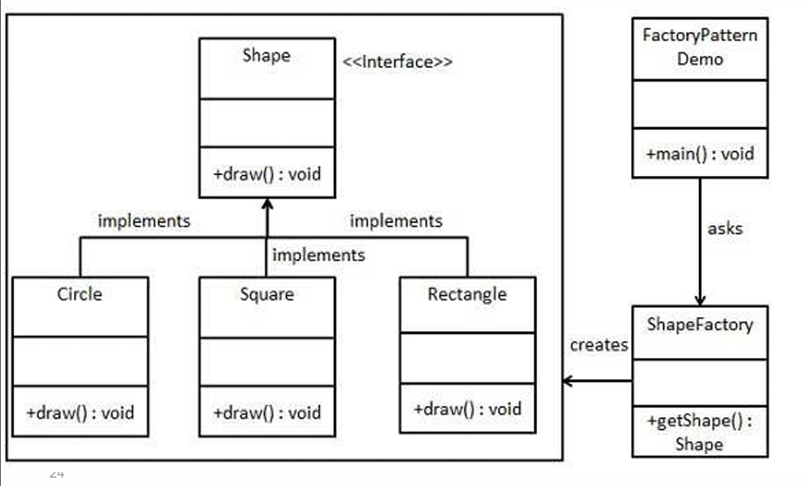

## Factory Patterns

This folder contains examples of three related creational design patterns: **Simple Factory**, **Factory Method**, and **Abstract Factory**. These patterns progressively increase in complexity and flexibility.

---

## Table of Contents

- [Pattern Structure](#pattern-structure)
- [File Overview](#file-overview)
- [Simple Factory](#simple-factory)
- [Factory Method](#factory-method)
- [Abstract Factory](#abstract-factory)
- [Pattern Comparison](#pattern-comparison)
- [When to Use Which Pattern](#when-to-use-which-pattern)
- [Compare with Other Patterns](#compare-with-other-patterns)
- [Code Examples Summary](#code-examples-summary)

---

## Pattern Structure

The following diagram illustrates the Simple Factory pattern structure:



**Diagram Components:**

1. **`Shape` Interface** (`<<Interface>>`)
   - Defines the common contract for all shapes
   - Method: `+draw(): void`
   - Serves as the product interface that all concrete shapes implement

2. **Concrete Shape Classes:**
   - **`Circle` Class**: Implements `Shape` interface, provides `+draw(): void` method
   - **`Square` Class**: Implements `Shape` interface, provides `+draw(): void` method
   - **`Rectangle` Class**: Implements `Shape` interface, provides `+draw(): void` method
   - All three classes are concrete implementations of the `Shape` interface

3. **`ShapeFactory` Class** (Factory)
   - Encapsulates the object creation logic
   - Method: `+getShape(): Shape` - Creates and returns `Shape` objects based on input
   - Responsible for instantiating the appropriate concrete shape class
   - Hides the concrete class instantiation from the client

4. **`FactoryPatternDemo` Class** (Client)
   - Uses the `ShapeFactory` to obtain `Shape` objects
   - Method: `+main(): void` - Entry point for the application
   - Depends on `ShapeFactory` to create shapes (relationship: "asks")
   - Does not need to know about concrete shape classes (`Circle`, `Square`, `Rectangle`)

**Key Relationships:**
- `Circle`, `Square`, and `Rectangle` **implement** `Shape` interface (realization)
- `ShapeFactory` **creates** `Shape` objects (dependency/creation)
- `FactoryPatternDemo` **uses** `ShapeFactory` to obtain shapes (dependency: "asks")
- Client depends on factory, factory depends on concrete products

**Pattern Flow:**
1. Client (`FactoryPatternDemo`) requests a shape from `ShapeFactory`
2. `ShapeFactory` decides which concrete shape class to instantiate based on input
3. Factory creates and returns the appropriate `Shape` object
4. Client uses the shape through the `Shape` interface without knowing the concrete class

This structure encapsulates object creation logic in the factory, allowing clients to create objects without knowing their concrete classes, following the Simple Factory pattern.

---

## File Overview

| File | Pattern | Example Domain | Key Concept |
|------|---------|----------------|-------------|
| `SimpleFactoryDemo.java` | Simple Factory | Notification system (Email/SMS) | Single factory class with parameterized method |
| `ShapeFactoryDemo.java` | Simple Factory | Shape system (Circle/Rectangle/Square) | Classic factory example with shape creation |
| `FactoryMethodDemo.java` | Factory Method | Dialog system (Windows/Mac buttons) | Abstract creator with factory method in subclasses |
| `AbstractFactoryDemo.java` | Abstract Factory | GUI widgets (Button + Checkbox families) | Factory interface creating multiple related products |

---

## Simple Factory

- **Intent**: Encapsulate object creation in a single factory class with a parameterized method that returns different product types based on input.
- **When to use**: When you have a small, fixed set of product types and want to centralize creation logic without the complexity of inheritance hierarchies.
- **Example**: `SimpleFactoryDemo.java` - Notification system where users can choose Email or SMS notifications.

### Structure
```java
class SimpleFactory {
    Product createProduct(String type) {
        if (type.equals("TypeA")) return new ProductA();
        if (type.equals("TypeB")) return new ProductB();
        throw new IllegalArgumentException();
    }
}
```

### Example Code
```java
class NotificationFactory {
    Notification createNotification(String type, String message) {
        if (type.equals("Email")) return new EmailNotification(message);
        if (type.equals("SMS")) return new SMSNotification(message);
        throw new IllegalArgumentException();
    }
}

class User {
    void placeOrder() {
        Notification n = factory.createNotification(notificationType, "Order Placed");
        n.encryptMessage();
        n.send();
    }
}
```

### Pros
- Simple and straightforward
- Centralizes creation logic
- Easy to understand and implement

### Cons
- Violates Open/Closed Principle (must modify factory to add new types)
- Uses conditional logic (if/else or switch)
- Not extensible without changing factory code

---

## Factory Method

- **Intent**: Define an interface for creating an object, but let subclasses decide which class to instantiate. Factory Method lets a class defer instantiation to subclasses.
- **When to use**: When you have a class that can't anticipate the class of objects it must create, or when you want to localize knowledge of which subclass gets created.
- **Example**: `FactoryMethodDemo.java` - Dialog system where WindowsDialog and MacDialog create platform-specific buttons.

### Structure
```java
abstract class Creator {
    abstract Product createProduct();  // Factory method
    
    void operation() {
        Product p = createProduct();  // Uses factory method
        p.use();
    }
}

class ConcreteCreator extends Creator {
    Product createProduct() { return new ConcreteProduct(); }
}
```

### Example Code
```java
abstract class Dialog {
    abstract Button createButton();  // Factory method
    
    void render() {
        Button btn = createButton();
        btn.paint();
    }
}

class WindowsDialog extends Dialog {
    Button createButton() { return new WindowsButton(); }
}

class MacDialog extends Dialog {
    Button createButton() { return new MacButton(); }
}
```

### Pros
- Eliminates the need to bind application-specific classes into your code
- Provides hooks for subclasses to extend functionality
- Connects parallel class hierarchies
- Follows Open/Closed Principle (extend via new subclasses)

### Cons
- Requires subclassing just to create a particular product
- Can make code more complex with many creator subclasses

---

## Abstract Factory

- **Intent**: Provide an interface for creating families of related or dependent objects without specifying their concrete classes.
- **When to use**: The system must be configured with one of multiple families (e.g., Windows/Mac UI), and you must enforce consistency across the family.
- **Example**: `AbstractFactoryDemo.java` - GUI system where factories create complete families of widgets (Button + Checkbox) that must be from the same OS theme.

### Structure
```java
interface AbstractFactory {
    ProductA createProductA();
    ProductB createProductB();
}

class ConcreteFactory1 implements AbstractFactory {
    ProductA createProductA() { return new ProductA1(); }
    ProductB createProductB() { return new ProductB1(); }
}
```

### Example Code
```java
interface GUIFactory { 
    Button createButton(); 
    Checkbox createCheckbox(); 
}

class MacFactory implements GUIFactory { 
    Button createButton() { return new MacButton(); }
    Checkbox createCheckbox() { return new MacCheckbox(); }
}

class WindowsFactory implements GUIFactory { 
    Button createButton() { return new WindowsButton(); }
    Checkbox createCheckbox() { return new WindowsCheckbox(); }
}

class Application {
    Application(GUIFactory factory) {
        button = factory.createButton();      // All from same family
        checkbox = factory.createCheckbox();  // Ensures consistency
    }
}
```

### Pros
- Enforces consistent families; easy to swap families
- Isolates creation logic; testable via factory doubles
- Prevents mixing incompatible products from different families
- Follows Open/Closed Principle

### Cons
- More indirection; adding new product types requires updating all factories
- Can be overkill if you only need to create one type of product

### OCP note
- Prefer registering factories (or suppliers) in a map to extend without modifying creation logic.

---

## Pattern Comparison

### Quick Reference Table

| Aspect | Simple Factory | Factory Method | Abstract Factory |
|--------|---------------|----------------|------------------|
| **Complexity** | Simplest | Medium | Most complex |
| **Structure** | Single factory class | Abstract creator + subclasses | Factory interface + implementations |
| **Creation Method** | Parameterized method (if/else) | Abstract method in subclasses | Multiple methods in interface |
| **Extensibility** | Must modify factory | Add new creator subclass | Add new factory implementation |
| **OCP Compliance** | ❌ Violates (modify to extend) | ✅ Follows (extend via subclass) | ✅ Follows (extend via implementation) |
| **DIP Compliance** | ⚠️ Partial (depends on concrete products) | ✅ Follows (depends on abstractions) | ✅ Follows (depends on abstractions) |
| **Number of Products** | One product type | One product type | Multiple related products |
| **Product Families** | No | No | Yes (ensures consistency) |
| **Use Case** | Fixed set of types | One product with variants | Multiple related products |
| **Example** | Notification (Email/SMS) | Dialog (Windows/Mac buttons) | GUI (Button + Checkbox families) |
| **When to Use** | Small, fixed product set | One product, multiple creators | Product families requiring consistency |
| **Code Modification** | Modify factory class | No modification (add subclass) | No modification (add implementation) |
| **Inheritance Required** | No | Yes (creator hierarchy) | No (interface implementation) |
| **Conditional Logic** | Yes (if/else or switch) | No | No |

### Detailed Comparison

#### 1. Simple Factory vs Factory Method

**Key Differences:**

| Aspect | Simple Factory | Factory Method |
|--------|---------------|----------------|
| **Structure** | One concrete factory class | Abstract creator + concrete creator subclasses |
| **Creation Logic** | Conditional (if/else or switch) | Polymorphic (each subclass creates its own) |
| **Adding New Types** | ❌ Modify factory class | ✅ Create new creator subclass |
| **OCP Compliance** | ❌ Violates | ✅ Follows |
| **Code Example** | `if (type.equals("A")) return new A();` | `abstract Product createProduct();` |

**Code Comparison:**

```java
// ❌ Simple Factory - Violates OCP
class SimpleFactory {
    Product createProduct(String type) {
        if (type.equals("A")) return new ProductA();
        if (type.equals("B")) return new ProductB();
        // Adding ProductC requires MODIFYING this method!
        throw new IllegalArgumentException();
    }
}

// ✅ Factory Method - Follows OCP
abstract class Creator {
    abstract Product createProduct();  // Factory method
    
    void operation() {
        Product p = createProduct();
        p.use();
    }
}

class ConcreteCreatorA extends Creator {
    Product createProduct() { return new ProductA(); }
}

class ConcreteCreatorB extends Creator {
    Product createProduct() { return new ProductB(); }
}

// Adding ProductC: Just create ConcreteCreatorC - NO MODIFICATION!
class ConcreteCreatorC extends Creator {
    Product createProduct() { return new ProductC(); }
}
```

**When to Choose:**
- **Simple Factory**: Use when you have a small, fixed set of types that won't change often
- **Factory Method**: Use when you need extensibility and want to follow OCP

---

#### 2. Factory Method vs Abstract Factory

**Key Differences:**

| Aspect | Factory Method | Abstract Factory |
|--------|----------------|------------------|
| **Products Created** | One product type | Multiple related products (family) |
| **Factory Method Count** | One method | Multiple methods (one per product type) |
| **Purpose** | Defer creation to subclasses | Create families of related objects |
| **Consistency** | Not enforced | Enforced (all products from same family) |
| **Example** | Button (Windows/Mac variants) | Button + Checkbox (both Windows or both Mac) |

**Code Comparison:**

```java
// Factory Method - Creates ONE product type
abstract class Dialog {
    abstract Button createButton();  // Single factory method
    
    void render() {
        Button btn = createButton();
        btn.paint();
    }
}

class WindowsDialog extends Dialog {
    Button createButton() { return new WindowsButton(); }
}

class MacDialog extends Dialog {
    Button createButton() { return new MacButton(); }
}

// Abstract Factory - Creates MULTIPLE related products
interface GUIFactory {
    Button createButton();      // Method 1
    Checkbox createCheckbox();  // Method 2
    // Can have more methods for more product types
}

class WindowsFactory implements GUIFactory {
    Button createButton() { return new WindowsButton(); }
    Checkbox createCheckbox() { return new WindowsCheckbox(); }
    // Ensures Button and Checkbox are both Windows style
}

class MacFactory implements GUIFactory {
    Button createButton() { return new MacButton(); }
    Checkbox createCheckbox() { return new MacCheckbox(); }
    // Ensures Button and Checkbox are both Mac style
}

class Application {
    Application(GUIFactory factory) {
        button = factory.createButton();      // From factory
        checkbox = factory.createCheckbox();   // From same factory
        // Both guaranteed to be from same family!
    }
}
```

**When to Choose:**
- **Factory Method**: Use when you need to create one product type with variants
- **Abstract Factory**: Use when you need multiple related products that must work together

---

#### 3. Simple Factory vs Abstract Factory

**Key Differences:**

| Aspect | Simple Factory | Abstract Factory |
|--------|---------------|------------------|
| **Complexity** | Simplest | Most complex |
| **Products** | One product type | Multiple related products |
| **Structure** | Single class | Interface + implementations |
| **Extensibility** | Low (modify to extend) | High (implement interface) |
| **Consistency** | Not enforced | Enforced across product family |

**Code Comparison:**

```java
// Simple Factory - One product, parameterized
class NotificationFactory {
    Notification createNotification(String type) {
        if (type.equals("Email")) return new EmailNotification();
        if (type.equals("SMS")) return new SMSNotification();
        throw new IllegalArgumentException();
    }
}

// Abstract Factory - Multiple products, family consistency
interface NotificationFactory {
    EmailService createEmailService();
    SMSService createSMSService();
    PushService createPushService();
}

class EnterpriseFactory implements NotificationFactory {
    EmailService createEmailService() { return new EnterpriseEmail(); }
    SMSService createSMSService() { return new EnterpriseSMS(); }
    PushService createPushService() { return new EnterprisePush(); }
    // All services from same enterprise provider
}

class StartupFactory implements NotificationFactory {
    EmailService createEmailService() { return new StartupEmail(); }
    SMSService createSMSService() { return new StartupSMS(); }
    PushService createPushService() { return new StartupPush(); }
    // All services from same startup provider
}
```

**When to Choose:**
- **Simple Factory**: Use for simple, single-product creation with few types
- **Abstract Factory**: Use when you need multiple related products with consistency guarantees

---

### Side-by-Side Code Example

Here's the same problem solved with all three patterns:

**Problem**: Create UI components for different operating systems.

```java
// ========== SIMPLE FACTORY ==========
class ButtonFactory {
    Button createButton(String os) {
        if (os.equals("Windows")) return new WindowsButton();
        if (os.equals("Mac")) return new MacButton();
        throw new IllegalArgumentException();
    }
}

// Usage
ButtonFactory factory = new ButtonFactory();
Button btn = factory.createButton("Windows");

// ❌ Problem: Adding Linux requires modifying factory
// ❌ Problem: Can't ensure Button and Checkbox match


// ========== FACTORY METHOD ==========
abstract class Dialog {
    abstract Button createButton();
    
    void render() {
        Button btn = createButton();
        btn.paint();
    }
}

class WindowsDialog extends Dialog {
    Button createButton() { return new WindowsButton(); }
}

class MacDialog extends Dialog {
    Button createButton() { return new MacButton(); }
}

// Usage
Dialog dialog = new WindowsDialog();
dialog.render();

// ✅ Can add LinuxDialog without modification
// ❌ Still can't ensure Button and Checkbox match


// ========== ABSTRACT FACTORY ==========
interface GUIFactory {
    Button createButton();
    Checkbox createCheckbox();
}

class WindowsFactory implements GUIFactory {
    Button createButton() { return new WindowsButton(); }
    Checkbox createCheckbox() { return new WindowsCheckbox(); }
}

class MacFactory implements GUIFactory {
    Button createButton() { return new MacButton(); }
    Checkbox createCheckbox() { return new MacCheckbox(); }
}

class Application {
    private Button button;
    private Checkbox checkbox;
    
    Application(GUIFactory factory) {
        button = factory.createButton();      // Windows
        checkbox = factory.createCheckbox(); // Windows (guaranteed match!)
    }
}

// Usage
GUIFactory factory = new WindowsFactory();
Application app = new Application(factory);
// ✅ Both button and checkbox are Windows style
// ✅ Can add LinuxFactory without modification
// ✅ Consistency guaranteed
```

---

### Decision Tree

```
Do you need to create products?
│
├─ Is it a fixed, small set of types? (2-5 types)
│  └─ YES → Use Simple Factory
│
├─ Do you need ONE product type with variants?
│  └─ YES → Use Factory Method
│     │
│     └─ Do you need extensibility without modification?
│        └─ YES → Factory Method (follows OCP)
│
└─ Do you need MULTIPLE related products?
   └─ YES → Use Abstract Factory
      │
      └─ Do products need to be from the same family?
         └─ YES → Abstract Factory (ensures consistency)
```

---

### Summary of Key Differences

1. **Simple Factory**
   - Simplest pattern
   - Single factory class with parameterized method
   - Uses conditional logic (if/else)
   - ❌ Violates OCP (must modify to extend)
   - ✅ Good for small, fixed sets

2. **Factory Method**
   - Medium complexity
   - Abstract creator with factory method in subclasses
   - Uses inheritance and polymorphism
   - ✅ Follows OCP (extend via subclass)
   - ✅ Good for one product with variants

3. **Abstract Factory**
   - Most complex pattern
   - Factory interface with multiple methods
   - Creates families of related products
   - ✅ Follows OCP (extend via implementation)
   - ✅ Ensures consistency across product family
   - ✅ Good for multiple related products

### Evolution Path

The three factory patterns represent an evolution from simple to complex, each solving progressively more sophisticated problems:

```
Simple Factory → Factory Method → Abstract Factory
     ↓                ↓                  ↓
  Parameter      Inheritance      Interface
  if/else        Subclasses       Implementations
  Single Class   Creator Hierarchy Factory Interface
```

**Progression:**

1. **Simple Factory** (Start Here)
   - **When**: You have a small, fixed set of product types
   - **Approach**: Single factory class with conditional logic
   - **Trade-off**: Simple but violates OCP
   - **Next Step**: Move to Factory Method when you need extensibility

2. **Factory Method** (Extensibility)
   - **When**: You need one product type with variants, and extensibility
   - **Approach**: Abstract creator with factory method in subclasses
   - **Trade-off**: More complex but follows OCP
   - **Next Step**: Move to Abstract Factory when you need product families

3. **Abstract Factory** (Product Families)
   - **When**: You need multiple related products that must work together
   - **Approach**: Factory interface with multiple creation methods
   - **Trade-off**: Most complex but ensures consistency
   - **Use Case**: Complete systems requiring family consistency

**Migration Example:**

```java
// Stage 1: Simple Factory
class ButtonFactory {
    Button create(String os) {
        if (os.equals("Windows")) return new WindowsButton();
        if (os.equals("Mac")) return new MacButton();
        return null;
    }
}

// Stage 2: Factory Method (when you need extensibility)
abstract class Dialog {
    abstract Button createButton();
    void render() {
        Button btn = createButton();
        btn.paint();
    }
}
class WindowsDialog extends Dialog {
    Button createButton() { return new WindowsButton(); }
}

// Stage 3: Abstract Factory (when you need product families)
interface GUIFactory {
    Button createButton();
    Checkbox createCheckbox();
}
class WindowsFactory implements GUIFactory {
    Button createButton() { return new WindowsButton(); }
    Checkbox createCheckbox() { return new WindowsCheckbox(); }
}
```

**Key Insight**: Each pattern builds on the previous one, solving more complex problems while maintaining good design principles.

---

## When to Use Which Pattern

### Use Simple Factory when:
- You have a small, fixed set of product types (2-5 types)
- Creation logic is straightforward
- You don't need extensibility
- Example: Notification types (Email, SMS, Push)

### Use Factory Method when:
- You have one product type with multiple variants
- You want extensibility without modifying existing code
- You need to defer instantiation to subclasses
- Example: Different dialog types creating different buttons

### Use Abstract Factory when:
- You need multiple related products that must work together
- You need to ensure consistency across a product family
- You want to swap entire families at runtime
- Example: Complete GUI theme (all widgets from same OS)

---

## Compare with Other Patterns

- **vs Builder**: Builder assembles one complex object step-by-step; Factory patterns create new instances. Simple Factory creates one product; Abstract Factory creates multiple related products.
- **vs Prototype**: Prototype copies an existing configured instance; Factory patterns create new instances from scratch.
- **vs Singleton**: Singleton ensures one instance; Factory patterns create multiple instances of different types.

---

## Code Examples Summary

### SimpleFactoryDemo.java
- **Domain**: Notification system
- **Products**: EmailNotification, SMSNotification
- **Factory**: NotificationFactory (single class with parameterized method)
- **Client**: User class that uses factory to send notifications
- **Key Point**: Centralized creation with simple conditional logic
- **Use Case**: Users can choose notification type (Email/SMS) for order updates

### ShapeFactoryDemo.java
- **Domain**: Shape drawing system
- **Products**: Circle, Rectangle, Square
- **Factory**: ShapeFactory (single class with getShape method)
- **Client**: Direct factory usage in demo class
- **Key Point**: Classic Simple Factory example - factory creates shapes based on string input
- **Use Case**: Creating different shapes without knowing their concrete classes
- **Note**: This is the most common textbook example of Simple Factory pattern

### FactoryMethodDemo.java
- **Domain**: Dialog system
- **Products**: WindowsButton, MacButton
- **Creators**: Dialog (abstract), WindowsDialog, MacDialog
- **Key Point**: Subclasses decide which button to create
- **Use Case**: Platform-specific dialog rendering

### AbstractFactoryDemo.java
- **Domain**: GUI widget system
- **Products**: Button + Checkbox (families)
- **Factories**: GUIFactory (interface), WindowsFactory, MacFactory
- **Key Point**: Ensures Button and Checkbox come from same OS family
- **Use Case**: Complete GUI theme consistency (all widgets from same OS)
