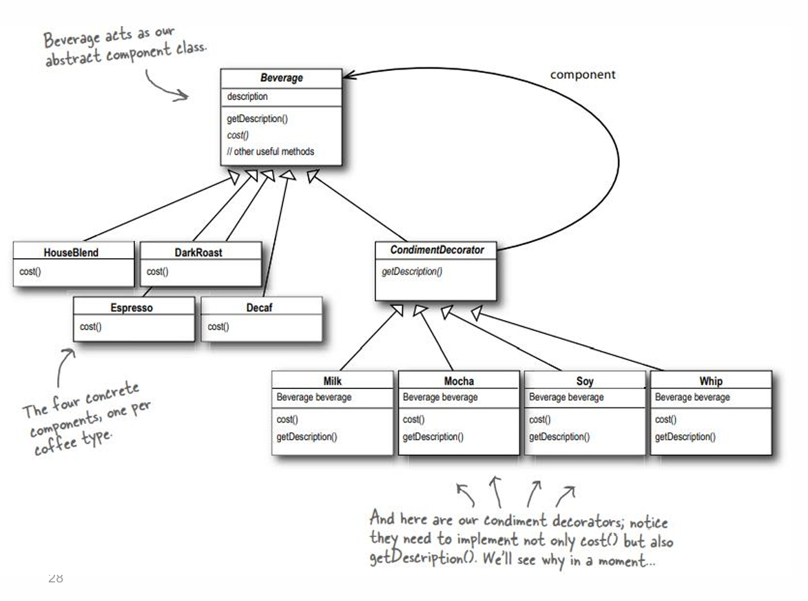

## Decorator Pattern

- **Intent**: Attach additional responsibilities to an object dynamically. Decorators provide a flexible alternative to subclassing for extending functionality.
- **When to use**: When you need to add behavior to objects at runtime, have many optional features, or want to avoid subclass explosion.

---

## Pattern Structure

The following diagram illustrates the Decorator pattern structure:



**Diagram Components:**

1. **`Beverage` Abstract Class** (Abstract Component)
   - Acts as the abstract component class
   - Attributes: `description`
   - Methods: `getDescription()`, `cost()`, and other useful methods
   - Base class for all beverages

2. **Concrete Components** (Coffee Types)
   - Four concrete classes inherit from `Beverage`:
     - `HouseBlend`
     - `DarkRoast`
     - `Espresso`
     - `Decaf`
   - Each implements `cost()` method
   - These are the base coffee types that can be decorated

3. **`CondimentDecorator` Abstract Class** (Abstract Decorator)
   - Inherits from `Beverage`
   - Has a composition relationship with `Beverage` (component)
   - Methods: `getDescription()`
   - Base class for all condiment decorators
   - **Key**: Contains a reference to a `Beverage` object (wraps it)

4. **Concrete Decorators** (Condiments)
   - Four concrete classes inherit from `CondimentDecorator`:
     - `Milk`
     - `Mocha`
     - `Soy`
     - `Whip`
   - Each has:
     - Attribute: `Beverage beverage` (composition relationship)
     - Methods: `cost()`, `getDescription()`
   - These decorators wrap and enhance `Beverage` objects

**Key Relationships:**
- **Inheritance**: 
  - Concrete beverages (`HouseBlend`, `DarkRoast`, `Espresso`, `Decaf`) inherit from `Beverage`
  - `CondimentDecorator` inherits from `Beverage`
  - Concrete decorators (`Milk`, `Mocha`, `Soy`, `Whip`) inherit from `CondimentDecorator`
- **Composition**: 
  - `CondimentDecorator` (and all its subclasses) holds a reference to a `Beverage` object
  - This allows decorators to wrap and enhance any `Beverage` component
  - Decorators can wrap other decorators, creating a chain

**Why Both `cost()` and `getDescription()`?**
- Decorators must implement both methods because they need to:
  - Add their own cost to the wrapped component's cost
  - Add their own description to the wrapped component's description
- This allows decorators to enhance both the cost and description dynamically

This structure allows beverages to be wrapped with multiple decorators (e.g., a `DarkRoast` with `Milk` and `Mocha`) to dynamically add cost and description details without modifying the base `Beverage` classes.

---

## Why Use the Decorator Pattern?

### The Problem: Subclass Explosion

When you need to add optional features to objects, using inheritance leads to a combinatorial explosion of subclasses:

```java
// Problem: Subclass explosion
abstract class Coffee {
    abstract double cost();
    abstract String description();
}

// Base classes
class SimpleCoffee extends Coffee { /* ... */ }
class Espresso extends Coffee { /* ... */ }

// With one feature (Milk)
class SimpleCoffeeWithMilk extends Coffee { /* ... */ }
class EspressoWithMilk extends Coffee { /* ... */ }

// With another feature (Sugar)
class SimpleCoffeeWithSugar extends Coffee { /* ... */ }
class EspressoWithSugar extends Coffee { /* ... */ }

// With both features
class SimpleCoffeeWithMilkAndSugar extends Coffee { /* ... */ }
class EspressoWithMilkAndSugar extends Coffee { /* ... */ }

// With 3 features: 2^3 = 8 classes per base type!
// With 4 features: 2^4 = 16 classes per base type!
// This grows exponentially!
```

**Problems with inheritance:**
- ❌ **Exponential growth**: Number of classes grows exponentially (2^n for n features)
- ❌ **Rigid**: Can't combine features at runtime
- ❌ **Maintenance nightmare**: Adding a feature requires many new classes
- ❌ **Code duplication**: Similar code repeated across classes
- ❌ **Inflexible**: Can't remove features or change combinations

### The Solution: Decorator Pattern

The Decorator pattern solves these problems by:
- ✅ **Composable**: Can combine features at runtime
- ✅ **Linear growth**: Number of classes grows linearly (1 per feature)
- ✅ **Flexible**: Add/remove features dynamically
- ✅ **No duplication**: Features implemented once
- ✅ **Open/Closed**: Open for extension, closed for modification

---

## With Decorator Pattern

### Decorator Example

```java
// Component interface
interface Coffee {
    double cost();
    String description();
}

// Concrete component
class SimpleCoffee implements Coffee {
    public double cost() {
        return 2.0;
    }
    
    public String description() {
        return "Simple coffee";
    }
}

// Base decorator
abstract class CoffeeDecorator implements Coffee {
    protected final Coffee delegate;  // Wrapped component
    
    protected CoffeeDecorator(Coffee coffee) {
        this.delegate = coffee;
    }
}

// Concrete decorators
class Milk extends CoffeeDecorator {
    public Milk(Coffee c) {
        super(c);
    }
    
    public double cost() {
        return delegate.cost() + 0.5;  // Add milk cost
    }
    
    public String description() {
        return delegate.description() + ", milk";  // Add milk description
    }
}

class Sugar extends CoffeeDecorator {
    public Sugar(Coffee c) {
        super(c);
    }
    
    public double cost() {
        return delegate.cost() + 0.2;  // Add sugar cost
    }
    
    public String description() {
        return delegate.description() + ", sugar";  // Add sugar description
    }
}

// Usage - compose features at runtime
Coffee coffee = new SimpleCoffee();
coffee = new Milk(coffee);      // Add milk
coffee = new Sugar(coffee);     // Add sugar
System.out.println(coffee.description() + " -> $" + coffee.cost());
// Output: "Simple coffee, milk, sugar -> $2.7"
```

**Benefits:**
- ✅ **Composable**: Can combine any features at runtime
- ✅ **Linear growth**: Only need 1 class per feature
- ✅ **Flexible**: Add/remove features dynamically
- ✅ **No duplication**: Each feature implemented once
- ✅ **Readable**: Code reads naturally (wraps like layers)

### Multiple Decorators

```java
// Can combine multiple decorators
Coffee coffee1 = new SimpleCoffee();
coffee1 = new Milk(coffee1);
// Result: Simple coffee with milk

Coffee coffee2 = new SimpleCoffee();
coffee2 = new Sugar(coffee2);
// Result: Simple coffee with sugar

Coffee coffee3 = new SimpleCoffee();
coffee3 = new Milk(coffee3);
coffee3 = new Sugar(coffee3);
// Result: Simple coffee with milk and sugar

Coffee coffee4 = new SimpleCoffee();
coffee4 = new Sugar(coffee4);
coffee4 = new Milk(coffee4);
// Result: Simple coffee with sugar and milk (order matters for description)
```

**Benefits:**
- ✅ **Any combination**: Can combine features in any order
- ✅ **Runtime composition**: Features added at runtime
- ✅ **Flexible**: Can create different combinations easily

---

## Without Decorator Pattern

### Subclass Explosion

```java
abstract class Coffee {
    abstract double cost();
    abstract String description();
}

class SimpleCoffee extends Coffee {
    public double cost() { return 2.0; }
    public String description() { return "Simple coffee"; }
}

// With Milk
class SimpleCoffeeWithMilk extends Coffee {
    public double cost() { return 2.5; }
    public String description() { return "Simple coffee, milk"; }
}

// With Sugar
class SimpleCoffeeWithSugar extends Coffee {
    public double cost() { return 2.2; }
    public String description() { return "Simple coffee, sugar"; }
}

// With Milk and Sugar
class SimpleCoffeeWithMilkAndSugar extends Coffee {
    public double cost() { return 2.7; }
    public String description() { return "Simple coffee, milk, sugar"; }
}

// With 3 features: 2^3 = 8 classes needed!
// With 4 features: 2^4 = 16 classes needed!
// This grows exponentially!
```

**Problems:**
- ❌ **Exponential growth**: 2^n classes for n features
- ❌ **Code duplication**: Similar code repeated
- ❌ **Maintenance nightmare**: Adding feature requires many new classes
- ❌ **Rigid**: Can't combine features at runtime
- ❌ **Inflexible**: Can't remove features

### Strategy Pattern Alternative

```java
interface CoffeeFeature {
    double getCost();
    String getDescription();
}

class Coffee {
    private double baseCost = 2.0;
    private List<CoffeeFeature> features = new ArrayList<>();
    
    public void addFeature(CoffeeFeature feature) {
        features.add(feature);
    }
    
    public double cost() {
        return baseCost + features.stream()
            .mapToDouble(CoffeeFeature::getCost)
            .sum();
    }
}

// Usage
Coffee coffee = new Coffee();
coffee.addFeature(new MilkFeature());
coffee.addFeature(new SugarFeature());
```

**Problems:**
- ⚠️ **Different approach**: Uses composition, not wrapping
- ⚠️ **Less flexible**: Can't change order of features
- ⚠️ **Different semantics**: Not true decorator pattern

---

## Comparison: Decorator vs Alternatives

| Aspect | Inheritance | Strategy Pattern | Decorator Pattern |
|--------|------------|------------------|-------------------|
| **Class Growth** | ❌ Exponential (2^n) | ✅ Linear (n) | ✅ Linear (n) |
| **Runtime Composition** | ❌ No | ✅ Yes | ✅ Yes |
| **Feature Order** | ❌ Fixed | ⚠️ Doesn't matter | ✅ Matters |
| **Wrapping** | ❌ No | ❌ No | ✅ Yes |
| **Flexibility** | ❌ Low | ⚠️ Medium | ✅ High |
| **Code Duplication** | ❌ High | ✅ Low | ✅ Low |

---

## Pros

- ✅ **Composable**: Can combine features at runtime
- ✅ **Linear growth**: Only need 1 class per feature (not 2^n)
- ✅ **Flexible**: Add/remove features dynamically
- ✅ **Open/Closed Principle**: Open for extension, closed for modification
- ✅ **No duplication**: Each feature implemented once
- ✅ **Single Responsibility**: Each decorator has one responsibility
- ✅ **Readable**: Code reads naturally (wraps like layers)

---

## Cons

- ❌ **Many small objects**: Can create many decorator objects
- ❌ **Debugging complexity**: Harder to debug decorator chains
- ❌ **Order matters**: Order of decorators can affect behavior
- ❌ **Type safety**: Can lose type information in decorator chain
- ❌ **Performance**: Slight overhead from multiple method calls
- ❌ **Complexity**: More classes and indirection

---

## When to Use Decorator Pattern

### ✅ Use Decorator When:
- You need to **add behavior** to objects at runtime
- You have **many optional features**
- You want to **avoid subclass explosion**
- You need **flexible composition** of features
- Features can be **combined in different ways**
- You want to **add/remove features** dynamically

### ❌ Don't Use Decorator When:
- **Simple objects**: Overhead not worth it
- **Fixed combinations**: If features are always combined the same way
- **Performance critical**: Multiple method calls hurt performance
- **Too complex**: Simpler solution exists

---

## Best Practices

1. **Component Interface**: Define clear component interface
2. **Base Decorator**: Use abstract base decorator to reduce duplication
3. **Composition**: Decorators should wrap components, not inherit
4. **Order Matters**: Document if order of decorators matters
5. **Single Responsibility**: Each decorator should add one feature

---

## Real-World Examples

### Java I/O Streams

```java
// Decorator pattern in Java I/O
InputStream fileStream = new FileInputStream("data.txt");
InputStream bufferedStream = new BufferedInputStream(fileStream);
InputStream dataStream = new DataInputStream(bufferedStream);
// Each decorator adds functionality
```

### GUI Components

```java
// Window with scrollbar and border
Window window = new SimpleWindow();
window = new ScrollbarDecorator(window);
window = new BorderDecorator(window);
// Features added dynamically
```

---

## Compare with Other Patterns

- **vs Adapter**: Adapter changes interface; Decorator preserves interface and adds behavior
- **vs Proxy**: Proxy controls access; Decorator adds behavior
- **vs Facade**: Facade simplifies subsystem; Decorator adds features to one object
- **vs Strategy**: Strategy changes algorithm; Decorator adds behavior

---

## File Examples

- **`DecoratorDemo.java`**: Coffee with condiments example showing decorator composition (composition-based)
- **`FileDecoratorDemo.java`**: File encryption and compression example (inheritance-based approach)
- **`FileDecoratorChainingDemo.java`**: File encryption and compression with decorator chaining (composition-based, proper Decorator pattern)
- **`FileDecoratorPatternDemo.java`**: File encryption and compression with abstract decorator (matches diagram structure)
- **`ShapeDecoratorDemo.java`**: Shape with red border decorator example (composition-based, proper Decorator pattern)

---

## Notes

- ⚠️ **Order matters**: Order of decorators can affect behavior and description
- ⚠️ **Many objects**: Can create many small decorator objects
- ⚠️ **Debugging**: Decorator chains can be harder to debug
- ⚠️ **Use appropriately**: Don't overuse - simpler solutions might be better
