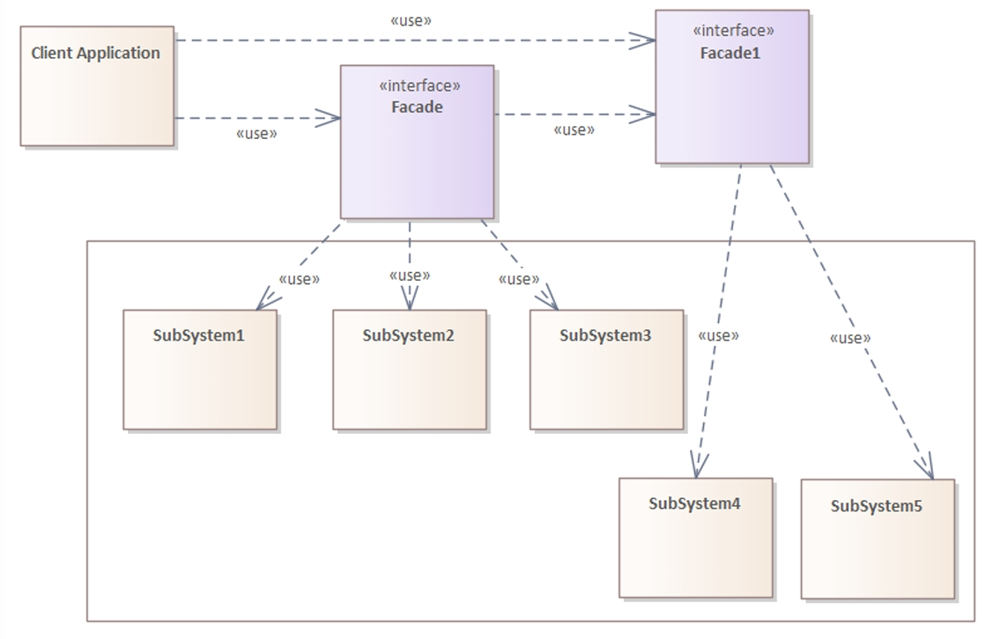

## Facade Pattern

- **Intent**: Provide a unified interface to a set of interfaces in a subsystem. Facade defines a higher-level interface that makes the subsystem easier to use.
- **When to use**: When you have a complex subsystem, common usage sequences, or want to reduce coupling from clients to subsystem internals.

---

## Pattern Structure

The following diagram illustrates the Facade pattern structure, showing a layered facade approach:



**Diagram Components:**

1. **`Client Application`** (Client)
   - The client that needs to interact with the subsystem
   - Uses facade interfaces to access subsystem functionality
   - Has "use" dependencies to both `Facade` and `Facade1` interfaces
   - Does not need to know about the underlying subsystems directly

2. **`<<interface>> Facade`** (Primary Facade)
   - Main facade interface that simplifies access to part of the subsystem
   - Provides a unified interface to `SubSystem1`, `SubSystem2`, and `SubSystem3`
   - Has "use" dependencies to:
     - `SubSystem1` - First subsystem component
     - `SubSystem2` - Second subsystem component
     - `SubSystem3` - Third subsystem component
   - Also has a "use" dependency to `Facade1`, suggesting delegation or layering between facades

3. **`<<interface>> Facade1`** (Secondary Facade)
   - Secondary facade interface that simplifies access to another part of the subsystem
   - Provides a unified interface to `SubSystem4` and `SubSystem5`
   - Has "use" dependencies to:
     - `SubSystem4` - Fourth subsystem component
     - `SubSystem5` - Fifth subsystem component
   - Can be used directly by the client or through the primary `Facade`

4. **Subsystem Components** (SubSystem1-5)
   - Five individual subsystem components grouped within a larger bounding box
   - Represent the underlying complex system whose details are hidden by the facades
   - **SubSystem1, SubSystem2, SubSystem3**: Used by the primary `Facade`
   - **SubSystem4, SubSystem5**: Used by the secondary `Facade1`
   - These are the actual implementation components that perform the work

**Key Relationships:**
- `Client Application` **uses** both `Facade` and `Facade1` interfaces (dependency: "use")
- `Facade` **uses** `SubSystem1`, `SubSystem2`, `SubSystem3`, and also `Facade1` (dependency: "use")
- `Facade1` **uses** `SubSystem4` and `SubSystem5` (dependency: "use")
- All relationships are "use" dependencies, indicating that the source depends on the target

**Pattern Flow:**
1. Client (`Client Application`) requests functionality through facade interfaces
2. Primary `Facade` coordinates calls to `SubSystem1`, `SubSystem2`, and `SubSystem3`
3. Primary `Facade` may delegate to `Facade1` for certain operations
4. Secondary `Facade1` coordinates calls to `SubSystem4` and `SubSystem5`
5. Client receives simplified interface without knowing subsystem details

**Layered Facade Approach:**
This diagram demonstrates a **layered facade** structure where:
- Multiple facades can exist to simplify different parts of a complex subsystem
- Facades can delegate to other facades, creating a hierarchy
- Each facade provides a simplified interface to a subset of subsystems
- The client can use multiple facades or a single facade that coordinates others

This structure allows for better organization of complex subsystems by dividing them into logical groups, each with its own facade, while still providing a simplified interface to clients.

---

## Why Use the Facade Pattern?

### The Problem: Complex Subsystem Usage

When using a complex subsystem, clients need to know many details and the correct sequence of operations:

```java
// Problem: Complex subsystem with many components
class Amplifier {
    void on() { System.out.println("Amp on"); }
    void off() { System.out.println("Amp off"); }
    void setVolume(int v) { System.out.println("Amp volume " + v); }
}

class Tuner {
    void on() { System.out.println("Tuner on"); }
    void off() { System.out.println("Tuner off"); }
}

class Screen {
    void down() { System.out.println("Screen down"); }
    void up() { System.out.println("Screen up"); }
}

class DvdPlayer {
    void on() { System.out.println("DVD on"); }
    void off() { System.out.println("DVD off"); }
    void play(String movie) { System.out.println("Playing " + movie); }
}

// Problem: Client must know all components and correct sequence
class Client {
    void watchMovie() {
        Amplifier amp = new Amplifier();
        Tuner tuner = new Tuner();
        Screen screen = new Screen();
        DvdPlayer dvd = new DvdPlayer();
        
        // Client must know exact sequence
        screen.down();
        amp.on();
        amp.setVolume(7);
        tuner.on();
        dvd.on();
        dvd.play("Inception");
        
        // Tear down - must know correct order
        dvd.off();
        tuner.off();
        amp.off();
        screen.up();
    }
}
```

**Problems with direct subsystem access:**
- ❌ **Complexity**: Client must know many components
- ❌ **Correct sequence**: Client must know correct order of operations
- ❌ **Tight coupling**: Client depends on subsystem internals
- ❌ **Error-prone**: Easy to forget steps or do them in wrong order
- ❌ **Maintenance**: Changes to subsystem affect all clients
- ❌ **Code duplication**: Same sequence repeated in multiple places

### The Solution: Facade Pattern

The Facade pattern solves these problems by:
- ✅ **Simplified interface**: Single interface for complex subsystem
- ✅ **Encapsulation**: Hides subsystem complexity from clients
- ✅ **Decoupling**: Client doesn't depend on subsystem internals
- ✅ **Consistency**: Ensures correct sequence of operations
- ✅ **Maintainability**: Changes to subsystem affect only facade
- ✅ **Reusability**: Common sequences implemented once

---

## With Facade Pattern

### Facade Example

```java
// Subsystem components (unchanged)
class Amplifier {
    void on() { System.out.println("Amp on"); }
    void off() { System.out.println("Amp off"); }
    void setVolume(int v) { System.out.println("Amp volume " + v); }
}

class Tuner {
    void on() { System.out.println("Tuner on"); }
    void off() { System.out.println("Tuner off"); }
}

class Screen {
    void down() { System.out.println("Screen down"); }
    void up() { System.out.println("Screen up"); }
}

class DvdPlayer {
    void on() { System.out.println("DVD on"); }
    void off() { System.out.println("DVD off"); }
    void play(String movie) { System.out.println("Playing " + movie); }
}

// Facade - simplified interface to subsystem
class HomeTheaterFacade {
    private final Amplifier amp;
    private final Tuner tuner;
    private final Screen screen;
    private final DvdPlayer dvd;
    
    HomeTheaterFacade(Amplifier a, Tuner t, Screen s, DvdPlayer d) {
        this.amp = a;
        this.tuner = t;
        this.screen = s;
        this.dvd = d;
    }
    
    // Simplified interface - encapsulates complex sequence
    public void watchMovie(String movie) {
        System.out.println("Get ready to watch a movie...");
        screen.down();
        amp.on();
        amp.setVolume(7);
        tuner.on();
        dvd.on();
        dvd.play(movie);
    }
    
    public void endMovie() {
        System.out.println("Shutting movie theater down...");
        dvd.off();
        tuner.off();
        amp.off();
        screen.up();
    }
}

// Usage - simple and clean
HomeTheaterFacade facade = new HomeTheaterFacade(
    new Amplifier(), new Tuner(), new Screen(), new DvdPlayer()
);
facade.watchMovie("Inception");  // Simple!
facade.endMovie();               // Simple!
```

**Benefits:**
- ✅ **Simple interface**: Client only needs to know facade
- ✅ **Encapsulation**: Subsystem complexity hidden
- ✅ **Correct sequence**: Facade ensures correct order
- ✅ **Decoupling**: Client doesn't depend on subsystem
- ✅ **Maintainable**: Changes to subsystem affect only facade
- ✅ **Reusable**: Common sequences implemented once

---

## Without Facade Pattern

### Direct Subsystem Access

```java
// Problem: Client must know all components and sequence
class Client {
    void watchMovie() {
        Amplifier amp = new Amplifier();
        Tuner tuner = new Tuner();
        Screen screen = new Screen();
        DvdPlayer dvd = new DvdPlayer();
        
        // Client must know exact sequence
        screen.down();
        amp.on();
        amp.setVolume(7);
        tuner.on();
        dvd.on();
        dvd.play("Inception");
        
        // Easy to forget steps or do in wrong order
        // dvd.off();  // Forgot this!
        // tuner.off(); // Forgot this!
        amp.off();
        screen.up();
    }
}
```

**Problems:**
- ❌ **Complexity**: Client must know many components
- ❌ **Error-prone**: Easy to forget steps or do in wrong order
- ❌ **Tight coupling**: Client depends on subsystem internals
- ❌ **Code duplication**: Same sequence repeated in multiple places
- ❌ **Maintenance**: Changes to subsystem affect all clients

### Multiple Clients with Same Sequence

```java
// Problem: Same sequence repeated in multiple places
class MovieClient {
    void watchMovie() {
        // Same complex sequence...
    }
}

class TheaterClient {
    void startShow() {
        // Same complex sequence repeated...
    }
}

class DemoClient {
    void runDemo() {
        // Same complex sequence repeated again...
    }
}
```

**Problems:**
- ❌ **Code duplication**: Same sequence repeated
- ❌ **Inconsistency**: Different clients might do sequence differently
- ❌ **Maintenance**: Need to update multiple places if sequence changes
- ❌ **Error-prone**: Easy to make mistakes in each place

---

## Comparison: Facade vs Alternatives

| Aspect | Direct Access | Manual Wrapper | Facade Pattern |
|--------|--------------|---------------|----------------|
| **Complexity** | ❌ High | ⚠️ Medium | ✅ Low |
| **Coupling** | ❌ High | ⚠️ Medium | ✅ Low |
| **Consistency** | ❌ Low | ⚠️ Medium | ✅ High |
| **Maintainability** | ❌ Low | ⚠️ Medium | ✅ High |
| **Code Duplication** | ❌ High | ⚠️ Medium | ✅ Low |
| **Error-Prone** | ❌ High | ⚠️ Medium | ✅ Low |

---

## Facade Characteristics

### 1. Simplified Interface
- **Purpose**: Provides simple interface to complex subsystem
- **Benefit**: Client doesn't need to know subsystem details

### 2. Encapsulation
- **Purpose**: Hides subsystem complexity
- **Benefit**: Client doesn't depend on subsystem internals

### 3. Common Sequences
- **Purpose**: Implements common usage sequences
- **Benefit**: Ensures correct sequence of operations

### 4. Decoupling
- **Purpose**: Reduces coupling between client and subsystem
- **Benefit**: Changes to subsystem don't affect client

---

## Pros

- ✅ **Simplified interface**: Client only needs to know facade
- ✅ **Encapsulation**: Hides subsystem complexity from clients
- ✅ **Decoupling**: Client doesn't depend on subsystem internals
- ✅ **Consistency**: Ensures correct sequence of operations
- ✅ **Maintainability**: Changes to subsystem affect only facade
- ✅ **Reusability**: Common sequences implemented once
- ✅ **Error reduction**: Less chance of errors (correct sequence guaranteed)

---

## Cons

- ❌ **God object risk**: Facade can become too large if it does too much
- ❌ **Limited functionality**: Might hide useful capabilities if too minimal
- ❌ **Additional layer**: Extra indirection and abstraction
- ❌ **Subsystem access**: Clients can still access subsystem directly (if allowed)
- ⚠️ **Balance**: Need to balance simplicity with functionality

---

## When to Use Facade Pattern

### ✅ Use Facade When:
- You have a **complex subsystem** with many components
- You have **common usage sequences** that are repeated
- You want to **reduce coupling** from clients to subsystem
- You want to **simplify** subsystem usage
- You want to **encapsulate** subsystem complexity
- You want to **ensure consistency** in subsystem usage

### ❌ Don't Use Facade When:
- **Simple subsystem**: Overhead not worth it
- **Need full control**: Client needs direct access to all components
- **Too minimal**: Facade hides too much functionality
- **Performance critical**: Extra indirection hurts performance

---

## Best Practices

1. **Keep it simple**: Facade should provide simple interface
2. **Common sequences**: Implement most common usage patterns
3. **Don't hide too much**: Balance simplicity with functionality
4. **Allow direct access**: Clients can still access subsystem if needed
5. **Document usage**: Clearly document what facade does

---

## Real-World Examples

### Java API Facades

```java
// Java's URLConnection is a facade
URL url = new URL("http://example.com");
URLConnection connection = url.openConnection();  // Facade
// Hides complexity of HTTP, TCP, DNS, etc.
```

### Framework Facades

```java
// Spring's JdbcTemplate is a facade
JdbcTemplate template = new JdbcTemplate(dataSource);
template.query("SELECT * FROM users", ...);  // Simple interface
// Hides complexity of JDBC, connection management, etc.
```

### Library Facades

```java
// Logging facade (SLF4J)
Logger logger = LoggerFactory.getLogger(MyClass.class);
logger.info("Message");  // Simple interface
// Hides complexity of different logging implementations
```

---

## Compare with Other Patterns

- **vs Builder**: Builder hides construction steps; Facade hides subsystem usage
- **vs Factory**: Factory hides object creation; Facade hides subsystem usage
- **vs Proxy**: Proxy controls access to one object; Facade simplifies access to subsystem
- **vs Adapter**: Adapter converts one interface; Facade simplifies subsystem interface
- **vs Mediator**: Mediator coordinates objects; Facade simplifies subsystem usage

---

## File Examples

- **`WithFacadeDemo.java`**: Home theater facade example showing simplified interface
- **`WithoutFacadeDemo.java`**: Direct subsystem access showing complexity
- **`HotelFacadeDemo.java`**: Hotel restaurant facade example (HotelKeeper simplifies access to different restaurant types)

---

## Notes

- ⚠️ **Balance simplicity**: Don't hide too much functionality
- ⚠️ **Allow direct access**: Clients can still access subsystem if needed
- ⚠️ **Common sequences**: Implement most common usage patterns
- ⚠️ **Don't overuse**: Only use when subsystem is truly complex
