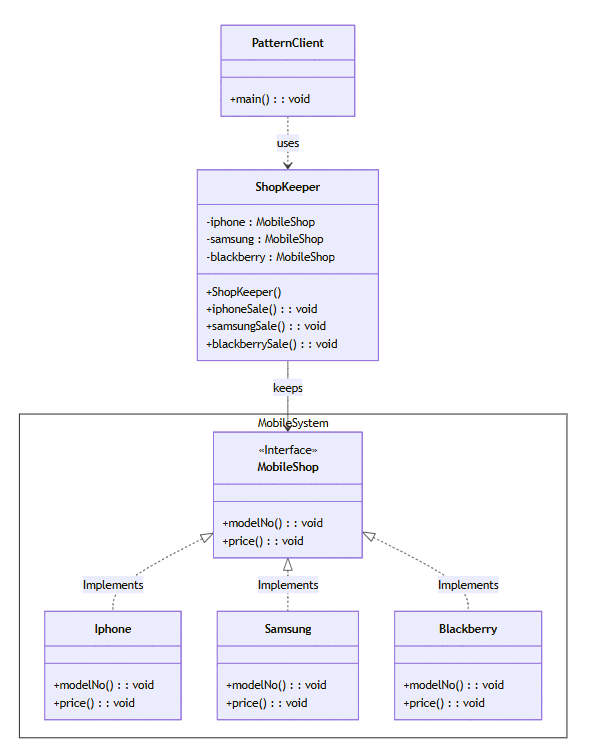
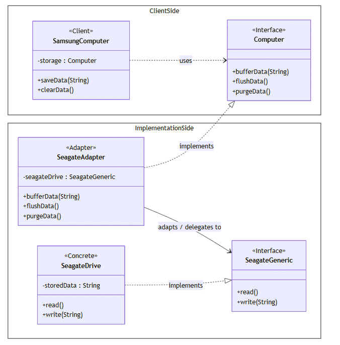

# Final Exam 2024 - Design Patterns

## Question (1): Multiple Choice Questions (30 Marks)

### 1. Which of the below is not a valid design pattern?
- a. Singleton
- b. Command
- c. Factory
- d. Java

### 2. Which design pattern ensures that only one object of particular class gets created?
- a. Singleton
- b. Filter pattern
- c. State pattern
- d. Bridge pattern

### 3. Which design pattern suggests multiple classes through which request is passed and multiple but only relevant classes carry out operations on the request?
- a. Singleton pattern
- b. Chain of responsibility pattern
- c. State pattern
- d. Bridge pattern

### 4. Which design pattern is used to create objects based on certain conditions, while abstracting the process of object creation?
- a. Factory Method
- b. Singleton
- c. Abstract Factory
- d. Prototype

### 5. Which design pattern is used to define a family of algorithms, encapsulate each one, and make them interchangeable?
- a. Strategy
- b. State
- c. Template
- d. Observer

### 6. Which type of design pattern is used for object creation mechanisms, trying to create objects in a manner suitable to the situation?
- a. Behavioural pattern
- b. Creational pattern
- c. Structural pattern
- d. Singleton pattern

### 7. Attach additional responsibilities to an object dynamically. It provides a flexible alternative to subclassing for extending functionality.
- a. Composite
- b. Adapter
- c. Decorator
- d. Chain of responsibility

### 8. Which design pattern is used to convert one interface of a class into another interface that clients expect?
- a. Singleton Pattern
- b. Adapter Pattern
- c. Strategy Pattern
- d. Observer Pattern

### 9. Which design pattern creates duplicate objects?
- a. Prototype pattern
- b. Adapter Pattern
- c. Facade pattern
- d. Observer Pattern

### 10. Which design pattern represents a way to access all the objects in a collection?
- a. Iterator pattern
- b. Facade pattern
- c. Builder pattern
- d. Bridge pattern

---

## Question (2): What is the best pattern for each scenario? (15 Marks)

### Scenario 1
The model stores a collection of blocks. Blocks can be metal or wood; can be painted, sanded, or chrome plated; and can sometimes be radioactive or magnetized. What design pattern would allow the system to easily add new types of blocks without changing existing code?

---

### Scenario 2
The model for a game stores robot. The robot navigates a maze that has obstacles. While playing the game, the robot can be upgraded with new parts that change its abilities like speed, weapons, and shields. Which design principle allows the robot object to change its behaviour at runtime in flexible ways.

---

## Question (3): UML Diagram Recognition (10 Marks)

Assume the following UML. What is the name of this pattern?



```
Pattern Client
+ main(): void
    |
    | uses
    |
ShopKeeper
-iphone: MobileShop
-samsung: MobileShop
-blackberry: MobileShop
+ShopKeeper()
+ IphoneSale():void
+ samsungSale():void
+ blackberrySale():void

    | uses
    |
<Interface>
MobileShop
+modelNo(): void
+price():void

    | implements
    |
    +--+--+
    |  |  |
Iphone    Samsung    Blackberry
+modelNo(): void    +modelNo(): void    +modelNo(): void
+price():void       +price():void      +price():void
```

---

## Question (4): Implementation Question (15 Marks)

Consider the following real-world computer scenario, where you want to plug in an external hard drive (pre-USB era!), `SeagateDrive` of interface type `SeagateGeneric`, to an incompatible computer, `SamsungComputer` of type `Computer`. `SeagateGeneric` provides `read()` and `write()` methods for the specified purposes, which need to be adapted to the actual `bufferData()`, `flushData()` and `purgeData()` methods of the `Computer`. Note that there is no equivalent of `purgeData()`. What is the ideal pattern to handle this scenario? Implement it using Java.



---

## Answers (Write these at the end)

### Question (1): Multiple Choice Answer Key
1. d (Java)
2. a (Singleton)
3. b (Chain of responsibility pattern)
4. a (Factory Method)
5. a (Strategy)
6. b (Creational pattern)
7. c (Decorator)
8. b (Adapter Pattern)
9. a (Prototype pattern)
10. a (Iterator pattern)

---

### Question (2): Scenario Answers
Scenario 1: Decorator Pattern
Scenario 2: Strategy Pattern (Decorator Pattern can also be argued if upgrades are purely additive)

---

### Question (3): UML Diagram Answer
Facade Pattern

---

### Question (4): Implementation Answer
Adapter Pattern

Explanation (why the adapter implements `Computer`):
- The client (`SamsungComputer`) expects to work with the **target interface** `Computer` (it has a field `storage: Computer` and calls `bufferData()`, `flushData()`, `purgeData()`).
- `SeagateDrive` is the **adaptee**: it doesn’t match `Computer` because it only supports `read()` and `write()`.
- Therefore, the adapter (`SeagateAdapter`) must **implement `Computer`** (so the client can use it) and **wrap a `SeagateGeneric`** internally (so it can delegate work to the adaptee).

Method mapping idea:
- `bufferData(data)` → `write(data)`
- `flushData()` → `read()`
- `purgeData()` → no direct equivalent (a common choice is to throw `UnsupportedOperationException`, or provide a best-effort behavior if possible)

Implementation reference: `FinalExams/2024/Question4.java`
