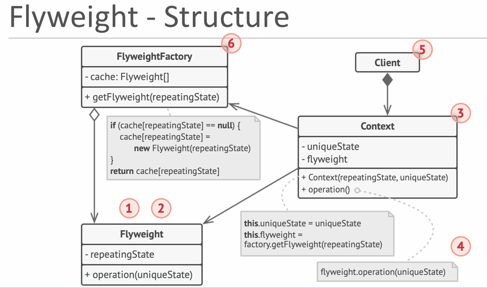
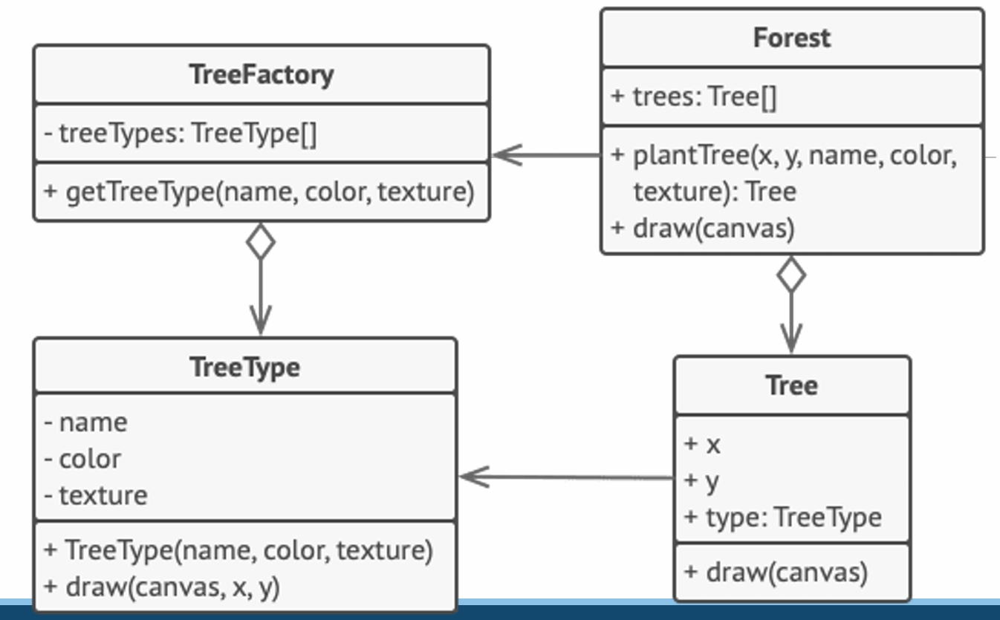

## Flyweight Pattern

- **Intent**: Fit more objects into the available memory by sharing common (intrinsic) state between them instead of storing all data in each object.
- **When to use**: When you have a huge number of similar objects, many of whose fields are repeated (e.g., characters in a document, trees in a game world, particles, tiles), and memory usage becomes a problem.

---

## Intrinsic and Extrinsic State

Suppose in a text editor when we enter a character, an object of `Character` class is created.  
Attributes of the `Character` class might be: `{symbol, font, size, row, column}`.

- **Intrinsic state**:
  - Data that is **shared** and **does not change per individual occurrence**.
  - Example: `symbol`, `font`, `size`.
  - The letter `'B'` with font `"Arial"` and size `12` is the same wherever it appears.
  - These attributes can be shared across many characters.

- **Extrinsic state**:
  - Data that **changes for each occurrence** and **cannot be shared**.
  - Example: `row`, `column` (position in the document).
  - No two characters occupy exactly the same position, so these values are different for each character.

The Flyweight pattern stores **intrinsic** state in **shared flyweight objects**, while **extrinsic** state is supplied from the outside (by the client) when needed.

---

## Pattern Structure

The following diagram illustrates the **generic UML structure** of the Flyweight pattern:



**Diagram Components:**

1. **`Flyweight` Interface**
   - Declares operations that take **extrinsic** state as arguments.
   - Example: `void draw(ExtrinsicState state)` or `void render(int x, int y)`.

2. **`ConcreteFlyweight` Class**
   - Implements the `Flyweight` interface.
   - Stores **intrinsic** state that can be shared.
   - Does **not** store extrinsic state.

3. **`FlyweightFactory` Class**
   - Creates and manages flyweight objects.
   - Ensures that flyweights are shared rather than created anew.
   - Returns existing flyweights if they were already created.

4. **Client**
   - Maintains references to flyweights.
   - Stores or computes **extrinsic** state and passes it to flyweight methods.

**Key Relationships:**

- Client asks `FlyweightFactory` for a flyweight with a given intrinsic state.
- Factory returns an existing `ConcreteFlyweight` or creates and caches a new one.
- Client stores extrinsic state and passes it to flyweight operations.

---

## Forest / Tree Example

In this example we simulate drawing many trees in a forest.

- Each tree has:
  - **Intrinsic state** (shared): type name and color.
  - **Extrinsic state** (unique): its position on the canvas (`x`, `y`).

We separate these into two classes:

- `TreeType` – the **Flyweight** that stores intrinsic state.
- `Tree` – stores extrinsic state (`x`, `y`) and a reference to a shared `TreeType`.

The following diagram shows the **specific UML structure** for our forest demo:



**Diagram Components:**

1. **`TreeType` Class** (Concrete Flyweight)
   - Intrinsic state:
     - `name: String`
     - `color: java.awt.Color` (or similar)
   - Method: `draw(int x, int y)` – draws a tree of this type at a given position.

2. **`Tree` Class**
   - Extrinsic state:
     - `x: int`
     - `y: int`
   - Reference:
     - `type: TreeType` (flyweight)
   - Method: `draw()` – delegates to `type.draw(x, y)`.

3. **`TreeFactory` Class** (Flyweight Factory)
   - Holds a `Map<String, TreeType>` cache.
   - Key is usually a combination of intrinsic attributes (e.g., `name + color`).
   - Method: `getTreeType(String name, Color color)` returns shared `TreeType` instances.

4. **`Forest` Class** (Client)
   - Maintains a `List<Tree>` representing many trees.
   - Method: `plantTree(int x, int y, String name, Color color)`:
     - Requests the proper `TreeType` from `TreeFactory`.
     - Creates a new `Tree` with extrinsic state and shared `TreeType`.
   - Method: `draw()` – iterates all trees and calls `tree.draw()`.

5. **`FlyweightForestDemo` Class** (Client / Demo)
   - Plants many trees using only a small number of `TreeType` instances.
   - Demonstrates how memory is saved when thousands of trees share a few types.

---

## Why Use the Flyweight Pattern?

### The Problem: Huge Number of Similar Objects

```java
// Naive approach: every Tree stores full state
class FatTree {
    private int x;
    private int y;
    private String name;
    private java.awt.Color color;
    // possibly large image or texture data...
}
```

**Problems:**

- ❌ Each tree duplicates the same intrinsic data (`name`, `color`, maybe large images).
- ❌ Memory usage grows linearly with number of trees.
- ❌ With millions of objects, memory becomes a serious issue.

### The Solution: Flyweight

The Flyweight pattern solves these problems by:

- ✅ Sharing **intrinsic** state between many objects.
- ✅ Storing only **extrinsic** state (small data) per object.
- ✅ Reducing memory usage when there are many similar objects.

---

## With Flyweight Pattern – Generic Example

```java
import java.util.HashMap;
import java.util.Map;

// Flyweight
interface Glyph {
    void draw(int row, int column); // extrinsic state: position
}

// Concrete Flyweight
class CharacterGlyph implements Glyph {
    private final char symbol; // intrinsic

    public CharacterGlyph(char symbol) {
        this.symbol = symbol;
    }

    @Override
    public void draw(int row, int column) {
        System.out.println("Drawing '" + symbol + "' at (" + row + "," + column + ")");
    }
}

// Flyweight Factory
class GlyphFactory {
    private static final Map<Character, Glyph> cache = new HashMap<>();

    public static Glyph getGlyph(char symbol) {
        Glyph glyph = cache.get(symbol);
        if (glyph == null) {
            glyph = new CharacterGlyph(symbol);
            cache.put(symbol, glyph);
        }
        return glyph;
    }
}

// Client
class TextEditorDemo {
    public static void main(String[] args) {
        String text = "HELLO";
        for (int i = 0; i < text.length(); i++) {
            char c = text.charAt(i);
            Glyph glyph = GlyphFactory.getGlyph(c); // shared intrinsic state
            glyph.draw(0, i);                       // extrinsic state: position
        }
    }
}
```

**Key Points:**

- `CharacterGlyph` stores only the character symbol (intrinsic).
- Position `(row, column)` is passed as extrinsic state.
- `GlyphFactory` ensures that only one `CharacterGlyph` per symbol is created.

---

## Forest Example Code Overview

The `FlyweightForestDemo.java` file in this folder provides a full implementation of the forest example:

- `TreeType` holds intrinsic state (`name`, `color`).
- `Tree` holds extrinsic state (`x`, `y`) and references a `TreeType`.
- `TreeFactory` caches `TreeType` instances and returns shared objects.
- `Forest` manages many `Tree` instances and draws them.
- `Demo` plants a large number of trees with only a few `TreeType` instances.

This closely matches the conceptual description given above for intrinsic and extrinsic state.

---

## Pros

- ✅ **Huge memory savings** when you have many similar objects.
- ✅ **Centralized intrinsic state** – easy to manage and update shared data.
- ✅ **Can improve performance** by reducing memory pressure and GC overhead.

---

## Cons

- ❌ **More complex design** – requires factory, shared cache, and careful separation of state.
- ❌ **Harder debugging** – shared objects make it harder to trace individual instances.
- ❌ **Requires immutable intrinsic state** – changes must be carefully managed.
- ❌ **Client responsibility** – client must supply correct extrinsic state every time.

---

## Compare with Other Patterns

- **vs Prototype**: Prototype clones full objects; Flyweight shares intrinsic parts across many objects.
- **vs Singleton**: Singleton limits you to one instance; Flyweight allows many shared instances (one per intrinsic combination).
- **vs Object Pool / Caching**: Pools manage reusable objects over time; Flyweight shares immutable intrinsic state between many logical objects.

---

## File Examples

- **`FlyweightForestDemo.java`**: Forest/Tree/TreeType example using shared tree types.
- **`FlyweightTextEditorDemo.java`**: Text editor characters example using shared glyphs (intrinsic) and positions (extrinsic).


