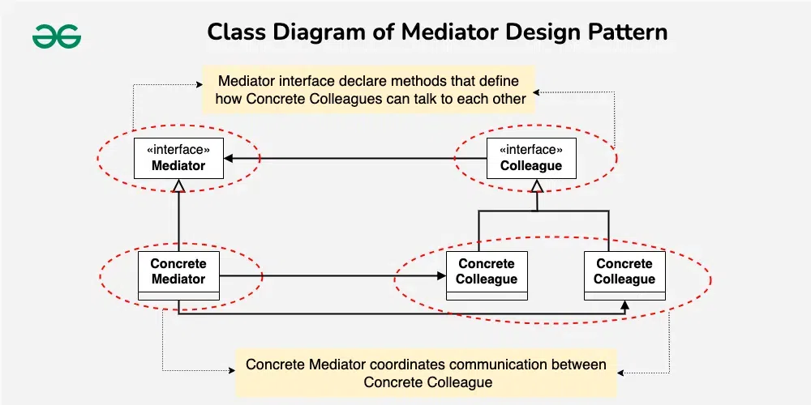
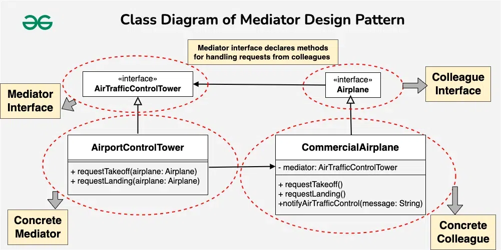

## Mediator Pattern

- **Intent**: Reduce communication complexity between multiple objects or classes by providing a mediator class that handles all communications between many different classes, supporting easy maintainability through loose coupling. The Mediator Design Pattern simplifies communication between multiple objects in a system by centralizing their interactions through a mediator. Instead of objects interacting directly, they communicate via a mediator, reducing dependencies and making the system easier to manage.
- **When to use**: 
  - When you have many objects communicating with each other in complex ways, and you want to reduce dependencies between them by centralizing their interactions
  - **Complex Communication**: Your system involves a set of objects that need to communicate with each other in a complex manner, and you want to avoid direct dependencies between them
  - **Loose Coupling**: You want to promote loose coupling between objects, allowing them to interact without knowing the details of each other's implementations
  - **Centralized Control**: You need a centralized mechanism to coordinate and control the interactions between objects, ensuring a more organized and maintainable system
  - **Changes in Behavior**: You anticipate changes in the behavior of components, and you want to encapsulate these changes within the mediator, preventing widespread modifications
  - **Enhanced Reusability**: You want to reuse individual components in different contexts without altering their internal logic or communication patterns

---

## Pattern Structure

The Mediator pattern consists of the following components:

1. **`Mediator`** (Interface)
   - Defines an interface for communicating with `Colleague` objects
   - Method: `onEvent(String event, Colleague sender)` - Handles events from colleagues

2. **`ConcreteMediator`** (Class)
   - Implements the `Mediator` interface
   - Knows about all colleague components
   - Coordinates communication between colleagues
   - Contains all the business logic for when to trigger actions
   - Example: `SmartHomeMediatorImpl`

3. **`Colleague`** (Interface)
   - Defines an interface for components that need to communicate
   - Methods: `setMediator(Mediator)`, `triggerEvent(String)`
   - Components don't communicate directly - they send events to the mediator

4. **`ConcreteColleague`** (Classes)
   - Implements the `Colleague` interface
   - Communicates with other colleagues only through the mediator
   - Examples: `Alarm`, `CoffeePot`, `Calendar`, `Sprinkler`

**Key Relationships:**
- `ConcreteMediator` **knows about** all `ConcreteColleague` objects (composition)
- `ConcreteColleague` objects **have a reference to** `Mediator` (association)
- `ConcreteColleague` objects **don't know about each other** (loose coupling)

**Pattern Flow:**
1. Client creates all colleague components and the mediator
2. Client registers colleagues with the mediator
3. When a colleague needs to communicate, it sends an event to the mediator
4. Mediator receives the event and coordinates appropriate actions with other colleagues
5. Mediator calls methods on relevant colleagues based on the event and current state

---

## Real-Life Analogy

Imagine a group project in a classroom:

- **Colleagues (Students)**: Each student in the class is like a colleague. They have their tasks but need to work together on a project.
- **Mediator (Teacher)**: The teacher is like the mediator. Instead of students talking directly to each other, they talk to the teacher.
- **Communication Flow**: If a student needs information from another, they tell the teacher. The teacher figures out how to get the needed information from the other students. The teacher then relays the information back to the requesting student.

Students communicate indirectly through the teacher, keeping things organized and preventing chaos in the classroom. This way, everyone collaborates effectively, and individual students don't have to directly deal with all the details of each other's work.

---

## Mediator Pattern Examples

### Example 1: Air Traffic Control System

**Problem Statement:**
Several airplanes in an airport must coordinate their movements and communicate with one another in order to prevent collisions and guarantee safe takeoffs and landings. Direct communication between aircraft without a centralized mechanism could result in chaos and higher risk.

**Challenges:**
- **Air Traffic Complexity**: Direct communication between airplanes might result in complex and error-prone coordination, especially when dealing with multiple aircraft in the same airspace.
- **Collision Risks**: Without a centralized control mechanism, the risk of collisions between airplanes during takeoffs, landings, or mid-flight maneuvers increases.

**How Mediator Pattern Solves This:**
By managing the complex coordination and communication between aircraft and air traffic controllers, the mediator pattern contributes to a safer and better-organized aviation system.

- **Centralized Control**: By serving as a mediator, the air traffic control tower helps aircraft communicate with one another. This guarantees that every aircraft is aware of the location and intentions of every other aircraft.
- **Collision Avoidance**: The mediator (air traffic control tower) manages the flow of airplanes, preventing collisions by providing clear instructions and coordinating their movements.

**See the complete implementation**: [MediatorAirplaneDemo.java](MediatorAirplaneDemo.java)

**Diagrams:**
-  - General Mediator pattern structure
-  - Air Traffic Control example with AirTrafficControlTower as Mediator

---

### Example 2: Smart Home Automation System

Imagine a smart home automation system with multiple components:
- **Alarm**: Rings in the morning and triggers routines
- **CoffeePot**: Brews coffee when needed
- **Calendar**: Tracks days, weekends, and special events (like trash day)
- **Sprinkler**: Waters the garden based on various conditions

### Code Without Mediator Pattern

Without a mediator, each component must directly know about and communicate with all other components:

```java
// Problem: Each component knows about all others - tight coupling
class Alarm {
    private Calendar calendar;
    private Sprinkler sprinkler;
    private CoffeePot coffeePot;
    
    public Alarm(Calendar calendar, Sprinkler sprinkler, CoffeePot coffeePot) {
        this.calendar = calendar;
        this.sprinkler = sprinkler;
        this.coffeePot = coffeePot;
    }
    
    public void ring() {
        System.out.println("Alarm: Ringing!");
        
        // Alarm must know about Calendar to check day
        if (calendar.isWeekend()) {
            // Alarm must know about Weather to check conditions
            // Alarm must know about Sprinkler to start it
            if (!isRaining() && getTemperature() > 65) {
                sprinkler.start();
            }
        } else {
            if (!isRaining() && getTemperature() > 70) {
                sprinkler.start();
            }
        }
        
        // Alarm must know about CoffeePot to start it
        coffeePot.startBrewing();
        
        // Alarm must know about Calendar to check trash day
        if (calendar.isTrashDay()) {
            reset();  // Reset alarm for trash day
        }
    }
}

class CoffeePot {
    private Calendar calendar;
    private Alarm alarm;
    
    public CoffeePot(Calendar calendar, Alarm alarm) {
        this.calendar = calendar;
        this.alarm = alarm;
    }
    
    public void onEvent() {
        // CoffeePot must know about Calendar
        if (calendar.isWeekend()) {
            // Different behavior on weekends
        }
        
        // CoffeePot must know about Alarm
        if (alarm.isRinging()) {
            // React to alarm
        }
    }
}

class Calendar {
    private Alarm alarm;
    private Sprinkler sprinkler;
    private CoffeePot coffeePot;
    
    public Calendar(Alarm alarm, Sprinkler sprinkler, CoffeePot coffeePot) {
        this.alarm = alarm;
        this.sprinkler = sprinkler;
        this.coffeePot = coffeePot;
    }
    
    public void setDayOfWeek(String day) {
        this.dayOfWeek = day;
        this.isWeekend = "Saturday".equals(day) || "Sunday".equals(day);
        
        // Calendar must coordinate with other components
        if (isWeekend) {
            alarm.adjustForWeekend();
        }
        
        // Calendar must know about Sprinkler
        if (shouldWaterToday()) {
            sprinkler.start();
        }
        
        // Calendar must know about CoffeePot
        coffeePot.adjustSchedule();
    }
}

class Sprinkler {
    private Calendar calendar;
    private WeatherService weather;
    private ShowerSystem shower;
    
    public Sprinkler(Calendar calendar, WeatherService weather, ShowerSystem shower) {
        this.calendar = calendar;
        this.weather = weather;
        this.shower = shower;
    }
    
    public void onEvent() {
        // Sprinkler must check Calendar
        if (calendar.isWeekend()) {
            // Different logic
        }
        
        // Sprinkler must check Weather
        if (weather.isRaining()) {
            return;  // Don't run if raining
        }
        
        // Sprinkler must check Shower
        if (shower.isRunning()) {
            return;  // Don't run if shower is on
        }
        
        start();
    }
}

// Client code - must wire all dependencies
public class WithoutMediatorDemo {
    public static void main(String[] args) {
        // Create all components with their dependencies
        Alarm alarm = new Alarm(calendar, sprinkler, coffeePot);
        CoffeePot coffeePot = new CoffeePot(calendar, alarm);
        Calendar calendar = new Calendar(alarm, sprinkler, coffeePot);
        Sprinkler sprinkler = new Sprinkler(calendar, weather, shower);
        
        // Circular dependencies! Hard to initialize.
        // Each component needs references to others.
    }
}
```

**Problems:**
- ❌ **High coupling**: Each component depends on many others (O(n²) dependencies)
- ❌ **Complex dependencies**: Components have circular dependencies
- ❌ **Hard to maintain**: Changing one component affects many others
- ❌ **Difficult to test**: Components can't be tested in isolation
- ❌ **Hard to extend**: Adding new component requires modifying existing ones
- ❌ **Scattered logic**: Coordination logic spread across all components
- ❌ **Initialization complexity**: Hard to create components due to circular dependencies

**The Solution: Mediator Pattern**

With a mediator, all coordination logic is centralized:

```java
// Solution: All coordination logic in the mediator
class SmartHomeMediator {
    void onEvent(String event, Colleague sender) {
        if (event == "ALARM_RING") {
            checkCalendar();
            if (weekend) {
                checkWeather();
                // ... mediator decides what to do
            }
            if (trashDay) {
                resetAlarm();
                // ... mediator coordinates actions
            }
            startCoffee();
            // ... mediator handles all coordination
        }
    }
}
```

**Benefits:**
- ✅ **Loose coupling**: Components only know about the mediator
- ✅ **Centralized logic**: All coordination in one place (easy to maintain)
- ✅ **Reduced complexity**: O(n) communication complexity instead of O(n²)
- ✅ **Easy to test**: Components can be tested independently
- ✅ **Easy to extend**: Add new components without modifying existing ones

---

## Implementation

### Mediator Interface

```java
interface Mediator {
    void onEvent(String event, Colleague sender);
}
```

### Colleague Interface

```java
interface Colleague {
    void setMediator(Mediator mediator);
    void triggerEvent(String event);
}
```

### Concrete Colleagues

```java
class Alarm implements Colleague {
    private Mediator mediator;
    
    public void setMediator(Mediator mediator) {
        this.mediator = mediator;
    }
    
    public void ring() {
        System.out.println("Alarm: Ringing!");
        mediator.onEvent("ALARM_RING", this);
    }
}

class CoffeePot implements Colleague {
    private Mediator mediator;
    
    public void setMediator(Mediator mediator) {
        this.mediator = mediator;
    }
    
    public void startBrewing() {
        System.out.println("CoffeePot: Starting to brew coffee");
    }
}

class Calendar implements Colleague {
    private Mediator mediator;
    private String dayOfWeek;
    private boolean isWeekend;
    
    public void setDayOfWeek(String day) {
        this.dayOfWeek = day;
        this.isWeekend = "Saturday".equals(day) || "Sunday".equals(day);
        mediator.onEvent("DAY_CHANGED", this);
    }
    
    public boolean isWeekend() {
        return isWeekend;
    }
}

class Sprinkler implements Colleague {
    private Mediator mediator;
    
    public void start() {
        System.out.println("Sprinkler: Started watering");
    }
    
    public void triggerEvent(String event) {
        mediator.onEvent(event, this);
    }
}
```

### Concrete Mediator

```java
class SmartHomeMediatorImpl implements Mediator {
    private Alarm alarm;
    private CoffeePot coffeePot;
    private Calendar calendar;
    private Sprinkler sprinkler;
    
    public void registerComponents(Alarm alarm, CoffeePot coffeePot, 
                                   Calendar calendar, Sprinkler sprinkler) {
        this.alarm = alarm;
        this.coffeePot = coffeePot;
        this.calendar = calendar;
        this.sprinkler = sprinkler;
        
        // Set mediator reference in each component
        alarm.setMediator(this);
        coffeePot.setMediator(this);
        calendar.setMediator(this);
        sprinkler.setMediator(this);
    }
    
    @Override
    public void onEvent(String event, Colleague sender) {
        if ("ALARM_RING".equals(event)) {
            // Mediator coordinates: check calendar, start sprinkler if needed, start coffee
            if (calendar.isWeekend()) {
                if (!isRaining && temperature > 65) {
                    sprinkler.start();
                }
            } else {
                if (!isRaining && temperature > 70) {
                    sprinkler.start();
                }
            }
            coffeePot.startBrewing();
        }
        // ... handle other events
    }
}
```

### Client Usage

```java
public class MediatorPatternDemo {
    public static void main(String[] args) {
        // Create components
        Alarm alarm = new Alarm("Morning");
        CoffeePot coffeePot = new CoffeePot("Kitchen");
        Calendar calendar = new Calendar("Home");
        Sprinkler sprinkler = new Sprinkler("Garden");
        
        // Create mediator
        SmartHomeMediatorImpl mediator = new SmartHomeMediatorImpl();
        
        // Register components with mediator
        mediator.registerComponents(alarm, coffeePot, calendar, sprinkler);
        
        // Trigger events - components communicate through mediator
        alarm.ring();  // Mediator coordinates response
        calendar.setDayOfWeek("Saturday");  // Mediator adjusts routines
    }
}
```

---

## Why Use the Mediator Pattern?

### The Problem: Complex Inter-Component Communication

Without the Mediator pattern, components communicate directly with each other, creating a web of dependencies:

```
Alarm ──┐
        ├──> Calendar
Coffee ─┼──> Alarm
        ├──> Sprinkler
Calendar┼──> Alarm
        ├──> Coffee
        └──> Sprinkler
Sprinkler─> Calendar
        └──> Weather
```

**Communication Complexity**: O(n²) - each component potentially communicates with every other component.

### The Solution: Centralized Communication

With the Mediator pattern, all communication flows through the mediator:

```
Alarm ──────┐
Coffee ─────┼──> Mediator ───> Alarm
Calendar ───┼                  Coffee
Sprinkler ──┘                  Calendar
                               Sprinkler
```

**Communication Complexity**: O(n) - each component only communicates with the mediator.

---

## Pattern Participants

1. **Mediator** (Interface)
   - Defines an interface for communicating with colleague objects
   - Example: `Mediator` interface with `onEvent()` method

2. **ConcreteMediator** (Class)
   - Implements the `Mediator` interface
   - Knows about and coordinates colleague objects
   - Contains all business logic for coordination
   - Example: `SmartHomeMediatorImpl`

3. **Colleague** (Interface)
   - Defines an interface for components that need to communicate
   - Components send events to mediator instead of directly to each other
   - Example: `Colleague` interface

4. **ConcreteColleague** (Classes)
   - Implements the `Colleague` interface
   - Communicates with other colleagues only through the mediator
   - Examples: `Alarm`, `CoffeePot`, `Calendar`, `Sprinkler`

5. **Client** (Class)
   - Creates colleague objects and mediator
   - Registers colleagues with mediator
   - Triggers events through colleagues
   - Example: `MediatorPatternDemo`

---

## Pros

- ✅ **Loose Coupling**: Components don't need to know about each other
- ✅ **Centralized Control**: All coordination logic in one place (easier to maintain)
- ✅ **Reduced Complexity**: Communication complexity reduced from O(n²) to O(n)
- ✅ **Easy to Extend**: Add new components without modifying existing ones
- ✅ **Single Responsibility**: Mediator handles coordination; components handle their own functionality
- ✅ **Easier Testing**: Components can be tested independently
- ✅ **Open/Closed Principle**: Open for extension (new colleagues), closed for modification

---

## Cons

- ❌ **Mediator Complexity**: The mediator can become a "god object" with too much responsibility
- ❌ **Single Point of Failure**: If mediator has bugs, entire system is affected
- ❌ **Performance Overhead**: All communication goes through mediator (may add slight overhead)
- ⚠️ **Overkill for Simple Systems**: May be unnecessary if components rarely interact

---

## When to Use Mediator Pattern

### ✅ Use Mediator Pattern When:

#### Complex Inter-Component Communication:
- You have many objects that communicate with each other in complex ways
- The communication logic is scattered across multiple classes
- You want to reduce the number of dependencies between objects

#### Centralized Coordination Needed:
- You need a single place to manage complex interactions between components
- Business rules for coordination change frequently
- You want to make coordination logic easier to understand and maintain

#### Loose Coupling Required:
- You want components to be independent and reusable
- Components should not need to know about each other
- You want to reduce coupling between components

#### Extensibility Important:
- You frequently add new components to the system
- You want to add new components without modifying existing ones
- The system needs to evolve without breaking existing functionality

#### Additional Use Cases:
- **GUI Components**: Dialog boxes where buttons, text fields, and checkboxes interact
- **Chat Applications**: Multiple users communicating through a central server
- **Air Traffic Control**: Multiple aircraft coordinating through a control tower
- **Workflow Systems**: Multiple steps coordinating through a workflow engine

### ❌ Don't Use Mediator Pattern When:

- **Simple Interactions**: The interactions between components are straightforward, and introducing a mediator would add unnecessary complexity.
- **Single Responsibility Principle (SRP)**: The Single Responsibility Principle states that each component has a single responsibility; adding a mediator could go against this principle and result in less maintainable code.
- **Performance Concerns**: Introducing a mediator could introduce a performance overhead, especially in situations where direct communication between components is more efficient.
- **Small Scale Applications**: In small-scale applications with a limited number of components, the overhead of implementing a mediator might outweigh its benefits.
- **Over-Engineering**: If the Mediator pattern appears like an over-engineered answer for your system's particular requirements, don't use it. Always take into account the particular requirements of your application as well as the trade-offs.
- **Simple Communication**: Components rarely interact or interactions are trivial
- **Performance Critical**: The overhead of going through mediator is too high
- **Tight Coupling Acceptable**: Components are naturally tightly coupled and that's acceptable
- **Small System**: System has few components and simple interactions

---

## Real-World Examples

### GUI Applications
- **Dialog Boxes**: Buttons, text fields, and checkboxes in a dialog communicate through the dialog mediator
- **Form Validation**: Multiple form fields coordinate validation through a form mediator
- **Wizard Dialogs**: Multiple wizard pages coordinate navigation through a wizard mediator

### Chat Applications
- **Chat Rooms**: Multiple users send messages through a chat room mediator
- **Group Messaging**: Group members communicate through a group mediator
- **Customer Support**: Multiple support agents coordinate through a support system mediator

### Workflow Systems
- **Business Process Management**: Multiple process steps coordinate through a workflow engine
- **Approval Workflows**: Multiple approvers coordinate through an approval mediator
- **Task Management**: Multiple tasks coordinate dependencies through a task scheduler

### Smart Home Systems
- **Home Automation**: Multiple smart devices coordinate through a home automation hub
- **Security Systems**: Sensors, alarms, and cameras coordinate through a security system mediator
- **Energy Management**: Appliances coordinate energy usage through an energy management mediator

---

## Compare with Other Patterns

### Mediator vs Facade

**Mediator:**
- Coordinates communication between **peer objects** (colleagues)
- Colleagues can communicate with each other (through mediator)
- Mediator knows about all colleagues
- Used when objects need to interact with each other

**Facade:**
- Provides a simplified interface to a **subsystem**
- Clients use facade instead of subsystem directly
- Facade hides subsystem complexity
- Used when you want to simplify access to a complex subsystem

### Mediator vs Observer

**Mediator:**
- **Centralized** communication through one mediator
- Mediator actively coordinates colleagues
- Colleagues don't know about each other
- Used when you need centralized coordination

**Observer:**
- **Distributed** communication through observers
- Subject notifies multiple observers
- Observers are independent
- Used when you need one-to-many notification

### Mediator vs Command

**Mediator:**
- Coordinates **multiple objects** communicating with each other
- Mediator contains coordination logic
- Used for reducing communication complexity

**Command:**
- Encapsulates **requests** as objects
- Command encapsulates a single operation
- Used for queuing, logging, and undo operations

---

## Best Practices

1. **Keep Mediator Focused**: Don't let mediator become a "god object" - it should only handle coordination
2. **Use Interfaces**: Define clear `Mediator` and `Colleague` interfaces
3. **Document Events**: Clearly document what events colleagues can send and how mediator handles them
4. **Avoid Business Logic in Colleagues**: Colleagues should focus on their own functionality, not coordination
5. **Consider Event Types**: Use enums or constants for event types to avoid typos
6. **Test Independently**: Test mediator and colleagues separately
7. **Monitor Mediator Size**: If mediator becomes too large, consider splitting it into multiple mediators

---

## Implementation Notes

### Event-Driven Communication

Colleagues communicate by sending events to the mediator:

```java
// Colleague sends event
public void triggerEvent(String event) {
    mediator.onEvent(event, this);
}

// Mediator handles event and coordinates response
public void onEvent(String event, Colleague sender) {
    if ("ALARM_RING".equals(event)) {
        // Coordinate response with other colleagues
        coffeePot.startBrewing();
        if (shouldStartSprinkler()) {
            sprinkler.start();
        }
    }
}
```

### Registration Pattern

Components register with mediator, establishing bidirectional communication:

```java
public void registerComponents(Alarm alarm, CoffeePot coffeePot, ...) {
    this.alarm = alarm;
    this.coffeePot = coffeePot;
    // ...
    
    // Set mediator reference in each component
    alarm.setMediator(this);
    coffeePot.setMediator(this);
    // ...
}
```

### State Management

Mediator can maintain state to make coordination decisions:

```java
class SmartHomeMediatorImpl implements Mediator {
    private boolean isRaining;
    private int temperature;
    private boolean isShowerRunning;
    
    // Mediator uses this state to coordinate actions
    public void onEvent(String event, Colleague sender) {
        if ("SPRINKLER_REQUEST".equals(event)) {
            if (isRaining || isShowerRunning || temperature < 60) {
                return; // Don't start sprinkler
            }
            sprinkler.start();
        }
    }
}
```

---

## Notes

- ⚠️ **Mediator can become complex**: As system grows, mediator may handle many events and become hard to maintain
- ⚠️ **Consider splitting mediator**: If mediator becomes too large, split into multiple specialized mediators
- ⚠️ **Event naming**: Use clear, consistent event names (consider enums or constants)
- ⚠️ **Avoid circular dependencies**: Ensure mediator and colleagues don't create circular references
- ⚠️ **Thread safety**: If colleagues run in different threads, ensure mediator is thread-safe

---

**Further reading**: See the demos for complete working examples:
- [MediatorPatternDemo.java](MediatorPatternDemo.java) - Smart Home Automation System example
- [MediatorAirplaneDemo.java](MediatorAirplaneDemo.java) - Air Traffic Control System example

