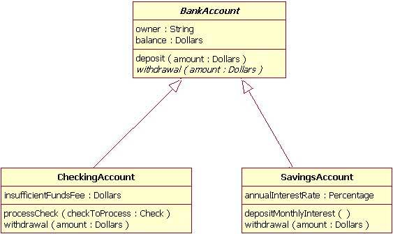
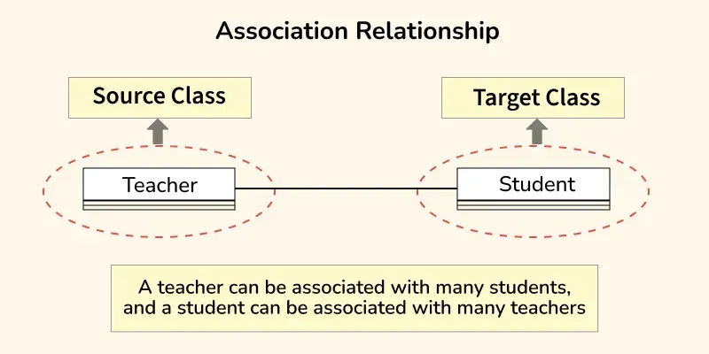
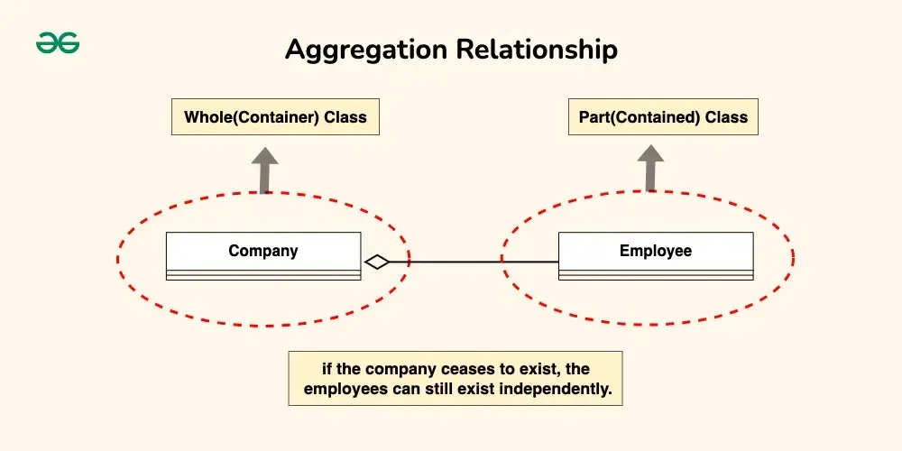
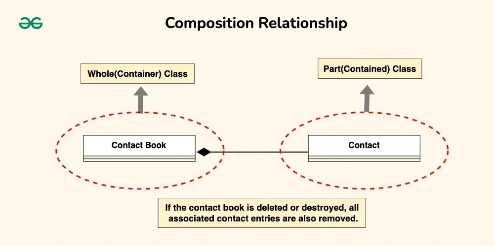
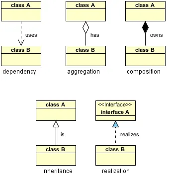
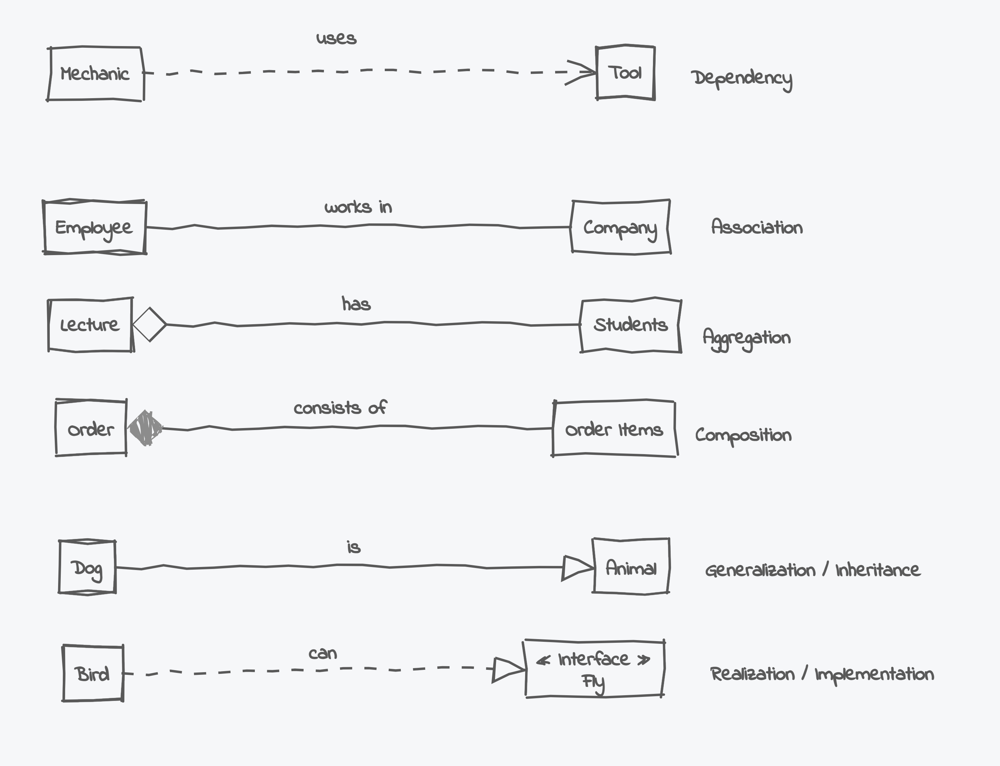
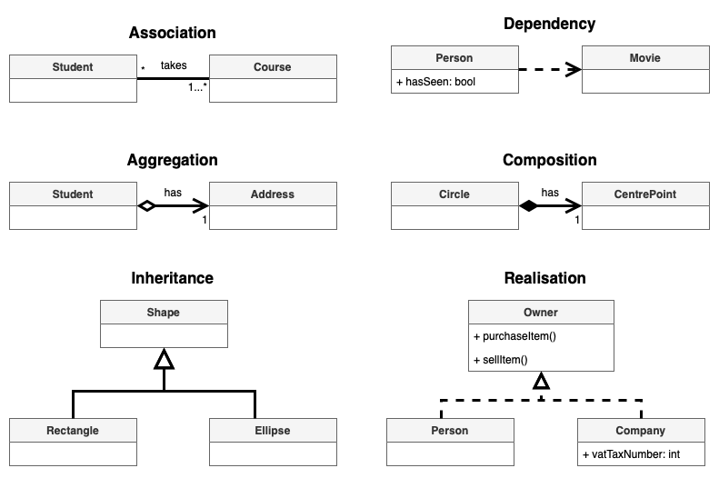

# UML Relationships and Object-Oriented Programming Concepts

## Overview

This folder explains the fundamental UML relationships and Object-Oriented Programming (OOP) concepts that are essential for understanding design patterns and software architecture.

---

## Table of Contents

- [UML Relationships](#uml-relationships)
  - [1. Dependency](#1-dependency)
  - [2. Generalization (Inheritance)](#2-generalization-inheritance)
  - [3. Realization](#3-realization)
  - [4. Association](#4-association)
  - [5. Aggregation](#5-aggregation)
  - [6. Composition](#6-composition)
- [Object-Oriented Programming Concepts](#object-oriented-programming-concepts)
  - [1. Encapsulation](#1-encapsulation)
  - [2. Inheritance (Generalization)](#2-inheritance-generalization)
  - [3. Polymorphism](#3-polymorphism)
    - [Compile-Time Polymorphism (Static Polymorphism)](#compile-time-polymorphism-static-polymorphism)
    - [Run-Time Polymorphism (Dynamic Polymorphism)](#run-time-polymorphism-dynamic-polymorphism)
  - [4. Abstraction](#4-abstraction)
- [Visual Comparison of UML Relationships](#visual-comparison-of-uml-relationships)
- [Quick Reference Table](#quick-reference-table)
- [Relationship Strength Comparison](#relationship-strength-comparison)

---

## UML Relationships

### 1. Dependency

**Definition**: A temporary relationship where one class uses another class, but the relationship is not structural. The dependent class requires the other class for a specific operation or method.

**UML Symbol**: Dashed arrow pointing from the dependent class to the class it depends on

**Characteristics**:
- Represents a "uses-a" relationship (temporary)
- Weakest form of relationship
- Typically used for method parameters, local variables, or return types
- No structural ownership or containment
- Objects can exist independently

**Java Example**:
```java
class Order {
    public void calculateTotal(Product product) {  // Dependency: Order uses Product
        double total = product.getPrice();
        System.out.println("Total: " + total);
    }
}

class Product {
    private double price;
    
    public Product(double price) {
        this.price = price;
    }
    
    public double getPrice() {
        return price;
    }
}

// Order depends on Product, but doesn't own it
Order order = new Order();
Product product = new Product(29.99);
order.calculateTotal(product);  // Temporary dependency
```

---

### 2. Generalization (Inheritance)

**Definition**: This represents an inheritance relationship between classes.

**UML Symbol**: Solid arrow pointing from subclass (child) to superclass (parent)



**Characteristics**:
- Represents an "is-a" relationship
- Child class inherits attributes and methods from parent class
- Promotes code reuse and hierarchical relationships

**Example**:
```
Animal (parent)
  ↑
  |
Dog (child)
```

**Java Example**:
```java
class Animal {
    void makeSound() {
        System.out.println("Animal makes a sound");
    }
}

class Dog extends Animal {
    @Override
    void makeSound() {
        System.out.println("Dog barks");
    }
}
```

---

### 3. Realization

**Definition**: A relationship where a class implements an interface, providing concrete implementations for the abstract methods defined in the interface.

**UML Symbol**: Dashed arrow with a hollow triangle pointing from the implementing class to the interface

**Characteristics**:
- Represents a "realizes" or "implements" relationship
- Similar to inheritance but for interfaces
- Class must implement all methods defined in the interface
- Supports multiple interface implementation (multiple realization)
- Promotes abstraction and polymorphism

**Java Example**:
```java
// Interface
interface Drawable {
    void draw();
    double getArea();
}

// Class realizes (implements) the interface
class Circle implements Drawable {
    private double radius;
    
    public Circle(double radius) {
        this.radius = radius;
    }
    
    @Override
    public void draw() {
        System.out.println("Drawing a circle");
    }
    
    @Override
    public double getArea() {
        return Math.PI * radius * radius;
    }
}

// Another class can also realize the same interface
class Rectangle implements Drawable {
    private double width, height;
    
    public Rectangle(double width, double height) {
        this.width = width;
        this.height = height;
    }
    
    @Override
    public void draw() {
        System.out.println("Drawing a rectangle");
    }
    
    @Override
    public double getArea() {
        return width * height;
    }
}
```

---

### 4. Association

**Definition**: A general link between two classes, representing a relationship where objects are connected but independent.

**UML Symbol**: Simple line connecting two classes



**Characteristics**:
- Represents a "uses" or "knows about" relationship
- Objects can exist independently
- Can be bidirectional or unidirectional
- Can have multiplicity (one-to-one, one-to-many, many-to-many)

**Example**:
```
Student ---- Course
```

**Java Example**:
```java
class Student {
    private Course course;  // Student is associated with Course
    
    public void enroll(Course course) {
        this.course = course;
    }
}

class Course {
    private String name;
    
    public Course(String name) {
        this.name = name;
    }
}
```

---

### 5. Aggregation

**Definition**: A strong form of association representing a whole-part relationship where the part can exist independently from the whole.

**UML Symbol**: Hollow diamond on the "whole" side



**Characteristics**:
- Represents a "has-a" relationship (weak ownership)
- The constituent part can exist independently from the aggregate (the whole)
- Transitive: If A is part of B, and B is part of C, then A is part of C
- Antisymmetric: If A is part of B, B cannot be part of A
- Lifecycle independence: Parts can exist before and after the whole

**Example**:
```
University ◇---- Department
```

**Java Example**:
```java
class University {
    private List<Department> departments;  // Aggregation
    
    public University() {
        this.departments = new ArrayList<>();
    }
    
    public void addDepartment(Department department) {
        departments.add(department);
    }
}

class Department {
    private String name;
    
    public Department(String name) {
        this.name = name;
    }
}

// Department can exist independently
Department csDept = new Department("Computer Science");
University uni = new University();
uni.addDepartment(csDept);
// Department still exists even if university is destroyed
```

---

### 6. Composition

**Definition**: A form of aggregation with stricter constraints. A part can belong to at most one assembly (whole) and has a coincident lifetime with the assembly.

**UML Symbol**: Filled diamond on the "whole" side



**Characteristics**:
- Represents an "owns" or "strong part-of" relationship
- Strong ownership: Part cannot exist independently
- Lifecycle dependency: Deletion of the assembly triggers automatic deletion of all constituent parts
- They "live and die as a whole"
- Part can belong to at most one whole

**Example**:
```
House ◆---- Room
```

**Java Example**:
```java
class House {
    private List<Room> rooms;  // Composition
    
    public House() {
        this.rooms = new ArrayList<>();
        // Rooms are created with the house
        rooms.add(new Room("Living Room"));
        rooms.add(new Room("Bedroom"));
    }
    
    // When house is destroyed, rooms are destroyed too
}

class Room {
    private String name;
    
    public Room(String name) {
        this.name = name;
    }
}

// Room cannot exist without House
House house = new House();
// If house is destroyed, rooms are automatically destroyed
```

**Key Difference from Aggregation**:
- **Composition**: Room cannot exist without House (strong ownership)
- **Aggregation**: Department can exist without University (weak ownership)

---

## Object-Oriented Programming Concepts

### 1. Encapsulation

**Definition**: Encapsulation involves bundling data and methods together within a class and restricting direct access to the internal workings of an object.

**In UML Diagrams**:
Encapsulation is represented through attribute and method visibility, denoted by:

- **`+`** Public
- **`#`** Protected
- **`-`** Private

**Application**:
The Singleton Pattern relies heavily on encapsulation by making the constructor private (e.g., `private Counter()`), which prevents external classes from creating instances directly and ensures controlled access to the single instance.

**Java Example**:
```java
class BankAccount {
    private double balance;  // Private - encapsulated
    
    public BankAccount(double initialBalance) {
        this.balance = initialBalance;
    }
    
    public void deposit(double amount) {  // Public interface
        if (amount > 0) {
            balance += amount;
        }
    }
    
    public double getBalance() {  // Controlled access
        return balance;
    }
}
```

---

### 2. Inheritance (Generalization)

**Definition**: Inheritance allows a class to derive attributes and methods from another class, promoting code reuse and hierarchical relationships.

**In UML Diagrams**:
Inheritance is referred to as a **Generalization** relationship.

**Visual Representation**:
- Depicted as a solid arrow pointing from the subclass (child) to the superclass (parent)

**Definition**:
Generalization represents an inheritance relationship between classes, where the child class extends the behavior of the parent class.

**Java Example**:
```java
// Parent class
class Vehicle {
    protected String brand;
    
    public Vehicle(String brand) {
        this.brand = brand;
    }
    
    public void start() {
        System.out.println(brand + " is starting...");
    }
}

// Child class
class Car extends Vehicle {
    private int doors;
    
    public Car(String brand, int doors) {
        super(brand);
        this.doors = doors;
    }
    
    public void honk() {
        System.out.println("Beep beep!");
    }
}
```

---

### 3. Polymorphism

**Definition**: Polymorphism allows objects to be treated as instances of a common parent class or interface, enabling different behaviors at runtime.

**Illustration**:
The Strategy Pattern demonstrates polymorphism by defining a family of algorithms and allowing them to be interchanged dynamically at runtime.

**Application**:
In the Factory Pattern, the client interacts with objects through a common interface (such as `Shape`) rather than concrete implementations (such as `Circle` or `Square`). This allows the system to work polymorphically with any object that implements the interface.

#### Compile-Time Polymorphism (Static Polymorphism)

**Definition**:
Compile-time polymorphism occurs when the method call is resolved at compile time, before the program runs.

**How it is achieved**:
- Method Overloading

**Key Characteristics**:
- Decision made by the compiler
- Faster (no runtime lookup)
- Method signature differs (parameters or type)

**Java Example**:
```java
class Calculator {
    int add(int a, int b) {
        return a + b;
    }
    
    double add(double a, double b) {
        return a + b;
    }
    
    int add(int a, int b, int c) {
        return a + b + c;
    }
}

// Usage
Calculator calc = new Calculator();
calc.add(5, 3);        // Calls int add(int, int)
calc.add(5.5, 3.2);    // Calls double add(double, double)
calc.add(1, 2, 3);     // Calls int add(int, int, int)
```

Here, the compiler decides which `add()` method to call based on the parameter types and number of arguments.

#### Run-Time Polymorphism (Dynamic Polymorphism)

**Definition**:
Run-time polymorphism occurs when the method call is resolved at runtime, based on the actual object type.

**How it is achieved**:
- Method Overriding
- Achieved through inheritance and interfaces

**Key Characteristics**:
- Decision made by the JVM at runtime
- Enables flexibility and extensibility
- Uses dynamic method dispatch

**Java Example**:
```java
class Animal {
    void sound() {
        System.out.println("Animal makes a sound");
    }
}

class Dog extends Animal {
    @Override
    void sound() {
        System.out.println("Dog barks");
    }
}

class Cat extends Animal {
    @Override
    void sound() {
        System.out.println("Cat meows");
    }
}

public class Main {
    public static void main(String[] args) {
        Animal a1 = new Dog();  // Parent reference, child object
        Animal a2 = new Cat();   // Parent reference, child object
        
        a1.sound();  // Calls Dog's sound() - "Dog barks"
        a2.sound();  // Calls Cat's sound() - "Cat meows"
    }
}
```

Even though the reference type is `Animal`, the actual object's implementation is executed at runtime.

---

### 4. Abstraction

**Definition**: Abstraction focuses on hiding complex implementation details while exposing only the essential features of an object.

**Principle**:
This concept is fundamental to the Dependency Inversion Principle, which states that high-level modules should depend on abstractions rather than concrete implementations.

**Application**:
The Abstract Factory and Factory Method patterns use abstraction by defining interfaces (such as `Shape` or `Bank`) that concrete classes must implement. This isolates the client from the complexity of object creation and improves flexibility and maintainability.

**Java Example**:
```java
// Abstraction - interface
interface Shape {
    double calculateArea();
    void draw();
}

// Concrete implementations
class Circle implements Shape {
    private double radius;
    
    public Circle(double radius) {
        this.radius = radius;
    }
    
    @Override
    public double calculateArea() {
        return Math.PI * radius * radius;
    }
    
    @Override
    public void draw() {
        System.out.println("Drawing a circle");
    }
}

class Rectangle implements Shape {
    private double width, height;
    
    public Rectangle(double width, double height) {
        this.width = width;
        this.height = height;
    }
    
    @Override
    public double calculateArea() {
        return width * height;
    }
    
    @Override
    public void draw() {
        System.out.println("Drawing a rectangle");
    }
}

// Client code uses abstraction
class ShapeDrawer {
    public void drawShape(Shape shape) {  // Works with any Shape
        shape.draw();
        System.out.println("Area: " + shape.calculateArea());
    }
}
```

---

## Visual Comparison of UML Relationships

The following diagrams provide multiple visual perspectives on UML relationships:

### Comparison 1: Basic Relationship Overview



This diagram illustrates the fundamental UML relationships with abstract classes:
- **Dependency** (uses): Dashed arrow - temporary "uses-a" relationship
- **Aggregation** (has): Solid line with hollow diamond - "has-a" relationship, part can exist independently
- **Composition** (owns): Solid line with filled diamond - "owns" relationship, part cannot exist without whole
- **Inheritance** (is): Solid arrow with triangle - "is-a" relationship, inheritance hierarchy
- **Realization** (realizes): Dashed arrow with triangle - class implements interface

### Comparison 2: Real-World Examples



This diagram shows practical examples of each relationship type:
- **Dependency**: Mechanic uses Tool (temporary relationship)
- **Association**: Employee works in Company (general link)
- **Aggregation**: Lecture has Students (part can exist independently)
- **Composition**: Order consists of Order Items (part cannot exist without whole)
- **Generalization/Inheritance**: Dog is Animal (inheritance hierarchy)
- **Realization/Implementation**: Bird can Fly (implements Fly interface)

### Comparison 3: Detailed UML Notation



This diagram demonstrates UML relationships with complete notation including multiplicities and attributes:
- **Association**: Student takes Course (with multiplicity `*` to `1..*`)
- **Dependency**: Person uses Movie (with attribute `hasSeen: bool`)
- **Aggregation**: Student has Address (with multiplicity `1`)
- **Composition**: Circle has CentrePoint (with multiplicity `1`, strong ownership)
- **Inheritance**: Rectangle and Ellipse inherit from Shape (multiple subclasses)
- **Realization**: Person and Company implement Owner interface (with interface methods and class attributes)

---

## Quick Reference Table

| Relationship | UML Symbol | Strength | Lifecycle | Example | Java Keyword |
|-------------|------------|----------|-----------|---------|--------------|
| **Dependency** | Dashed arrow (⇢) | Weakest | Independent | Class A uses Class B | Method parameter, local variable |
| **Association** | Simple line (—) | Weak | Independent | Student uses Course | Reference variable |
| **Aggregation** | Hollow diamond (◇) | Medium | Independent | University has Department | Collection/Reference |
| **Composition** | Filled diamond (◆) | Strong | Dependent | House owns Room | Object creation in constructor |
| **Generalization** | Solid arrow (→) | Strong | Inherited | Dog is-a Animal | `extends` |
| **Realization** | Dashed arrow with triangle (⇢) | Strong | Inherited | Class implements Interface | `implements` |

---

## Relationship Strength Comparison

**From Weakest to Strongest**:

1. **Association** (Weakest)
   - Simple connection
   - Independent lifecycles
   - Example: Student ↔ Course

2. **Aggregation** (Medium)
   - "Has-a" relationship
   - Part can exist independently
   - Example: University ◇ Department

3. **Composition** (Strong)
   - "Owns" relationship
   - Part cannot exist without whole
   - Example: House ◆ Room

4. **Generalization** (Strongest)
   - "Is-a" relationship
   - Inheritance hierarchy
   - Example: Dog → Animal

---

## Summary

Understanding UML relationships and OOP concepts is crucial for:
- **Design Patterns**: Many patterns rely on these relationships (e.g., Strategy uses polymorphism, Singleton uses encapsulation)
- **Code Quality**: Proper use of relationships leads to maintainable, flexible code
- **System Design**: Helps in modeling real-world systems accurately
- **Communication**: Provides a common language for discussing software architecture

---

## Related Topics

- [SOLID Principles](../SOLID/README.md) - Principles that guide good OOP design
- [Anti-Patterns](../AntiPatterns/README.md) - What to avoid in design
- [Design Patterns](../../README.md) - Patterns that utilize these relationships
