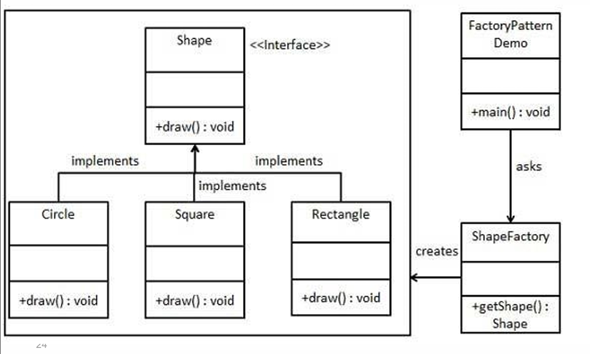
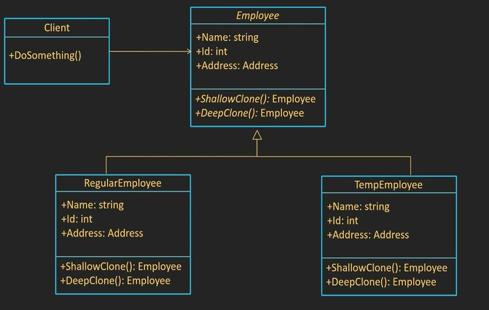
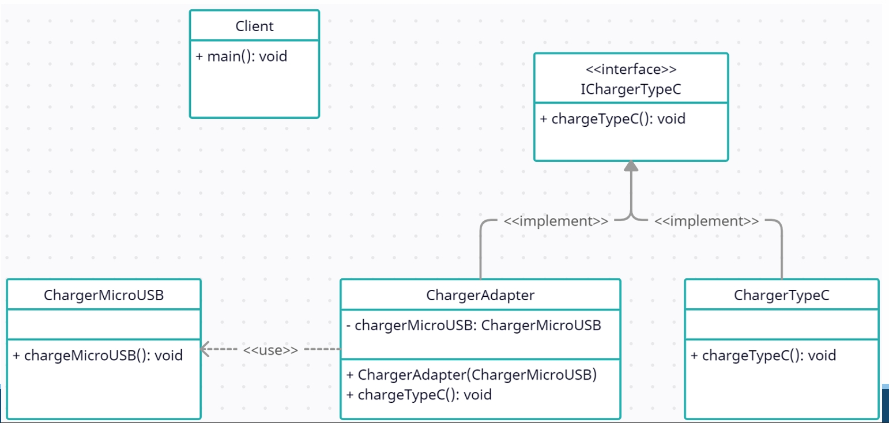
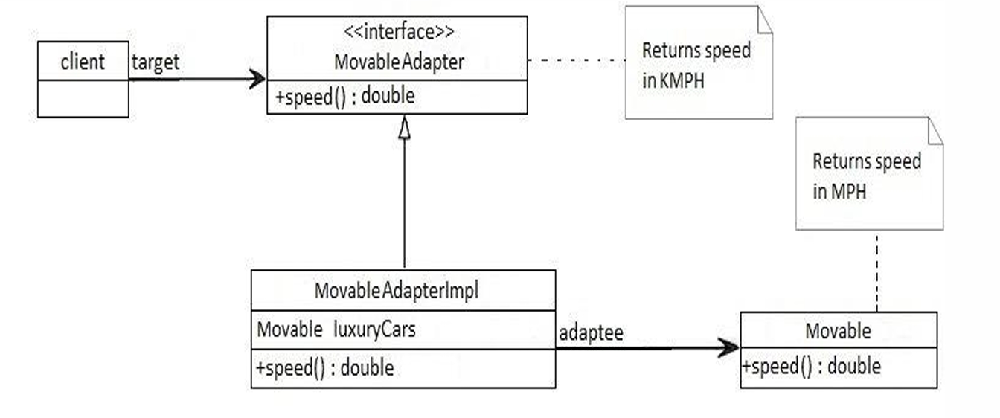
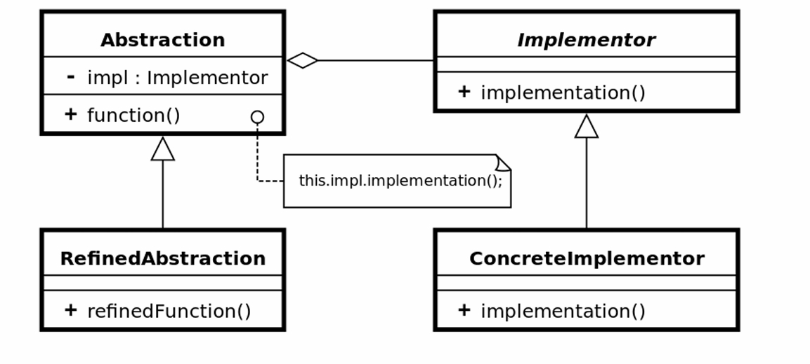
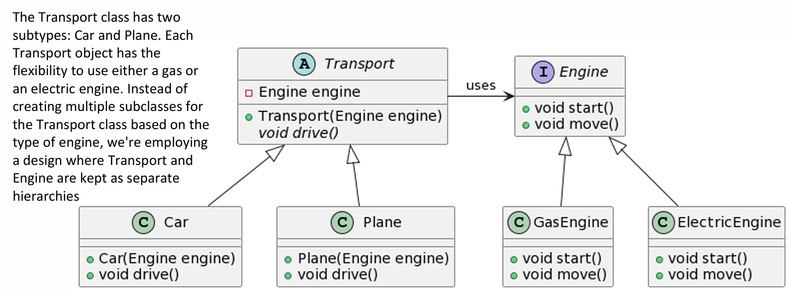
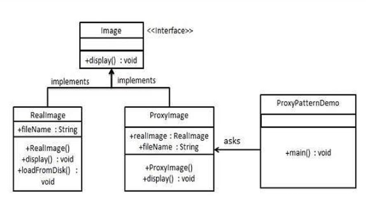

## Design Patterns – Quick Revision Summary

This is a concise revision sheet for all the design patterns in this project.  
Each section gives:

- **Intent & When to use**
- **Key structure idea (with existing diagram image)**
- **How it feels in code**
- **Brief comparison with related patterns**

---

## Quick Navigation

### Creational Patterns
- [Singleton](#singleton)
- [Factory Family](#factory-family-simple-factory-factory-method-abstract-factory)
- [Builder](#builder)
- [Prototype](#prototype)

### Structural Patterns
- [Adapter](#adapter)
- [Decorator](#decorator)
- [Bridge](#bridge)
- [Facade](#facade)
- [Flyweight](#flyweight)
- [Proxy](#proxy)

---

## Pattern Classification Overview

The table below summarizes the patterns in this codebase using the classic **GoF classification** by **purpose** (Creational vs Structural) and **scope** (Class vs Object).

| Scope  | Purpose     | Patterns in this repo                           |
|--------|-------------|-------------------------------------------------|
| Class  | Creational  | Factory Method (part of Factory family)        |
| Object | Creational  | Abstract Factory, Builder, Prototype, Singleton, Simple Factory |
| Class  | Structural  | Adapter (class form – shown conceptually)      |
| Object | Structural  | Adapter (object form), Bridge, Decorator, Facade, Flyweight, Proxy |

Only **Creational** and **Structural** patterns are implemented here; Behavioral patterns (Strategy, Observer, etc.) are not part of this project.

---

## Singleton

- **Intent**: Ensure a class has only one instance and provide a global access point to it.
- **When to use**:
  - Exactly one shared object should exist (e.g., configuration, logger, cache, connection pool).
- **Structure**:
  - No diagram image, but see examples in `Singleton/README.md`.
  - Pattern:
    - Private constructor.
    - Static field to hold single instance.
    - Static `getInstance()` method.
- **Code feel**:
  - `Logger logger = Logger.getInstance();`
-  - All code uses the same instance.
- **Similar to / compared with**:
  - **Flyweight**: Flyweight allows many shared instances (one per intrinsic key); Singleton enforces exactly one instance.
  - **Static class**: Static classes have no instance and cannot implement interfaces; Singleton is an object and can be passed around.

- **Further reading**: [Singleton README](Singleton/README.md), demos: [EagerSingletonDemo](Singleton/EagerSingletonDemo.java), [LazySingletonDemo](Singleton/LazySingletonDemo.java), [SynchronizedSingletonDemo](Singleton/SynchronizedSingletonDemo.java)

---

## Factory Family (Simple Factory, Factory Method, Abstract Factory)

- **Intent**: Encapsulate object creation so client code depends on abstractions, not concrete classes.
- **When to use**:
  - You want to centralize creation logic.
  - You want to vary which concrete classes are instantiated without changing client code.
- **Structure**:
  - Diagram:
    -   
      *Shows the base product interface, its concrete products, and a factory class responsible for creating them for the client.*
  - Key variants:
    - **Simple Factory**: one class with a method that uses `if/switch` to return different products.
    - **Factory Method**: superclass declares factory method; subclasses decide which concrete product to create.
    - **Abstract Factory**: interface for creating families of related products (e.g., button + checkbox).
- **Code feel**:

```java
class ShapeFactory {
    Shape create(String type) {
        if ("circle".equals(type)) return new Circle();
        if ("square".equals(type)) return new Square();
        throw new IllegalArgumentException();
    }
}
```
- **Similar to / compared with**:
  - **Builder**: Builder focuses on step-by-step construction; factories just pick which class to instantiate.
  - **Prototype**: Prototype clones existing instances; factories build new ones from scratch.
  - **Singleton**: Singleton controls *how many* instances exist; factories control *which type* of instance you get.

- **Further reading**: [Factory README](Factory/README.md), demos: [SimpleFactoryDemo](Factory/SimpleFactoryDemo.java), [ShapeFactoryDemo](Factory/ShapeFactoryDemo.java), [FactoryMethodDemo](Factory/FactoryMethodDemo.java), [AbstractFactoryDemo](Factory/AbstractFactoryDemo.java)

---

## Builder

- **Intent**: Separate the construction of a complex object from its representation so the same construction process can create different representations.
- **When to use**:
  - Object construction has many optional/stepwise parameters.
-  - You want readable, step-by-step creation instead of a telescoping constructor.
- **Structure**:
  - Diagrams:
    -   
      *Shows the core Builder pattern class diagram: Product, abstract Builder, ConcreteBuilder, and an optional Director coordinating construction.*
    -   
      *Shows a concrete usage example of the Builder pattern, where a client assembles an object step‑by‑step via builder methods and then calls `build()`.*
  - Roles:
    - **Builder**: defines steps to build parts.
    - **Concrete Builder**: implements steps for a specific product.
    - **Director**: runs building steps in a particular order.
    - **Product**: complex object being constructed.
- **Code feel**:

```java
Car car = new CarBuilder()
        .withEngine("V8")
        .withColor("Red")
        .build();
```
- **Similar to / compared with**:
  - **Factory**: Factory returns a fully-built object in one call; Builder focuses on step-by-step construction.
  - **Prototype**: Prototype clones an existing configured object; Builder constructs from scratch via steps.

- **Further reading**: [Builder README](Builder/README.md), demos: [CarBuilderDemo](Builder/CarBuilderDemo.java), [DirectorBuilderDemo](Builder/DirectorBuilderDemo.java), [DocumentBuilderDemo](Builder/DocumentBuilderDemo.java), [TelescopingConstructorDemo](Builder/TelescopingConstructorDemo.java)

---

## Prototype

- **Intent**: Create new objects by copying (cloning) existing prototype instances instead of instantiating classes directly.
- **When to use**:
  - Object creation is expensive or complex.
  - You need many similar objects configured at runtime.
- **Structure**:
  - Diagram:
    -   
      *Shows the Prototype interface, concrete prototype subclasses, and the client cloning them instead of using `new`.*
  - Roles:
    - **Prototype**: declares clone operation.
    - **Concrete Prototype**: implements cloning (shallow/deep).
    - **Client**: clones via Prototype interface instead of `new`.
- **Code feel**:

```java
Shape prototype = new Circle(10, "red");
Shape copy = prototype.clone();
copy.setColor("blue");
```
- **Shallow vs Deep cloning (conceptually)**:
  - *Shallow clone*: copies primitive fields and **references** as-is; original and clone still share referenced objects.
  - *Deep clone*: copies primitive fields and also **creates new copies** of referenced objects so original and clone are fully independent.
- **Similar to / compared with**:
  - **Factory**: Factory chooses a class to instantiate; Prototype duplicates existing configured objects.
  - **Flyweight**: Prototype makes copies; Flyweight shares intrinsic state among many logical objects.

- **Further reading**: [Prototype README](Prototype/README.md), demos: [PrototypeDirectDemo](Prototype/PrototypeDirectDemo.java), [PrototypeRegistryDemo](Prototype/PrototypeRegistryDemo.java), [PrototypeShallowDeepDemo](Prototype/PrototypeShallowDeepDemo.java)

---

## Adapter

- **Intent**: Convert the interface of a class into another interface clients expect so that incompatible classes can work together.
- **When to use**:
  - You have existing code (legacy or third-party) with an interface that does not match what your client code expects.
  - You want to reuse an existing class without modifying it.
- **Structure**:
  - Diagrams:
    -   
      *Shows a client using a Target interface while an Adapter wraps an Adaptee to translate calls.*
    -   
      *Shows the Movable speed example converting MPH to KMPH via an object adapter.*
  - Roles:
    - **Target**: interface that the client expects.
    - **Adaptee**: existing class with incompatible interface.
    - **Adapter**: implements Target, wraps Adaptee, converts calls.
    - **Client**: talks only to Target.
- **Code feel**:

```java
RoundHole hole = new RoundHole(5);
SquarePeg square = new SquarePeg(5);
RoundPegTarget adapter = new SquarePegAdapter(square);
hole.fits(adapter);
```
- **Similar to / compared with**:
  - **Bridge**: Bridge is a design from the start to separate abstraction and implementation; Adapter is usually added later to fix an incompatibility.
  - **Facade**: Facade provides a new simpler interface to a whole subsystem; Adapter converts one existing class’s interface to another.

- **Further reading**: [Adapter README](Adapter/README.md), demos: [AdapterDemo](Adapter/AdapterDemo.java), [ChargerAdapterDemo](Adapter/ChargerAdapterDemo.java)

---

## Decorator

- **Intent**: Attach additional responsibilities to an object dynamically. Decorators provide a flexible alternative to subclassing for extending functionality.
- **When to use**:
  - Many optional features around a core type (e.g., condiments around coffee, visual effects around a window).
  - You want to add/remove behavior at runtime and avoid subclass explosion.
- **Structure**:
  - Diagram:
    -   
      *Shows the Component hierarchy with Decorator subclasses that wrap components to add responsibilities dynamically.*
  - Roles:
    - **Component**: base interface or abstract class.
    - **Concrete Component**: core implementation.
    - **Decorator**: implements Component and wraps another Component.
    - **Concrete Decorators**: add extra behavior before/after delegating to wrapped component.
- **Code feel**:

```java
Coffee c = new SimpleCoffee();
c = new Milk(c);
c = new Sugar(c);
```
- **Similar to / compared with**:
  - **Proxy**: Proxy controls access; Decorator adds behavior while preserving the same interface.
  - **Adapter**: Adapter changes the interface; Decorator keeps the same interface and adds responsibilities.

- **Further reading**: [Decorator README](Decorator/README.md), demos: [DecoratorDemo](Decorator/DecoratorDemo.java), [ShapeDecoratorDemo](Decorator/ShapeDecoratorDemo.java), [FileDecoratorDemo](Decorator/FileDecoratorDemo.java), [FileDecoratorChainingDemo](Decorator/FileDecoratorChainingDemo.java), [FileDecoratorPatternDemo](Decorator/FileDecoratorPatternDemo.java)

---

## Bridge

- **Intent**: Decouple an abstraction from its implementation so that the two can vary independently.
- **When to use**:
  - You have two independent dimensions that can both change (e.g., transport type vs engine type, GUI vs OS API).
  - You want to avoid combinatorial explosion like `GasCar`, `ElectricCar`, `GasPlane`, `ElectricPlane`, etc.
- **Structure**:
  - Diagrams:
    -   
      *Shows the general Bridge layout: Abstraction holding an Implementor, with RefinedAbstractions and ConcreteImplementors on each side.*
    -   
      *Shows the Transport/Engine example where Car and Plane use GasEngine or ElectricEngine via the Bridge composition.*
  - Roles:
    - **Abstraction** + **Refined Abstractions**: high-level interface and its variations (e.g., `Transport`, `Car`, `Plane`).
    - **Implementor** + **Concrete Implementors**: platform- or detail-specific behaviors (e.g., `Engine`, `GasEngine`, `ElectricEngine`).
    - **Client**: uses Abstraction; doesn’t know which Implementor is used.
- **Code feel**:

```java
Transport car = new Car(new GasEngine());
Transport plane = new Plane(new ElectricEngine());
car.drive();
plane.drive();
```
- **Similar to / compared with**:
  - **Adapter**: Adapter usually wraps one existing class to fix an incompatible interface; Bridge is a design choice from the start to separate two hierarchies.
  - **Strategy**: Strategy swaps algorithms; Bridge splits class responsibilities between abstraction and implementation.
  - **Decorator**: Decorator stacks behaviors; Bridge separates two dimensions (type vs implementation).

- **Further reading**: [Bridge README](Bridge/README.md), demos: [BridgeTransportDemo](Bridge/BridgeTransportDemo.java), [BridgeGuiApiDemo](Bridge/BridgeGuiApiDemo.java)

---

## Facade

- **Intent**: Provide a unified, simple interface to a set of interfaces in a subsystem. Facade defines a higher-level interface that makes the subsystem easier to use.
- **When to use**:
  - A subsystem is complex and you want to simplify the typical use cases.
  - You want to decouple client code from many subsystem classes.
- **Structure**:
  - Diagram:
    -   
      *Shows a single Facade class delegating work to multiple complex subsystem classes behind the scenes.*
  - Roles:
    - **Facade**: offers simple high-level operations.
    - **Subsystem classes**: many classes that implement the actual work.
    - **Client**: uses only the Facade.
- **Code feel**:

```java
HotelFacade hotel = new HotelFacade();
hotel.bookStayWithBreakfast();
```
- **Similar to / compared with**:
  - **Adapter**: Adapter changes one class's interface; Facade groups many classes behind a simpler interface.
  - **Bridge**: Bridge decouples abstraction from implementation for two hierarchies; Facade is just a convenient front-end to an existing subsystem.

- **Further reading**: [Facade README](Facade/README.md), demos: [WithoutFacadeDemo](Facade/WithoutFacadeDemo.java), [WithFacadeDemo](Facade/WithFacadeDemo.java), [HotelFacadeDemo](Facade/HotelFacadeDemo.java)

---

## Flyweight

- **Intent**: Fit more objects into memory by sharing common (intrinsic) state between multiple objects and externalizing varying (extrinsic) state.
- **When to use**:
  - You have *huge* numbers of similar objects (characters, trees, tiles) and memory use is a concern.
- **Structure**:
  - Diagrams:
    -   
      *Shows the Flyweight interface, ConcreteFlyweight, FlyweightFactory, and Client that supplies extrinsic state.*
    -   
      *Shows the Forest example with Tree holding position (extrinsic) and TreeType as the shared flyweight for intrinsic state.*
  - Roles:
    - **Flyweight** / **ConcreteFlyweight**: store intrinsic state (shared).
    - **FlyweightFactory**: creates and caches flyweights.
    - **Client / Context**: stores extrinsic state and supplies it to flyweights.
- **Code feel**:

```java
TreeType oak = TreeFactory.getTreeType("Oak", Color.GREEN);
forest.plantTree(10, 20, "Oak", Color.GREEN); // shares same TreeType
```
- **Similar to / compared with**:
  - **Prototype**: Prototype clones whole objects; Flyweight avoids copying by sharing intrinsic state.
  - **Singleton**: Singleton has exactly one global instance; Flyweight has one instance *per intrinsic configuration* (e.g., per tree type or character).
  - **Caching / Pools**: Pools reuse heavy objects over time; Flyweight shares immutable intrinsic state among many logical objects at the same time.

- **Further reading**: [Flyweight README](Flyweight/README.md), demos: [FlyweightForestDemo](Flyweight/FlyweightForestDemo.java), [FlyweightTextEditorDemo](Flyweight/FlyweightTextEditorDemo.java)

---

## Proxy

- **Intent**: Provide a surrogate or placeholder for another object to control access to it.
- **When to use**:
  - You want lazy loading, access control, logging, caching, or remote access while keeping the same interface.
- **Structure**:
  - Diagram:
    -   
      *Shows the Subject interface, RealSubject, and Proxy which forwards calls while adding access control or other logic.*
  - Roles:
    - **Subject**: common interface for RealSubject and Proxy.
    - **RealSubject**: does the real work.
    - **Proxy**: holds reference to RealSubject, controls access, may add behavior.
- **Code feel**:

```java
Subject service = new LoggingProxy(new RealService());
service.request();
```
- **Similar to / compared with**:
  - **Decorator**: both wrap another object with same interface; Decorator emphasizes adding features, Proxy emphasizes controlling access/lifecycle.
  - **Facade**: Facade simplifies a subsystem; Proxy stands in for a single object.

- **Further reading**: [Proxy README](Proxy/README.md), demos: [LoggingProxyDemo](Proxy/LoggingProxyDemo.java), [ProtectionProxyDemo](Proxy/ProtectionProxyDemo.java), [VirtualProxyDemo](Proxy/VirtualProxyDemo.java)

---

## High-Level Comparison Cheat Sheet

- **Interface / access focused**:
  - **Adapter**: change interface of one class to another.
  - **Facade**: offer a simpler interface to a whole subsystem.
  - **Proxy**: same interface, but controls access (lazy, secure, remote, logging).

- **Object creation focused**:
  - **Factory (Simple / Method / Abstract)**: centralize and vary which class gets instantiated.
  - **Builder**: construct complex objects step-by-step.
  - **Prototype**: copy existing configured objects.
  - **Singleton**: restrict to a single instance.

- **Structure / variation focused**:
  - **Bridge**: separate abstraction from implementation (two dimensions).
  - **Decorator**: wrap objects to add behavior dynamically.
  - **Flyweight**: share common intrinsic state across many small objects.


