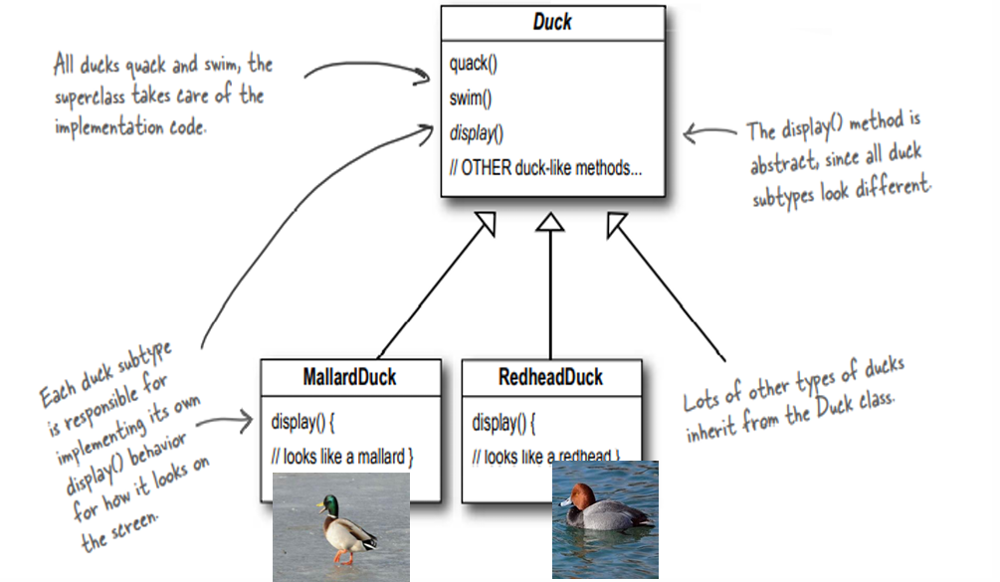
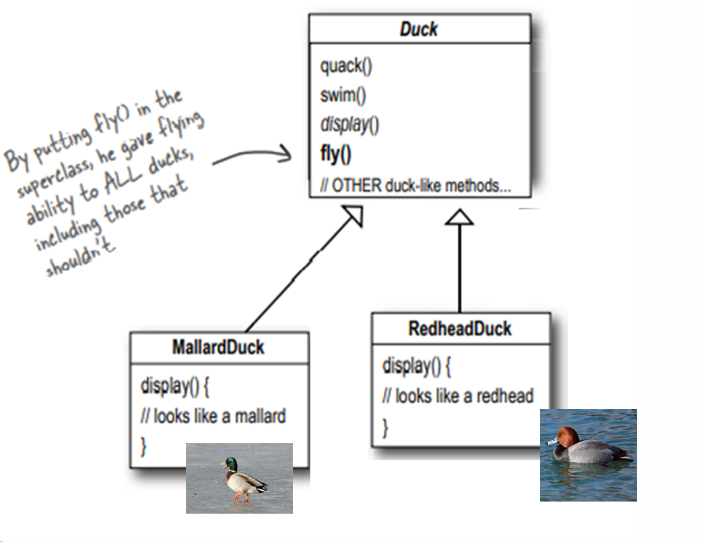
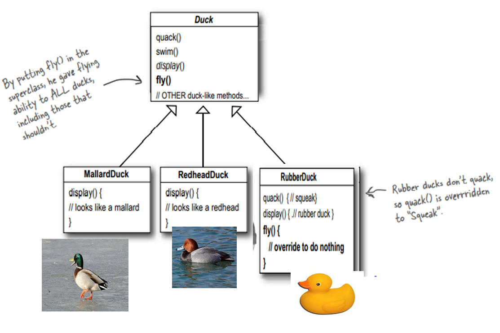
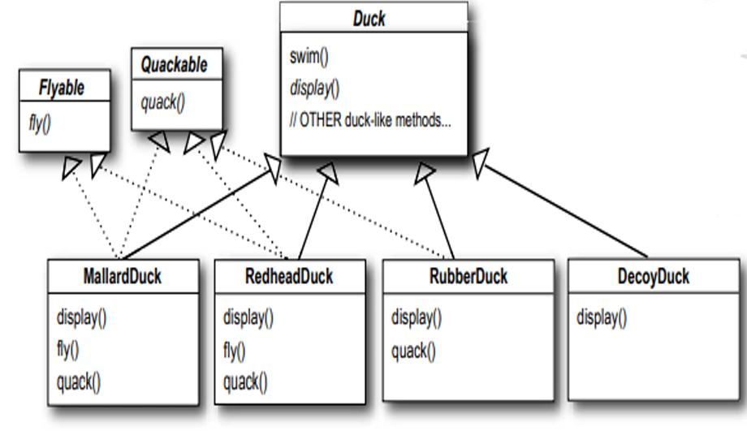
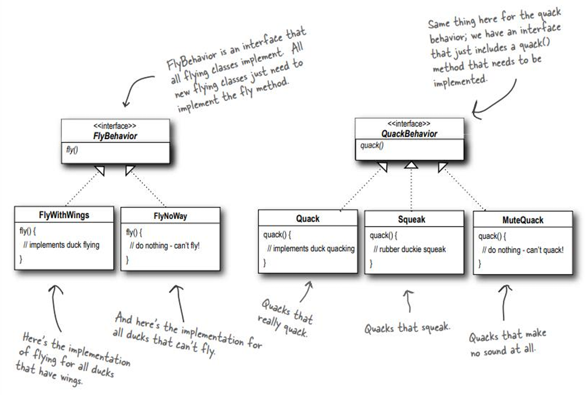
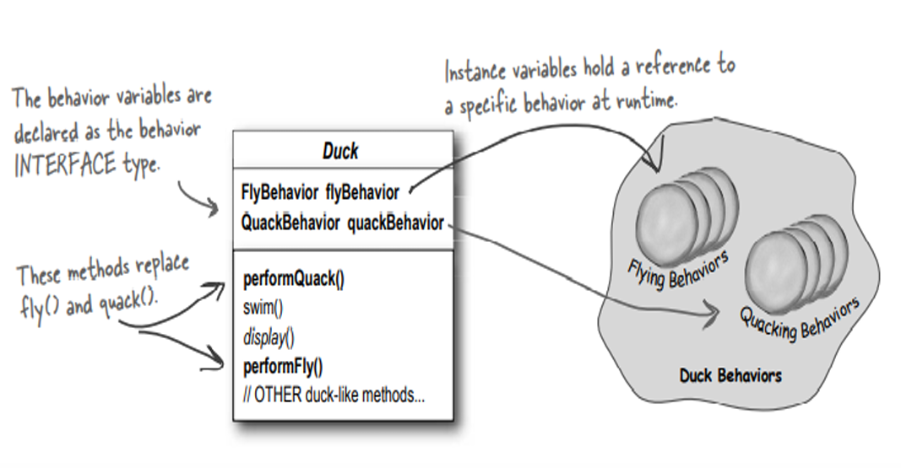
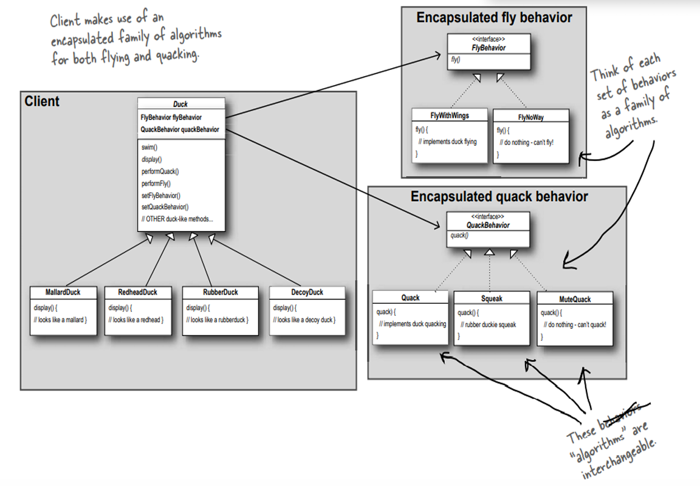

## Strategy Pattern

- **Intent**: Define a family of algorithms, encapsulate each one, and make them interchangeable at runtime without changing the client.
- **Why**: Avoid giant `if/else` blocks and subclass explosions when behavior must vary dynamically (e.g., ducks that fly differently, multiple encryption schemes).  
  *Slides reference*: See the lecture handout for the classic duck example and the encryption table of AES / RSA / ECC options.

---

## When to Use
- You have several interchangeable algorithms (sorting, compression, encryption, pricing rules).
- Behavior must switch at runtime based on context or configuration.
- You want to follow the Open/Closed Principle: add new behaviors without touching existing client code.
- You want to unit test behaviors in isolation.

---

## Structure (roles)
- `Strategy`: interface describing the algorithm (`fly()`, `quack()`, `encrypt()`).
- `ConcreteStrategy`: individual implementations (e.g., `FlyWithWings`, `FlyNoWay`, `AesEncryption`).
- `Context`: holds a `Strategy` reference and delegates to it; can swap strategies on the fly (`Duck`, `SecureMessenger`).
- `Client`: configures which strategy to use.
Key idea: **composition over inheritance**. The context *has a* strategy instead of hard-coding behavior.

---

## Duck Example – Diagram Walkthrough

### 1. Basic inheritance – `Duck` + concrete ducks (`diagram1.png`)


- **Idea**: All ducks `quack()` and `swim()`, so `Duck` implements these once and every subtype (e.g., `MallardDuck`, `RedheadDuck`) inherits that implementation.
- **`display()`** is **abstract** in `Duck` because each subtype looks different and must implement its own display behavior.
- Many other duck types can inherit from `Duck` and provide their own `display()`.

### 2. The problem – adding `fly()` to `Duck`


- When we add `fly()` to the `Duck` superclass, **all** ducks can now fly by inheritance.
- This is wrong for ducks like rubber or wooden decoys that **should not fly**, but still get `fly()` for free.

### 3. Patching with overrides – Rubber & Decoy ducks


- We try to fix the problem by adding `RubberDuck` and `DecoyDuck` subclasses that override behavior:
  - `RubberDuck.quack()` is overridden to **squeak** instead of a real quack.
  - Both `RubberDuck.fly()` and `DecoyDuck.fly()` are overridden to **do nothing**.
  - `DecoyDuck.quack()` is also overridden to **do nothing**.
- This works for a while, but every new non‑flying / non‑quacking duck forces more overrides and duplicated “do nothing” code.

### 4. Splitting responsibilities – `Flyable` and `Quackable`


- To avoid forcing all ducks to inherit `fly()` and `quack()`, we **extract interfaces**:
  - `Flyable` with `fly()`.
  - `Quackable` with `quack()`.
- Only ducks that actually fly implement `Flyable`; only ducks that actually quack implement `Quackable`.
- This reduces wrong behavior, but still couples each duck directly to a single hard‑coded implementation of `fly()` / `quack()`.

### 5. Encapsulating behaviors – `FlyBehavior` and `QuackBehavior`


- We move from “can fly” / “can quack” markers to full **behavior interfaces**:
  - `FlyBehavior` with implementations: `FlyWithWings`, `FlyNoWay`, etc.
  - `QuackBehavior` with implementations: `Quack`, `Squeak`, `MuteQuack`.
- Each behavior class encapsulates one algorithm:
  - `FlyWithWings.fly()` implements real flying.
  - `FlyNoWay.fly()` does nothing (for ducks that cannot fly).
  - `Quack.quack()` prints a real quack, `Squeak.quack()` squeaks, `MuteQuack.quack()` is silent.

### 6. Final `Duck` design – has‑a behavior


- The `Duck` class no longer hard‑codes `fly()` / `quack()` implementation; instead it **contains** strategy objects:
  - Fields: `FlyBehavior flyBehavior`, `QuackBehavior quackBehavior`.
  - Methods: `performFly()` delegates to `flyBehavior.fly()` and `performQuack()` delegates to `quackBehavior.quack()`.
- `display()` remains abstract so each concrete duck can define how it looks.
- Concrete ducks (Mallard, Redhead, Rubber, Decoy) are configured by **choosing which behavior objects** they use.

### 7. Full system – client + encapsulated behaviors


- On the right side, we have **families of algorithms** (encapsulated fly and quack behaviors) that are interchangeable.
- On the left, client code uses the **`Duck` abstraction**:
  - Each `Duck` subtype holds references to a `FlyBehavior` and a `QuackBehavior`.
  - Client calls `performFly()` / `performQuack()` on ducks without knowing which concrete behavior is used.
- This is the Strategy pattern: the client works with a `Duck`, and the **behavior objects** supply the pluggable algorithms.

---

## Examples in this folder
- `StrategyDuckDemo.java`: Classic duck simulator where flying/quacking behaviors are pluggable and changeable at runtime.
- `StrategyEncryptionDemo.java`: Secure messenger that can switch between AES, RSA, and ECC strategies based on the required security level.

Compile & run from this directory:
```bash
javac StrategyDuckDemo.java StrategyEncryptionDemo.java
java StrategyDuckDemo
java StrategyEncryptionDemo
```

---

## Example 1 – Duck behaviors (runtime swapping)
- Strategies: `FlyBehavior` (`FlyWithWings`, `FlyNoWay`, `RocketFly`) and `QuackBehavior` (`Quack`, `Squeak`, `MuteQuack`).
- Context: `Duck` with `performFly()` / `performQuack()` delegating to current strategies.
- Benefit: Add a new fly or quack behavior without changing `Duck` subclasses; swap behaviors on the fly for a single duck instance.

---

## Example 2 – Pluggable encryption
- Strategies: `AesEncryption`, `RsaEncryption`, `EccEncryption`.
- Context: `SecureMessenger` encrypts outgoing messages using the injected strategy; caller can swap strategy per message or per session.
- Benefit: Different security levels without changing messenger code; adding a new algorithm means adding one class.

---

## Benefits & Trade-offs
- ✅ Add/replace algorithms independently of the context.
- ✅ Test each strategy separately; reduce branching in the context.
- ✅ Swap behavior at runtime.
- ⚠️ Slightly more objects; ensure sensible defaults to avoid `null` strategies.

---

## Related Patterns
- **State**: similar structure, but strategies represent independent algorithms; state typically models lifecycle stages with transitions.
- **Decorator**: adds responsibilities by wrapping; Strategy swaps core behavior.
- **Factory**: often used to choose which strategy to instantiate.
