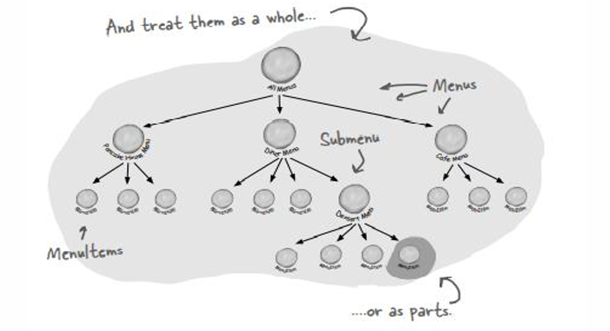
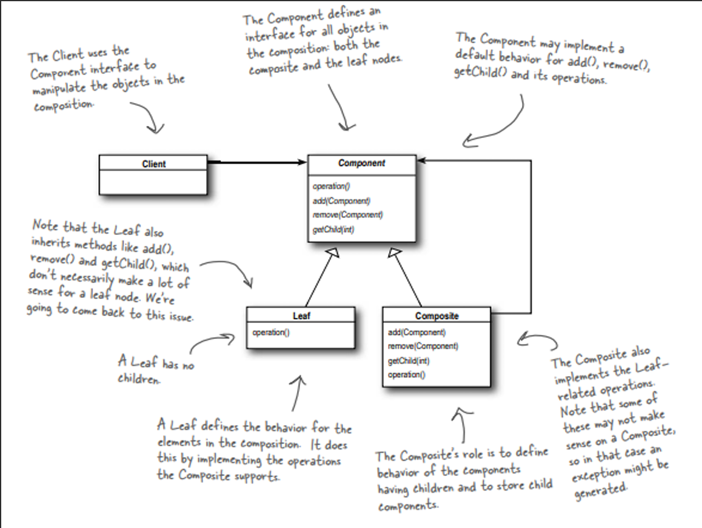
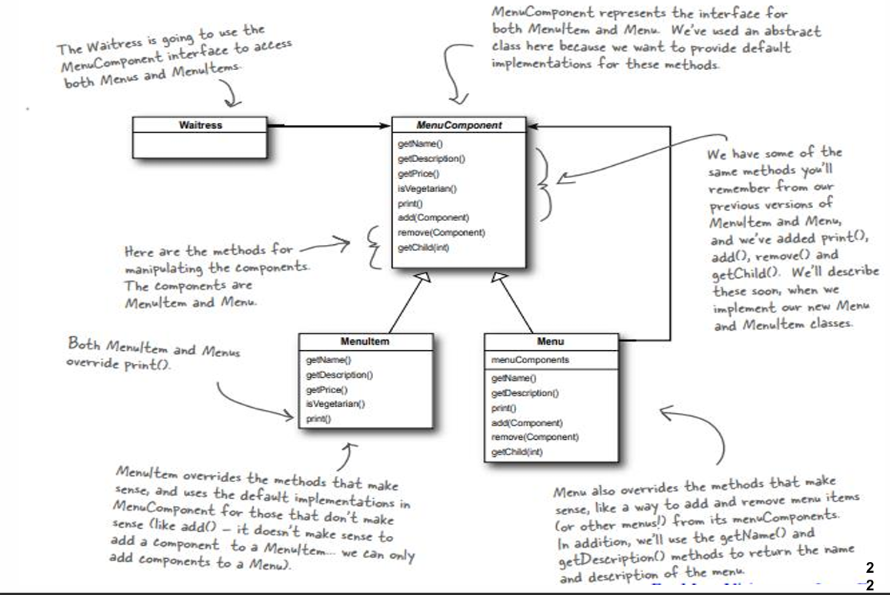

## Composite Pattern

- **Intent**: Compose objects into tree structures to represent part-whole hierarchies. Composite lets clients treat individual objects and compositions of objects uniformly.
- **When to use**: When you need to represent part-whole hierarchies and want clients to treat individual objects and compositions uniformly.

---

## Table of Contents

- [Pattern Structure](#pattern-structure)
- [Why Use the Composite Pattern?](#why-use-the-composite-pattern)
- [Pattern Structure – Diagram Walkthrough](#pattern-structure--diagram-walkthrough)
- [Implementation](#implementation)
- [Pattern Participants](#pattern-participants)
- [Pros](#pros)
- [Cons](#cons)
- [When to Use Composite Pattern](#when-to-use-composite-pattern)
- [Real-World Examples](#real-world-examples)
- [Compare with Other Patterns](#compare-with-other-patterns)
- [Best Practices](#best-practices)
- [Implementation Notes](#implementation-notes)
- [Notes](#notes)

---

## Pattern Structure

The Composite pattern consists of the following components:

1. **`Component`** (Abstract Class/Interface)
   - Defines an interface for all objects in the composition (both composite and leaf nodes)
   - Declares operations like `operation()`, `add()`, `remove()`, `getChild()`
   - May provide default implementations (often throwing `UnsupportedOperationException`)

2. **`Leaf`** (Concrete Class)
   - Represents leaf objects that have no children
   - Implements operations defined in `Component`
   - Inherits methods like `add()`, `remove()`, `getChild()` but they don't make sense for leaves

3. **`Composite`** (Concrete Class)
   - Defines behavior for components having children
   - Stores child components (can be `Leaf` or other `Composite` objects)
   - Implements child-related operations (`add()`, `remove()`, `getChild()`)
   - Implements `operation()` to delegate to children

4. **`Client`** (Class)
   - Uses the `Component` interface to manipulate objects in the composition
   - Treats individual objects and compositions uniformly

**Key Relationships:**
- `Leaf` and `Composite` both inherit from `Component`
- `Composite` contains a collection of `Component` objects (its children)
- `Client` interacts only with `Component` interface

**Pattern Flow:**
1. Client creates `Component` objects (can be `Leaf` or `Composite`)
2. Client uses `Component` interface to call operations
3. `Composite` objects delegate operations to their children
4. `Leaf` objects perform actual operations

---

## Pattern Structure – Diagram Walkthrough

### 1. Restaurant Menu Hierarchy Example


- **Root Node**: "All Menus" - represents the entire menu structure (composite)
- **Intermediate Nodes**: "Pancake House Menu", "Diner Menu", "Cafe Menu" - also composites
- **Nested Composite**: "Dessert Menu" (submenu) - shows composites can contain other composites
- **Leaf Nodes**: Individual menu items - the actual items that cannot have children
- **Key Insight**: The entire structure can be treated as a whole, or individual parts can be accessed separately

### 2. UML Structure Diagram


- **Component**: Abstract class/interface defining common interface
- **Leaf**: Individual objects with no children
- **Composite**: Objects that can contain children
- **Client**: Uses Component interface uniformly
- **Note**: Leaf inherits `add()`, `remove()`, `getChild()` which don't make sense for leaves

### 3. Menu System Implementation


- **MenuComponent**: Abstract class providing default implementations
- **MenuItem**: Leaf node - individual menu items
- **Menu**: Composite node - can contain MenuItems or other Menus
- **Waitress**: Client that uses MenuComponent interface
- **Key Design**: Default implementations throw `UnsupportedOperationException` for methods that don't apply

---

## Why Use the Composite Pattern?

### Code Without Composite Pattern

Without the Composite pattern, you need separate handling for individual objects and collections:

```java
// Problem: Different handling for individual items vs collections
class MenuItem {
    String name;
    double price;
    void print() { System.out.println(name + " - $" + price); }
}

class Menu {
    List<MenuItem> items;
    String name;
    
    void print() {
        System.out.println(name);
        for (MenuItem item : items) {
            item.print();  // Must know MenuItem structure
        }
    }
}

// Problem: Can't nest menus, must handle Menu and MenuItem differently
```

**Problems:**
- ❌ **Different interfaces**: Must handle Menu and MenuItem separately
- ❌ **No nesting**: Can't have menus within menus
- ❌ **Code duplication**: Similar operations duplicated in different classes
- ❌ **Tight coupling**: Client must know about Menu vs MenuItem differences

### The Solution: Composite Pattern

The Composite pattern solves these problems by:
- ✅ **Uniform interface**: Same interface for individual objects and compositions
- ✅ **Recursive composition**: Composites can contain other composites
- ✅ **Simplified client code**: Client treats all objects uniformly
- ✅ **Flexible structure**: Easy to add new component types

---

## Implementation

### Component (Abstract Class)

```java
public abstract class MenuComponent {
    // Composite methods - for managing children
    public void add(MenuComponent menuComponent) {
        throw new UnsupportedOperationException();
    }

    public void remove(MenuComponent menuComponent) {
        throw new UnsupportedOperationException();
    }

    public MenuComponent getChild(int i) {
        throw new UnsupportedOperationException();
    }

    // Operation methods - for leaf nodes
    public String getName() {
        throw new UnsupportedOperationException();
    }

    public String getDescription() {
        throw new UnsupportedOperationException();
    }

    public double getPrice() {
        throw new UnsupportedOperationException();
    }

    public boolean isVegetarian() {
        throw new UnsupportedOperationException();
    }

    // Operation method for both
    public void print() {
        throw new UnsupportedOperationException();
    }
}
```

**Key Point**: Default implementations throw `UnsupportedOperationException`. This allows:
- `MenuItem` to inherit default `add()`, `remove()`, `getChild()` (which don't make sense)
- `Menu` to inherit default `getPrice()`, `isVegetarian()` (which don't make sense)

### Leaf (MenuItem)

```java
public class MenuItem extends MenuComponent {
    String name;
    String description;
    boolean vegetarian;
    double price;

    public MenuItem(String name, String description, boolean vegetarian, double price) {
        this.name = name;
        this.description = description;
        this.vegetarian = vegetarian;
        this.price = price;
    }

    public String getName() {
        return name;
    }

    public String getDescription() {
        return description;
    }

    public double getPrice() {
        return price;
    }

    public boolean isVegetarian() {
        return vegetarian;
    }

    public void print() {
        System.out.print("  " + getName());
        if (isVegetarian()) {
            System.out.print(" (v)");
        }
        System.out.println(", " + getPrice());
        System.out.println("     -- " + getDescription());
    }
}
```

**Key Point**: `MenuItem` overrides methods that make sense and uses default implementations for `add()`, `remove()`, `getChild()`.

### Composite (Menu)

```java
import java.util.ArrayList;
import java.util.Iterator;

public class Menu extends MenuComponent {
    ArrayList<MenuComponent> menuComponents = new ArrayList<>();
    String name;
    String description;

    public Menu(String name, String description) {
        this.name = name;
        this.description = description;
    }

    public void add(MenuComponent menuComponent) {
        menuComponents.add(menuComponent);
    }

    public void remove(MenuComponent menuComponent) {
        menuComponents.remove(menuComponent);
    }

    public MenuComponent getChild(int i) {
        return menuComponents.get(i);
    }

    public String getName() {
        return name;
    }

    public String getDescription() {
        return description;
    }

    public void print() {
        System.out.print("\n" + getName());
        System.out.println(", " + getDescription());
        System.out.println("---------------------");

        Iterator<MenuComponent> iterator = menuComponents.iterator();
        while (iterator.hasNext()) {
            MenuComponent menuComponent = iterator.next();
            menuComponent.print();  // Recursive call - works for Menu or MenuItem
        }
    }
}
```

**Key Point**: `Menu` can contain both `MenuItem` objects and other `Menu` objects. The `print()` method recursively calls `print()` on all children.

### Client (Waitress)

```java
public class Waitress {
    MenuComponent allMenus;

    public Waitress(MenuComponent allMenus) {
        this.allMenus = allMenus;
    }

    public void printMenu() {
        allMenus.print();  // Works for entire menu hierarchy
    }
}
```

**Key Point**: The `Waitress` doesn't need to know if it's dealing with a `Menu` or `MenuItem` - it just calls `print()`.

### Usage Example

```java
public class MenuTestDrive {
    public static void main(String[] args) {
        MenuComponent pancakeHouseMenu = new Menu("PANCAKE HOUSE MENU", "Breakfast");
        MenuComponent dinerMenu = new Menu("DINER MENU", "Lunch");
        MenuComponent cafeMenu = new Menu("CAFE MENU", "Dinner");
        MenuComponent dessertMenu = new Menu("DESSERT MENU", "Dessert of course!");

        MenuComponent allMenus = new Menu("ALL MENUS", "All menus combined");

        allMenus.add(pancakeHouseMenu);
        allMenus.add(dinerMenu);
        allMenus.add(cafeMenu);

        dinerMenu.add(new MenuItem(
            "Pasta",
            "Spaghetti with Marinara Sauce, and a slice of sourdough bread",
            true,
            3.89));

        dinerMenu.add(dessertMenu);  // Adding a menu to a menu!

        dessertMenu.add(new MenuItem(
            "Apple Pie",
            "Apple pie with a flakey crust, topped with vanilla icecream",
            true,
            1.59));

        Waitress waitress = new Waitress(allMenus);
        waitress.printMenu();  // Prints entire hierarchy
    }
}
```

---

## Pattern Participants

1. **Component** (Abstract Class/Interface)
   - Defines interface for all objects in composition
   - Provides default implementations (often throwing exceptions)
   - Example: `MenuComponent`

2. **Leaf** (Concrete Class)
   - Represents individual objects with no children
   - Implements operations that make sense for leaves
   - Example: `MenuItem`

3. **Composite** (Concrete Class)
   - Represents objects that can have children
   - Implements child management operations
   - Stores collection of `Component` objects
   - Example: `Menu`

4. **Client** (Class)
   - Uses `Component` interface to manipulate objects
   - Treats all objects uniformly
   - Example: `Waitress`

---

## Pros

- ✅ **Uniform Treatment**: Clients treat individual objects and compositions uniformly
- ✅ **Recursive Composition**: Composites can contain other composites
- ✅ **Easy to Add New Types**: Add new component types without changing client code
- ✅ **Simplified Client Code**: Client doesn't need to distinguish between leaf and composite
- ✅ **Flexible Structure**: Easy to build complex tree structures

---

## Cons

- ❌ **Type Safety**: Leaf nodes inherit methods that don't make sense (`add()`, `remove()`)
- ❌ **Runtime Errors**: May throw `UnsupportedOperationException` if wrong method called
- ❌ **Overhead**: Additional abstraction layer adds complexity
- ⚠️ **Design Trade-off**: Flexibility vs. type safety

---

## When to Use Composite Pattern

### ✅ Use Composite Pattern When:

#### Part-Whole Hierarchies:
- You need to represent part-whole hierarchies
- Objects can be composed into tree structures
- You want to treat individual objects and compositions uniformly

#### Uniform Operations:
- You want to apply the same operations over both composites and individual objects
- Operations can be performed recursively on the tree structure

#### Flexible Structure:
- The structure needs to be flexible (add/remove components dynamically)
- Components can be nested arbitrarily

#### Additional Use Cases:
- **File Systems**: Directories (composite) and files (leaf)
- **GUI Components**: Containers (composite) and widgets (leaf)
- **Organization Charts**: Departments (composite) and employees (leaf)
- **Menu Systems**: Menus (composite) and menu items (leaf)

### ❌ Don't Use Composite Pattern When:
- **Simple Structures**: Structure is simple and won't change
- **No Hierarchy**: Objects don't form a part-whole hierarchy
- **Different Operations**: Leaf and composite need very different operations
- **Performance Critical**: The overhead is too high

---

## Real-World Examples

### File System
- **Directory** (Composite): Can contain files and other directories
- **File** (Leaf): Individual file with no children
- **Operations**: `list()`, `getSize()`, `delete()` work on both

### GUI Components
- **Container** (Composite): Can contain widgets and other containers
- **Widget** (Leaf): Individual UI element (button, label)
- **Operations**: `render()`, `handleEvent()` work on both

### Organization Chart
- **Department** (Composite): Can contain employees and sub-departments
- **Employee** (Leaf): Individual employee
- **Operations**: `getSalary()`, `print()` work on both

---

## Compare with Other Patterns

### Composite vs Decorator

**Composite:**
- Builds **tree structures** (part-whole hierarchies)
- Focuses on **structure** (containment)
- Used for **hierarchical** relationships

**Decorator:**
- Adds **responsibilities** to objects
- Focuses on **behavior** (enhancement)
- Used for **wrapping** objects

**Key Difference**: Composite = "build tree structures", Decorator = "add features"

### Composite vs Flyweight

**Composite:**
- Represents **part-whole hierarchies**
- Focuses on **structure** and **composition**
- Used for **tree-like** relationships

**Flyweight:**
- Shares **intrinsic state** among many objects
- Focuses on **memory efficiency**
- Used for **many similar objects**

**Key Difference**: Composite = "tree structure", Flyweight = "memory sharing"

### Composite vs Iterator

**Composite:**
- Builds **tree structures**
- Used for **representing** hierarchies

**Iterator:**
- Traverses **collections**
- Used for **accessing** elements

**They work together**: Iterator can traverse Composite structures.

---

## Best Practices

1. **Default Implementations**: Use abstract class with default implementations throwing `UnsupportedOperationException`
2. **Type Safety**: Consider using separate interfaces for leaf and composite operations if type safety is critical
3. **Child Management**: Composite should manage its children collection
4. **Recursive Operations**: Design operations to work recursively on the tree
5. **Transparency vs Safety**: Balance between uniform interface (transparency) and type safety

---

## Implementation Notes

### Abstract Class vs Interface

**Abstract Class Approach** (used in example):
- Provides default implementations
- Allows throwing `UnsupportedOperationException` for inappropriate methods
- More flexible but less type-safe

**Interface Approach**:
- More type-safe
- Requires separate interfaces for leaf and composite operations
- Less uniform treatment

### Child Management

```java
// Composite manages children
public class Menu extends MenuComponent {
    private List<MenuComponent> children = new ArrayList<>();
    
    public void add(MenuComponent component) {
        children.add(component);
    }
    
    public void remove(MenuComponent component) {
        children.remove(component);
    }
}
```

### Recursive Operations

```java
// Operations work recursively
public void print() {
    System.out.println(name);
    for (MenuComponent child : children) {
        child.print();  // Recursive - works for Menu or MenuItem
    }
}
```

---

## Notes

- ⚠️ **Type Safety Trade-off**: Leaf nodes inherit methods that don't make sense (`add()`, `remove()`)
- ⚠️ **Exception Handling**: Default implementations throw `UnsupportedOperationException`
- ⚠️ **Recursive Operations**: Operations must be designed to work recursively
- ⚠️ **Child Management**: Composite is responsible for managing its children

---

**Further reading**: See the demo for a complete working example:
- [CompositeMenuDemo.java](CompositeMenuDemo.java)
